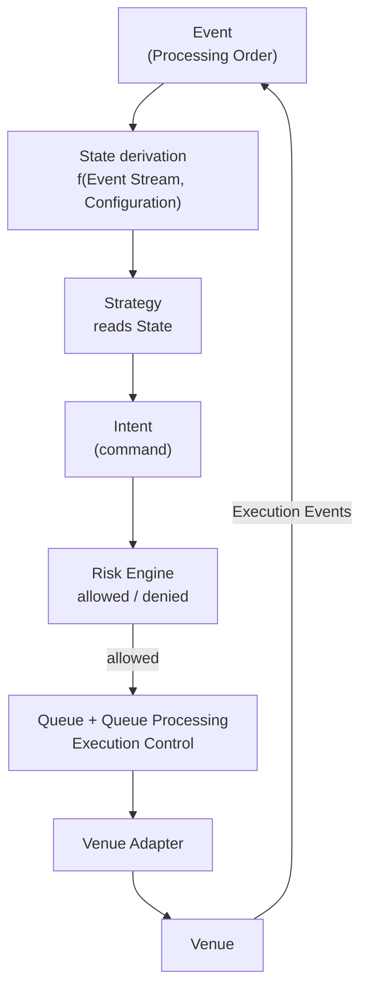
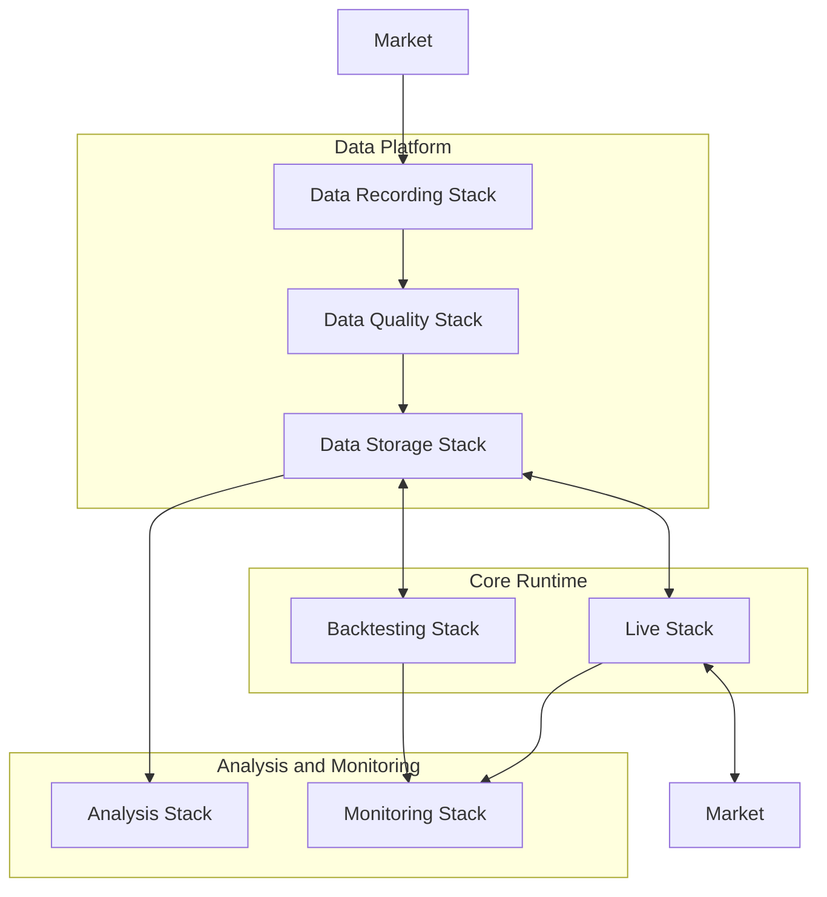

# Architecture Map

---

## Purpose

This document helps readers navigate the architecture documentation.

It explains **which document is authoritative for which concern** and provides reading paths for common questions. It does not carry primary definitions — those belong in the documents it points to.

For a brief semantic introduction to each core concept, see [Concepts Overview](../20-concepts/concepts-overview.md).

---

## Document map

### Foundational semantics — read first

| Question | Document |
| -------- | -------- |
| What do all core terms mean? | [Terminology](terminology.md) |
| What is an Event? What kinds exist? | [Event Model](../20-concepts/event-model.md) |
| What is the Event Stream and Processing Order? | [Event Model](../20-concepts/event-model.md) · [Time Model](../20-concepts/time-model.md) |
| What is Configuration and why does it matter? | [Terminology: Configuration](terminology.md#configuration) |
| What is State and how is it derived? | [State Model](../20-concepts/state-model.md) |
| What are the three State domains? Is Queue a domain? | [State Model](../20-concepts/state-model.md) |
| What is Processing Order vs Event Time? | [Time Model](../20-concepts/time-model.md) |

### Core runtime model

| Question | Document |
| -------- | -------- |
| What are the logical components and their responsibilities? | [Logical Architecture](../10-architecture/logical-architecture.md) |
| What is the step-by-step runtime sequence? | [Infrastructure Flows](../10-architecture/infrastructure-flows.md) |
| How does an Intent move from Strategy to Venue? | [Intent Pipeline](../10-architecture/intent-pipeline.md) |
| What is the Infrastructure's top-level structure and layer organization? | [Architecture Overview](../10-architecture/architecture-overview.md) |

### Lifecycle semantics

| Question | Document |
| -------- | -------- |
| What is an Intent? What lifecycle stages does it pass through? | [Intent Lifecycle](../10-architecture/intent-lifecycle.md) |
| When does an Order begin? What states can it reach? | [Order Lifecycle](../20-concepts/order-lifecycle.md) |
| How are concurrent Intents for the same order key reconciled? | [Intent Dominance](../20-concepts/intent-dominance.md) |

### Execution Control and Queue

| Question | Document |
| -------- | -------- |
| What is the Queue? Is it a source of truth? | [Queue Semantics](../20-concepts/queue-semantics.md) |
| How does Queue Processing select work for dispatch? | [Queue Processing](../20-concepts/queue-processing.md) |
| What is Execution Control and how does it differ from Risk? | [Terminology: Execution Control](terminology.md#execution-control) · [Logical Architecture](../10-architecture/logical-architecture.md) |

### Determinism and correctness

| Question | Document |
| -------- | -------- |
| What does determinism mean? What breaks it? | [Determinism Model](../20-concepts/determinism-model.md) |
| What are the non-negotiable invariants? | [Invariants](../20-concepts/invariants.md) |

### Infrastructure and deployment

| Question | Document |
| -------- | -------- |
| How are the Infrastructure's stacks organized? | [Architecture Overview](../10-architecture/architecture-overview.md) |
| How does Backtesting relate to Live at the semantic level? | [Architecture Overview](../10-architecture/architecture-overview.md) |
| How is the Infrastructure deployed? | [Physical Architecture](../10-architecture/physical-architecture.md) |

---

## Runtime decision flow

Trading decisions inside the Core Runtime follow a deterministic event-driven chain:

Key points for navigation:

- **Events ➝ State:** Every State transition is caused by an Event. State is `f(Event Stream, Configuration)`. ➝ [Event Model](../20-concepts/event-model.md), [State Model](../20-concepts/state-model.md)
- **Strategy:** Reads derived State projections; emits **Intents** (ephemeral commands, not Events, not Orders). ➝ [Logical Architecture](../10-architecture/logical-architecture.md)
- **Risk Engine:** Decides **policy admissibility only** (allowed / denied). Does not schedule, rate-limit, or gate. ➝ [Logical Architecture](../10-architecture/logical-architecture.md)
- **Queue + Queue Processing:** Implement **Execution Control only** — schedule and dispatch allowed work as part of deterministic Event processing; no separate runtime tick; Queue is derived substate, not a source of truth. ➝ [Queue Semantics](../20-concepts/queue-semantics.md), [Queue Processing](../20-concepts/queue-processing.md)
- **Orders:** Begin at submission. Queue residency and Risk acceptance are not Order states. ➝ [Order Lifecycle](../20-concepts/order-lifecycle.md)
- **Venue feedback:** Returns as Execution Events, advancing already-existing Orders. ➝ [Event Model](../20-concepts/event-model.md), [Order Lifecycle](../20-concepts/order-lifecycle.md)

For the full step-by-step sequence, see [Infrastructure Flows](../10-architecture/infrastructure-flows.md).

---

## Infrastructure topology

The Infrastructure is organized into three infrastructure layers:

| Layer | Role |
| ----- | ---- |
| **Data Platform** | Collects, validates, and stores canonical datasets |
| **Core Runtime** | Executes trading logic deterministically (Backtesting and Live) |
| **Analysis and Monitoring** | Evaluates results and observes operational health |

Detailed Stack descriptions: [Architecture Overview](../10-architecture/architecture-overview.md) · [Stacks](../30-stacks/stacks-overview.md)

---

## Backtesting and Live

Backtesting and Live are two implementations of the **same Core Runtime semantics**.

Both apply `State = f(Event Stream, Configuration)`, the same Intent ➝ Risk ➝ Execution Control ➝ Dispatch chain, and the same Order lifecycle beginning at submission.

Infrastructure differs; semantics do not:

| Aspect | Backtesting | Live |
| ------ | ----------- | ---- |
| Market data | Historical datasets | Live Venue feeds |
| Venue | Simulated | Real |
| Operation mode | Batch experiments | Continuous |

➝ [Architecture Overview](../10-architecture/architecture-overview.md) · [Backtesting Stack](../30-stacks/backtesting/backtesting-overview.md) · [Live Stack](../30-stacks/live/live-overview.md)
