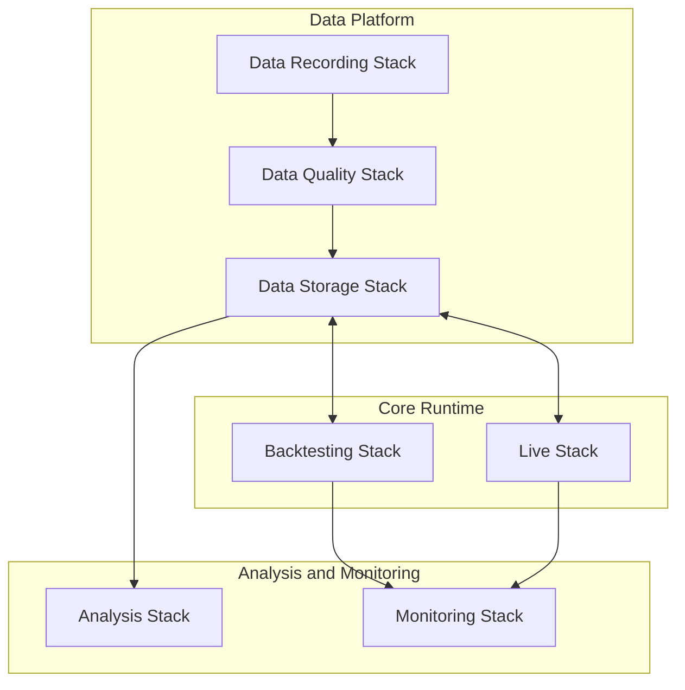
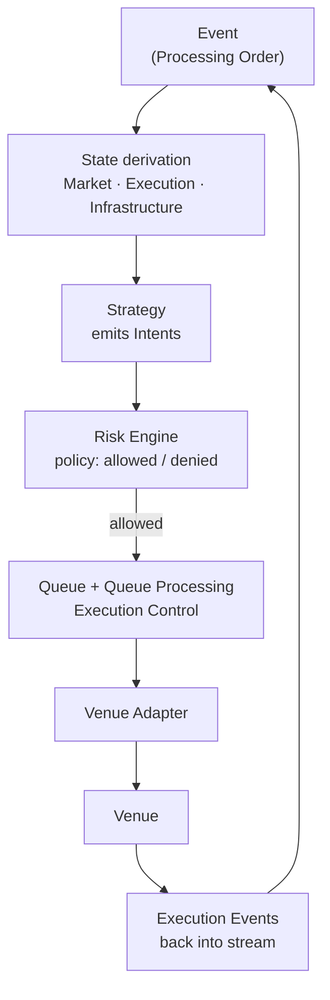

# Architecture Overview

For the architectural design philosophy of the Infrastructure see:
[Architecture Principles](../10-architecture/architecture-principles.md)

---

## Purpose and scope

This document provides a **top-level architectural overview** of the Infrastructure.

It explains:

- the **major architectural layers** and their roles
- the **Core Runtime**: the deterministic event-driven engine that executes trading logic
- how **Backtesting** and **Live** Runtimes relate to each other
- how supporting infrastructure layers relate to the Core Runtime

This document describes **structural architecture**. It does not replace:

- [Logical Architecture](logical-architecture.md) — logical component definitions and responsibility boundaries
- [Infrastructure Flows](infrastructure-flows.md) — step-by-step runtime sequencing within the Core
- [Concepts Overview](../20-concepts/concepts-overview.md) — semantic definitions of Events, State, Intent, Order, etc.

Capitalized terms are used as in [Terminology](../00-guides/terminology.md).

---

## Architectural layers

The Infrastructure is organized into three structural layers:

| Layer | Role |
| ----- | ---- |
| **Data Platform** | Collects, validates, and stores canonical datasets |
| **Core Runtime** | Executes trading logic deterministically (Backtesting and Live) |
| **Analysis and Monitoring** | Evaluates results and observes operational health |

---

## Core Runtime

The **Core Runtime** is the deterministic, event-driven engine that executes **Strategy** logic, manages **risk**, controls **outbound execution**, and processes **Venue feedback**.

It is the semantic center of the Infrastructure. The Data Platform supplies canonical inputs; Analysis and Monitoring consume outputs. The Core Runtime applies the **Event Stream** under **Configuration** and produces **derived State**, dispatch decisions, and **Orders**.

### Deterministic event-driven processing

The Core Runtime advances **only** through **Event processing**:

`State = f(Event Stream, Configuration)`

Every **State transition** results from processing a canonical **Event**. There are no spontaneous state changes, no out-of-band mutations, and no independent runtime ticks. Given an identical **Event Stream** and identical **Configuration**, the Core Runtime always produces identical **State** and identical dispatch decisions.

### Core runtime chain

At the architectural level, the Core Runtime executes the following chain on each processing step:

**Architectural roles in the chain:**

| Component | Role |
| --------- | ---- |
| **Event intake** | Events are consumed in **Processing Order**, not wall-clock order |
| **State derivation** | Derived State is updated: `f(Event Stream, Configuration)` |
| **Strategy** | Reads State projections; emits **Intents** (ephemeral commands, not Events) |
| **Risk Engine** | Evaluates each Intent for **policy admissibility** (allowed / denied) only |
| **Queue + Queue Processing** | Schedules and dispatches **allowed** work; implements **Execution Control** only; part of deterministic Event processing — not a separate tick |
| **Venue Adapter** | Protocol translation and external I/O; no policy or scheduling authority |
| **Venue** | External or simulated execution environment; emits feedback as Events |

### Key architectural constraints

**Intent.** An Intent is a **command** produced by Strategy. It is not an Event, not persistent, and not an Order. It enters the processing chain as transient input to the current step. Intent-processing outcomes appear in the stream as Events only when canonical history requires it.

**Risk.** The Risk Engine decides **admissibility only** (allowed / denied). It does not schedule transmission, apply rate limits, or manage inflight gating. Those responsibilities belong exclusively to **Execution Control** (Queue + Queue Processing).

**Queue and Execution Control.** The Queue is **derived execution-control substate** within **Execution State** — not a fourth top-level domain, not a source of truth, and fully recomputable from **Event Stream + Configuration** ([Queue Semantics](../20-concepts/queue-semantics.md)). Queue Processing runs as a deterministic computation **within Event processing** — there is no separate runtime tick.

**Orders.** An **Order** is a derived entity in **Execution State**. The Order lifecycle **begins at submission** (`Submitted` is the first Order state). Queue residency, Risk acceptance, and Intent generation do not constitute an Order. After submission, Order state evolves through **Execution Events** from the Venue. The Intent lifecycle and Order lifecycle are distinct.

---

## Data Platform

The Data Platform collects, validates, and stores canonical datasets for use by the Core Runtime and Analysis.

### Data Recording Stack

Collects raw market data from real Venues.

Responsibilities: connecting to Venue APIs and data feeds, recording order book updates and trades, persisting raw streams, handling reconnects and interruptions.

### Data Quality Stack

Validates and normalizes recorded raw datasets before promotion to Canonical Storage.

Responsibilities: schema validation, gap detection, normalization of Venue-specific formats, promotion of validated datasets.

### Data Storage Stack

Stores canonical datasets — validated market data, Research datasets, and experiment results — that the Core Runtime and Analysis consume.

Canonical Storage is the source of validated persistent data for replay and Research. It is **not** the Runtime Event Stream; deterministic replay and State reconstruction are defined from Events, not from storage alone.

---

## Analysis and Monitoring

### Analysis Stack

Provides tools for inspecting datasets and experiment results produced by the Core Runtime.

Responsibilities: experiment analysis, Strategy evaluation, performance evaluation, dataset exploration.

The Analysis Stack is read-only with respect to canonical datasets.

### Monitoring Stack

Provides operational visibility into running Stacks and infrastructure.

Responsibilities: metrics collection, Runtime telemetry, operational dashboards, alerting and incident visibility.

---

## Backtesting and Live parity

A central architectural goal of the Infrastructure is **semantic parity** between Backtesting and Live.

Both Runtimes run the same **Core Runtime** semantics:

- **Event-driven, deterministic processing** (`State = f(Event Stream, Configuration)`)
- Same **Intent → Risk → Execution Control → Venue Adapter** chain
- Same **Order lifecycle** beginning at submission
- Same **Queue** semantics: derived execution-control substate, no independent tick

Infrastructure differs between the two Runtimes; semantics do not:

| Aspect | Backtesting | Live |
| ------ | ----------- | ---- |
| Market data source | Historical datasets from Canonical Storage | Live Venue feeds |
| Venue | Simulated Venue | Real Venue |
| Operation mode | Batch experiments | Continuous operation |
| Goal | Strategy evaluation | Capital deployment |

This design ensures that behavior validated during Backtesting is structurally reproducible in Live execution: same Core, same rules, different inputs and Venue boundary.

---

## Relationship to other documents

| Document | What it adds |
| -------- | ------------ |
| [Logical Architecture](logical-architecture.md) | Logical component definitions and hard responsibility boundaries |
| [Infrastructure Flows](infrastructure-flows.md) | Step-by-step canonical sequencing within the Core Runtime |
| [Physical Architecture](physical-architecture.md) | Infrastructure deployment and runtime environment |
| [Concepts Overview](../20-concepts/concepts-overview.md) | Semantic definitions of Event, State, Intent, Order, Queue, etc. |
| [State Model](../20-concepts/state-model.md) | Formal definition of `State = f(Event Stream, Configuration)` and State domains |
| [Determinism Model](../20-concepts/determinism-model.md) | What determinism requires and what breaks it |
| [Order Lifecycle](../20-concepts/order-lifecycle.md) | Order states and transitions from submission onward |
