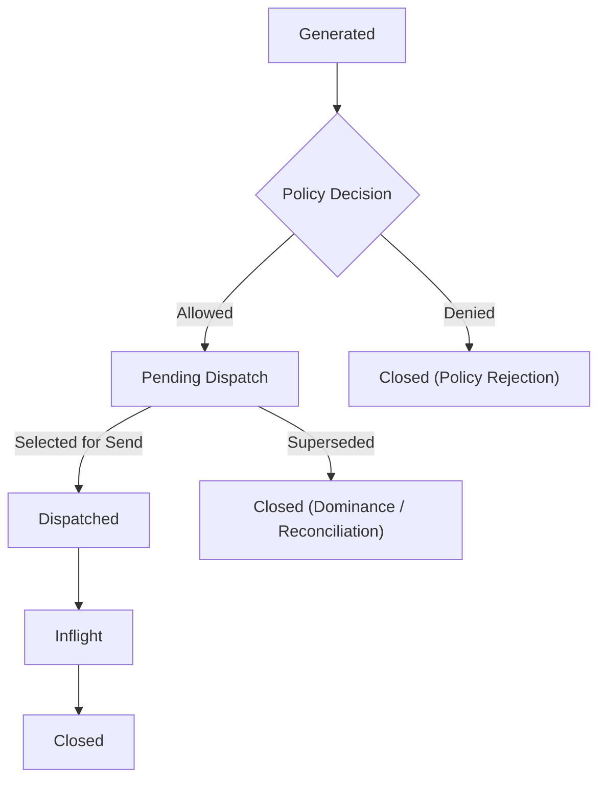

# Intent Lifecycle

---

## Purpose and scope

This document defines the **lifecycle of Intents only**: how a **command** produced by **Strategy** moves from creation to **terminal disposition** inside the Infrastructure.

It specifies **conceptual stages** and **valid transitions**. It does **not**:

- define **Order** lifecycle ([Order Lifecycle](../20-concepts/order-lifecycle.md));
- restate formal **Event** or **State** semantics ([Event Model](../20-concepts/event-model.md), [State Model](../20-concepts/state-model.md));
- replace the canonical glossary ([Terminology](../00-guides/terminology.md));
- restate full **Runtime** sequencing ([System Flows](system-flows.md)) or component boundaries ([Logical Architecture](logical-architecture.md));
- specify **Queue** structure, **dominance** algorithms, or **scheduling** policies in detail ([Queue Semantics](../20-concepts/queue-semantics.md), [Intent Dominance](../20-concepts/intent-dominance.md), [Queue Processing](../20-concepts/queue-processing.md), [Intent Pipeline](intent-pipeline.md)).

Capitalized terms are used as in [Terminology](../00-guides/terminology.md).

---

## What an Intent represents

An **Intent** is an ephemeral **command**—a desired trading action (e.g. `NEW`, `REPLACE`, `CANCEL`) in internal form, produced by **Strategy** during **Event processing**.

**Normative rules:**

1. An Intent is **not** an **Event**, **not** an **Order**, and **not** a **persistent mutable object** with its own parallel history.
2. The **Intent lifecycle** is the conceptual progression of that command through **policy**, **Execution Control**, **dispatch**, and **disposition**.
3. Progress becomes **system-visible** and **replayable** only through **Intent-related Events** when **canonical history** so requires ([Terminology: Intent visibility](../00-guides/terminology.md#intent-visibility), [Event Model: Intent-related Events](../20-concepts/event-model.md#intent-related-events)).

Naming **IntentGenerated**, **IntentAccepted**, **IntentRejected**, and **IntentDispatched** below names **categories of records** that **may** appear on the stream when required—not every transition **must** emit a dedicated Event type if Configuration does not demand that record for replay or audit.

---

## Lifecycle stages

These **stages** describe the **Intent** alone. They **do not** name **Execution Events** from the **Venue** or **Order** projection states (those belong to **Order lifecycle** and **Execution State** derivation).

| Stage | Meaning |
| ----- | ------- |
| **Generated** | Strategy has emitted the command for the current processing context. |
| **Policy decided** | **Risk** has classified the command as **allowed** or **denied** (policy only). |
| **Pending dispatch** | **Allowed** and represented in **derived execution-control substate** (Queue), awaiting selection for send. |
| **Dispatched** | Handed to the **Venue Adapter** for outbound I/O in this processing arc. |
| **Inflight** | Outbound request for this arc is outstanding; System awaits protocol-level completion relevant to this dispatch. |
| **Closed** | Terminal: no further progression for **this** Intent’s logical arc. |

A separate stage: **Eligible**. **Eligibility**—whether an Intent in **Pending dispatch** may be selected this step—is a **deterministic execution-control derivation** ([Terminology: Queue Processing](../00-guides/terminology.md#queue-processing)). It is **not** a mandatory named lifecycle state and does **not** by itself require an **Event** unless **canonical history** explicitly requires recording it ([Terminology: Intent visibility](../00-guides/terminology.md#intent-visibility)).

Similarly, **rate-limit** and **wakeup** readiness are **derivations** inside **Execution Control**, **not** additional lifecycle stages.

---

## Valid transitions

**Normative ordering** (not every Intent traverses every stage):

1. **Generated → Policy decided** — **Strategy** output is evaluated by the **Risk Engine** ([System Flows](system-flows.md)).  
   - **Intent-related Event:** **IntentGenerated** may be recorded **if** canonical history requires visibility of generation.

2. **Policy decided** — **Allowed** or **denied** only ([Logical Architecture](logical-architecture.md)).  
   - **Denied** → **Closed**.  
   - **Intent-related Events:** **IntentAccepted** / **IntentRejected** **if** canonical history requires recording the policy outcome.

3. **Policy allowed → Pending dispatch** — **Execution Control** merges **allowed** work into **derived Queue substate** ([State Model](../20-concepts/state-model.md)).  
   - Residency here is **execution-control substate** ([Queue Semantics](../20-concepts/queue-semantics.md)).  
   - **Queue Processing** runs **inside** the same **Event processing** as the rest of the step ([System Flows](system-flows.md)); there is **no separate tick**.

4. **Pending dispatch → Closed (superseded)** — While resident in that substate, reconciliation (e.g. [Intent Dominance](../20-concepts/intent-dominance.md)) may **replace** or **remove** this logical Intent in favor of a more effective command. **Supersession** is **terminal** for the superseded **Intent**’s arc and does **not** imply an **Order** state by itself.

5. **Pending dispatch → Dispatched** — **Queue Processing** selects this work for send; handoff to **Venue Adapter**.  
   - **Intent-related Event:** **IntentDispatched** **if** canonical history requires recording dispatch.

6. **Dispatched → Inflight** — Outbound request is active; **Execution Control** may **block** competing requests per **Order** key ([Intent Pipeline](intent-pipeline.md)). This is **Intent-centric** coordination, **not** the **Order lifecycle** definition.

7. **Inflight → Closed** — The **Intent**’s outbound arc is **done** for lifecycle purposes: protocol-level handling for this dispatch has reached a **terminal** point defined by System rules (e.g. acknowledgement of execution outcome that **closes** this Intent’s obligation in derived Execution / execution-control projections).  
   - Concrete **Order** states (accepted, filled, canceled, etc.) are defined in [Order Lifecycle](../20-concepts/order-lifecycle.md) and arise from **Execution Events**, not from Intent stages.

**Not all stages emit Events:** internal steps such as **dominance**, **eligibility**, and **scheduling** remain **deterministic derivations** unless **explicitly** required on the **Event Stream** for canonical history (see [Terminology: Intent visibility](../00-guides/terminology.md#intent-visibility)).

---

## Terminal outcomes

An **Intent** ends in exactly one **terminal** class:

| Outcome | Description |
| ------- | ----------- |
| **Policy rejection** | **Denied** by **Risk**; never enters **Pending dispatch**. |
| **Superseded** | Removed or replaced in **execution-control substate** before **Dispatched** (e.g. [Intent Dominance](../20-concepts/intent-dominance.md)); no longer an active outbound command for that arc. |
| **Closed after dispatch** | **Dispatched** (when that occurs) and processed through **Inflight** to lifecycle **Closed** per System rules; the **Intent** arc is finished. **Order** and position projections may continue to evolve under **Order lifecycle** independently. |

Terminal outcomes for Intents **must not** be conflated with **Order** terminal states (fully filled, canceled at Venue, etc.—see [Order Lifecycle](../20-concepts/order-lifecycle.md)).

---

## Relationship to Orders and Execution State

- An **Order** is a **derived** projection in **Execution State** ([Terminology: Order](../00-guides/terminology.md#order)). Its lifecycle **begins at submission** with state **Submitted** and is defined only in [Order Lifecycle](../20-concepts/order-lifecycle.md).
- **Intents** are **commands** that may **lead** to **dispatch** and then to **Execution Events** that update **Orders**; an Intent **is not** an Order and **does not** carry **Order** state names.
- **Correlation** between a logical **Intent** arc and an **Order** (e.g. replace/cancel targeting an existing **Order**) is represented in **derived State**, not by merging the two lifecycles in this document.

---

## Dominance and transmission stability

**Intent dominance** and similar reconciliation apply to work **resident in Pending dispatch** (derived **Queue** substate). After handoff to the **Venue Adapter** (**Dispatched**), execution-control reconciliation **does not** retroactively replace the transmitted command for that send. This boundary matches the separation between **pre-dispatch** reconciliation and **stable** outbound requests (see [Intent Pipeline](intent-pipeline.md)).

---

## Lifecycle invariants

1. **Intent is a command** — **Ephemeral** Strategy output; **not** an **Event** and **not** an **Order**.
2. **Visibility** — Lifecycle progression that must appear in **canonical history** is reflected via **Intent-related Events** and **State** derivation, not via a parallel mutable Intent store ([Event Model](../20-concepts/event-model.md)).
3. **Policy vs Execution Control** — **Risk** sets **allowed / denied** only; **transmission timing**, **ordering**, **inflight** gating, and **rate-compliant** sequencing are **Queue Processing** only ([Logical Architecture](logical-architecture.md)).
4. **Queue is derived** — **Pending dispatch** is **execution-control substate**, **not** a fourth top-level State domain and **not** a second source of truth ([State Model](../20-concepts/state-model.md)).
5. **No separate tick** — Progression through stages occurs **within deterministic Event processing** ([System Flows](system-flows.md)).
6. **Derivations ≠ lifecycle states** — **Eligibility**, **scheduling**, and similar rules **do not** add mandatory named stages or **Events** **unless** canonical history explicitly requires them.
7. **Order lifecycle is separate** — **Order** evolution after **submission** (state **Submitted**) is defined in [Order Lifecycle](../20-concepts/order-lifecycle.md), not here.

---

## Relationship to other documents

- [Terminology](../00-guides/terminology.md) — canonical terms.
- [Event Model](../20-concepts/event-model.md), [State Model](../20-concepts/state-model.md) — **Event** / **State** semantics.
- [Logical Architecture](logical-architecture.md), [System Flows](system-flows.md) — responsibilities and Runtime order.
- [Intent Pipeline](intent-pipeline.md), [Queue Semantics](../20-concepts/queue-semantics.md), [Queue Processing](../20-concepts/queue-processing.md), [Intent Dominance](../20-concepts/intent-dominance.md) — pipeline and queue mechanics.
- [Order Lifecycle](../20-concepts/order-lifecycle.md) — **Order** progression (distinct from this document).
