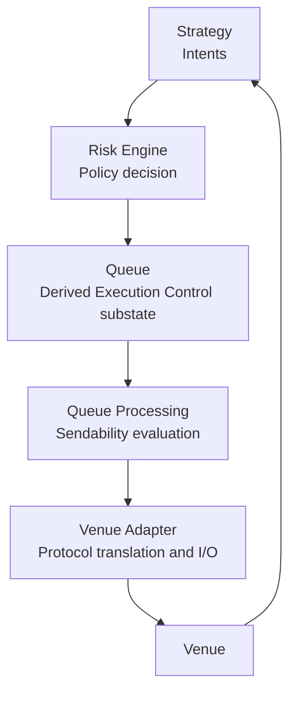

# Intent Pipeline

---

## Purpose and scope

This document defines the **outbound Intent pipeline** as a **conceptual transformation path**: the sequence of stages through which a **Strategy**-produced **Intent** passes before becoming an outbound submission to a **Venue**.

The pipeline is **not** an independent runtime engine and **not** a second source of truth. It is the **conceptual view** of how an **Intent** command flows through **policy decision**, **Execution Control handling**, and **dispatch** as part of deterministic **Event processing** ([Infrastructure Flows](infrastructure-flows.md)).

This document does **not**:

- restate formal **Event** or **State** semantics ([Event Model](../20-concepts/event-model.md), [State Model](../20-concepts/state-model.md));
- replace the canonical glossary ([Terminology](../00-guides/terminology.md));
- replace component responsibility definitions ([Logical Architecture](logical-architecture.md));
- replace lifecycle definitions ([Intent Lifecycle](intent-lifecycle.md), [Order Lifecycle](../20-concepts/order-lifecycle.md));
- replace Queue Processing evaluation rules ([Queue Processing](../20-concepts/queue-processing.md)).

Capitalized terms are used as in [Terminology](../00-guides/terminology.md).

---

## What the outbound Intent pipeline represents

The outbound Intent pipeline is the conceptual path that describes **how** an **Intent**—an ephemeral **command** produced by **Strategy**—is transformed into a stable, rate-compliant, sequenced outbound request handed to a **Venue**.

Rather than forwarding every generated **Intent** directly to the **Venue**, the Infrastructure applies a **reconciliation and control** process before dispatch. This prevents structural execution instabilities such as:

- duplicate requests targeting the same **Order**;
- replace or cancel storms from high-frequency **Strategy** output;
- overlapping concurrent requests for the same **Order** (inconsistent **Order** lifecycle transitions).

The pipeline is best understood as the **logical path through canonical Event processing** at which an **Intent** command is validated, reconciled, scheduled, and submitted—not as a parallel runtime with its own state or clock.

---

## Pipeline stages

The outbound Intent pipeline has **five** conceptual stages. Each stage has a single, bounded responsibility.

| Stage | Responsibility |
| ----- | -------------- |
| **Strategy** | Reads derived **State** projections; produces **Intents** (commands). |
| **Risk Engine** | Evaluates each **Intent** for **policy admissibility** (allowed / denied). |
| **Queue** | Holds **derived Execution Control substate**: reconciled **allowed** pending outbound work. |
| **Queue Processing** | Evaluates **sendability** among pending work; applies eligibility, inflight gating, ordering, rate-limit rules. |
| **Venue Adapter** | Translates selected work into **Venue**-specific requests; surfaces **Venue** responses as **Events**. |

The **Venue** is outside the pipeline proper; it receives requests and emits **Execution Events** that re-enter the **Event Stream** and close the feedback loop.

---

## Policy vs Execution Control

The pipeline enforces a strict separation between **two** independent control planes:

| Control plane | Stage | Question answered |
| ------------- | ----- | ----------------- |
| **Policy** | Risk Engine | *Is this Intent admissible under policy?* |
| **Execution Control** | Queue + Queue Processing | *Of the admissible work, what can be sent right now?* |

**Policy** comes first and is **irreversible** within the pipeline: a **denied** Intent does not proceed to Execution Control. **Risk** does **not** decide transmission timing, ordering, rate-limit compliance, or inflight gating—those are **Execution Control** only ([Logical Architecture](logical-architecture.md)).

**Execution Control** (Queue + Queue Processing) operates **only** on **allowed** work. It may **delay** transmission, **reconcile** concurrent commands, or **gate** concurrent requests, but it **cannot** reinstate **denied** Intents and does **not** re-run policy ([Queue Processing](../20-concepts/queue-processing.md)).

---

## Derived Queue and dispatch readiness

### The Queue as derived Execution Control substate

The **Queue** is **derived Execution Control substate**: a projection within **Execution State** that holds the current effective pending outbound work per logical order key, recomputable from **Event Stream + Configuration** ([Queue Semantics](../20-concepts/queue-semantics.md)).

Because the **Queue** is derived, its contents are **reconstructible** by replay—the **Event Stream** remains canonical.

### Reconciliation at Queue admission

When an **allowed** Intent enters Execution Control substate, reconciliation (e.g. [Intent Dominance](../20-concepts/intent-dominance.md)) is applied: the Queue holds **at most one effective command** per logical order key. Redundant or superseded commands are collapsed before dispatch.

For example, if **Strategy** produces rapid successive updates for the same **Order**:

`NEW ➝ REPLACE ➝ REPLACE ➝ REPLACE ➝ CANCEL`

Reconciliation collapses these to the single effective command:

`CANCEL`

Only the minimal effective command is dispatched. This is a **deterministic derivation** from current State and Configuration; it does **not** require a separate **Event** per supersession unless canonical history explicitly demands it ([Terminology: Intent visibility](../00-guides/terminology.md#intent-visibility)).

### Sendability evaluation

**Queue Processing** evaluates which pending work is **sendable** in the current processing step by applying ([Queue Processing](../20-concepts/queue-processing.md)):

- **State validity**: the pending command is still coherent under current derived State.
- **Inflight gating**: no conflicting request for the same order key is outstanding.
- **Rate-limit compliance**: outbound capacity is available under Configuration rules.
- **Ordering**: deterministic ordering among multiple eligible commands.

These are **internal deterministic derivations** over derived State. They do **not** require separate canonical **Event** types unless the Infrastructure explicitly requires records for replay or audit ([Terminology: Intent visibility](../00-guides/terminology.md#intent-visibility)).

Queue Processing is part of **deterministic Event processing**—**not** a separate tick or autonomous scheduler loop ([Infrastructure Flows](infrastructure-flows.md)).

---

## Submission boundary and Order emergence

**Submission** is the **semantic boundary** between the **Intent lifecycle** and the **Order lifecycle**.

**At dispatch:**

- the **Intent** lifecycle enters **Dispatched** then **Inflight** ([Intent Lifecycle](intent-lifecycle.md));
- the **Venue Adapter** transmits the outbound request;
- the **Order** comes into existence in **Execution State** at **Submitted**—this is the **entry point** of the **Order lifecycle** ([Order Lifecycle](../20-concepts/order-lifecycle.md)).

**The Order exists from the moment of dispatch**, not from any later Venue response. The Infrastructure records a **Submitted** representation as soon as the outbound request is transmitted.

**After dispatch**, the **Venue** processes the request and returns responses. These responses enter the **Event Stream** as **Execution Events** and **evolve the existing Order** through subsequent lifecycle stages (e.g. **Accepted**, **Filled**, **Rejected**, **Cancelled**). Venue acknowledgement does **not** create the Order for the first time—it advances an Order that already exists in **Submitted** state.

**Pre-dispatch stages**—Intent command creation, Risk policy evaluation, Queue residency, and Queue Processing evaluation—belong entirely to the **Intent lifecycle**. **No Order** exists in **Execution State** during those stages.

The pipeline's role ends at dispatch. Everything from **Submitted** onward is governed by the **Order lifecycle** and **Execution Events**.

---

## Structural stability guarantees

The reconciliation and control mechanisms of the pipeline provide **structural protection** against unstable execution behavior as a natural consequence of the derivation rules—not through ad hoc filters:

- **No duplicate requests:** at most one effective command per order key is held in Execution Control substate.
- **No replace storms:** successive replaces collapse to the most recent effective replace.
- **No cancel storms:** multiple cancels for the same order key collapse to a single cancel.
- **No concurrent conflicts:** inflight gating ensures at most one outstanding request per order key.

These guarantees hold under **deterministic** replay.

---

## Relationship to other documents

This document defines the **conceptual pipeline path**. For the detailed semantics of each aspect, see:

- [Terminology](../00-guides/terminology.md) — canonical terms.
- [Logical Architecture](logical-architecture.md) — component boundaries and responsibilities.
- [Infrastructure Flows](infrastructure-flows.md) — canonical **Runtime** sequencing of all pipeline stages within **Event processing**.
- [Intent Lifecycle](intent-lifecycle.md) — **Intent** stage progression (`Generated ➝ Policy decided ➝ Pending dispatch ➝ Dispatched ➝ Inflight ➝ Closed`).
- [Order Lifecycle](../20-concepts/order-lifecycle.md) — **Order** evolution from **Submitted** onward (downstream from pipeline dispatch).
- [Queue Processing](../20-concepts/queue-processing.md) — deterministic sendability evaluation rules.
- [Queue Semantics](../20-concepts/queue-semantics.md) — Queue structure and identity model.
- [Intent Dominance](../20-concepts/intent-dominance.md) — reconciliation rules at Queue admission.
