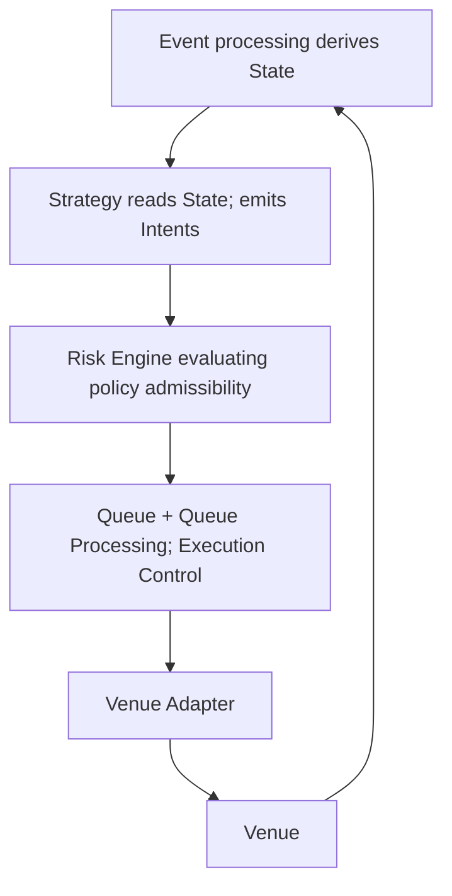

# Logical Architecture

---

## Purpose and scope

The **Logical Architecture** defines the **logical components** of the Infrastructure, their **responsibilities**, and **hard boundaries** between them.

It answers:

- which **Components** exist at the logical layer;
- what each Component **must** and **must not** do;
- how Components **relate** conceptually.

This document **does not**:

- redefine **Event** or **State** formal semantics ([Event Model](../20-concepts/event-model.md), [State Model](../20-concepts/state-model.md));
- replace the canonical glossary ([Terminology](../00-guides/terminology.md));
- define **Order lifecycle** stages ([Order Lifecycle](../20-concepts/order-lifecycle.md));
- describe **Stack** placement or **physical** deployment ([Physical Architecture](physical-architecture.md));
- provide a full **Runtime** walkthrough ([Infrastructure Flows](infrastructure-flows.md)).

Canonical terms (**Event**, **Intent**, **State**, **Queue**, **Risk**, **Execution Control**, **Order**) mean what [Terminology](../00-guides/terminology.md) defines.

---

## Architectural principles in context

The logical layer assumes the following (see foundational documents for detail):

1. **State** is fully **derived** from **Event Stream + Configuration**; **Events** are the **only** source of **State transitions**.
2. An **Intent** is an ephemeral **command**, **not** an Event and **not** persistent; intent-processing outcomes become visible through **Events** when **canonical history** requires it.
3. **Risk** is the **policy layer only**. **Queue** and **Queue Processing** implement **Execution Control** only. The **Queue** is **derived execution-control substate**, not a second source of truth.
4. **Queue Processing** is part of **deterministic Event processing**—there is **no** separate Runtime **tick** or **loop** owned by the Queue as an autonomous subinfrastructure.
5. An **Order** is a **derived entity** in **Execution State**; its lifecycle **begins at submission** with state **Submitted**. Strategy does not **own** Orders as primary control objects.

Components **read** derived State (or documented **projections** of it). They **do not** hold parallel mutable “truths”. Effects on State occur only through **Event processing** under Configuration.

---

## Core logical components

At the logical layer, the following Components cooperate:

| Component | One-line role |
| --------- | ------------- |
| **Runtime / Core** (conceptual envelope) | Applies the Event Stream, derives State, and invokes the other logical Components in the order implied by processing rules—not defined procedurally here. |
| **Strategy** | Produces **Intents** from read-only views of derived State. |
| **Risk Engine** | Decides **policy admissibility** of each Intent (**allowed** / **denied**). |
| **Queue** | Holds **execution-control substate**: reconciled **allowed** pending outbound work (derived). |
| **Queue Processing** | Computes **Execution Control**: eligibility, ordering, inflight gating, rate-compliant timing—**within** Event processing. |
| **Venue Adapter** | **Protocol translation** and **external I/O** to or from the **Venue**. |
| **Venue** | **Infrastructure boundary**: external or simulated execution environment. |

The **Runtime / Core** is not a separate “business” Component; it names the **processing context** in which logical Components operate. Concrete packaging belongs to implementation docs.

---

## Responsibilities and boundaries

### Strategy

**Responsibilities:**

- Consume **projections** of **derived State** (Market and Execution views as needed for the Strategy).
- Emit **Intents**: ephemeral **commands** expressing desired trading actions (e.g. create, replace, cancel).

**Normative boundaries:**

- Strategy **does not** mutate derived State directly.
- Strategy **does not** interact with the **Venue**, **Venue Adapter**, **Queue**, or **Risk** outside the contracts defined by the processing model ([State Model](../20-concepts/state-model.md), [Event Model](../20-concepts/event-model.md)).
- Strategy **must not** assume that an Intent has been executed or that an **Order** exists until **Execution State** reflects that through **Events** (Orders are **derived**; lifecycle **begins at submission** with state **Submitted**).

An **Order** is **not** a Strategy-owned control object; it is a **projection** in **Execution State**.

---

### Risk Engine

**Responsibilities:**

- Evaluate each **Intent** against **policy**: limits, kill-switch, parameter validity, and other **admissibility** rules.
- Emit or cause **Events** only as prescribed when a policy outcome must appear in **canonical history** (see [Terminology: Intent visibility](../00-guides/terminology.md#intent-visibility)).

**Normative boundaries:**

- Risk decides **admissibility only** (**allowed** / **denied**). It **does not**:
  - **schedule** outbound transmission;
  - choose **send timing** relative to rate limits or wakeups;
  - enforce **inflight** gating or **queue ordering**;
  - **manage rate limits** in the sense of execution pacing (that is **Execution Control**).
- Risk **does not** replace **Queue Processing**. “Send later” is **not** a Risk outcome; **delay** is decided by **Execution Control** after an Intent is **allowed**.

---

### Queue

**Responsibilities:**

- Materialize **derived execution-control substate**: effective pending outbound work for **allowed** Intents after reconciliation (e.g. dominance), as defined under Configuration.

**Normative boundaries:**

- The Queue is **not** a fourth top-level **State domain**; it is **substate** of **Execution State** ([State Model](../20-concepts/state-model.md)).
- The Queue is **not** a **second source of truth**; it must be **recomputable** from **Event Stream + Configuration** and deterministic execution-control rules.
- The Queue is **not** an autonomous decision center; it **stores** reconciled **allowed** work, not policy verdicts and not arbitrary Strategy history.

---

### Queue Processing

**Responsibilities:**

- **Execution Control** only: among **allowed** Intents, decide **whether** and **in what order** work may be presented to the **Venue Adapter**, subject to inflight rules, rate rules, and ordering rules—all as **deterministic functions** of current derived State and Configuration.

**Normative boundaries:**

- Queue Processing **does not** re-run **Risk policy** except where Configuration defines **re-validation** against projections that are themselves already derived State (policy layer remains conceptually separate).
- **Dominance**, **eligibility**, **inflight** status, and **scheduling** are **internal deterministic derivations** during Event processing; they **do not** spawn separate **Events** **unless** canonical history explicitly requires it ([Terminology: Intent visibility](../00-guides/terminology.md#intent-visibility)).
- **No separate runtime tick:** Queue Processing runs as part of **deterministic Event processing**, not as a parallel periodic loop.

---

### Venue Adapter

**Responsibilities:**

- Map internal outbound actions to **Venue-specific** requests.
- Perform **external I/O** (or simulator I/O) and surface Venue feedback so it can be represented as **Events** for the stream.

**Normative boundaries:**

- The Adapter **does not** decide **policy** (**Risk**) or **Execution Control** (**Queue Processing**).
- The Adapter **does not** own derived State; it **reads** what Execution Control hands off and **writes** the Infrastructure only through **Events** (or through mechanisms that append **Events**).

---

### Venue

**Responsibilities (boundary):**

- Accept execution requests and emit **market** and **execution** feedback according to the Venue’s (or simulator’s) rules.

The **Venue** is outside the logical Core; responses enter the Infrastructure as **Events**.

---

## Interaction model (high-level)

The following is a **conceptual** dependency between logical Components, **not** a procedural Runtime specification:

**Reading:**

- **Events** (from Venue, control, infrastructure, and recorded outcomes where required) advance **derived State** through **Event processing**.
- **Strategy** reads State and produces **Intents**.
- **Risk** filters Intents by **policy** only.
- **Queue** and **Queue Processing** apply **Execution Control** to **allowed** work.
- **Venue Adapter** translates and performs I/O; **Venue** sits at the boundary.

Feedback closes when Venue (and related) **Events** are applied—**State** updates; **Strategy** may run again under the same Event-processing rules.

---

## Determinism (logical layer)

**Logical** determinism means: given the same **Event Stream**, **Configuration**, and **Strategy** logic, derived **State** (including **execution-control substate**) is identical at each **Processing Order** position.

Components **must not** introduce behavior that depends on wall-clock time, OS scheduling, or hidden mutable stores outside **Event Stream + Configuration** and the formal derivation rules.

---

## Relationship to Runtimes

The **same** logical Components apply in **Backtesting** and **Live**. **Differences** are **infrastructure** and **boundary implementations** (e.g. historical vs live inputs, simulated vs real **Venue**, corresponding **Venue Adapter**), not separate logical roles for Strategy, Risk, or Execution Control.

---

## Non-responsibilities and explicit exclusions

| Topic | Where it belongs |
| ----- | ---------------- |
| Formal **Event** kinds and stream rules | [Event Model](../20-concepts/event-model.md) |
| **State** domains, derivation law, snapshots | [State Model](../20-concepts/state-model.md) |
| **Processing Order** vs **Event Time** | [Time Model](../20-concepts/time-model.md) |
| **Stack** layout and canonical datasets | [Architecture Overview](architecture-overview.md), stacks docs |
| **Order lifecycle** states and transitions | [Order Lifecycle](../20-concepts/order-lifecycle.md) |
| Step-by-step **Runtime** narrative | [Infrastructure Flows](infrastructure-flows.md) |
| **Deployment** | [Physical Architecture](physical-architecture.md) |

This document **must not** be read as defining **Intent lifecycle** stages; lifecycle docs map to processing; Component boundaries stay as above.

---

## Relationship to other documents

- [Terminology](../00-guides/terminology.md) — canonical terms.
- [Event Model](../20-concepts/event-model.md), [State Model](../20-concepts/state-model.md) — formal Event and State semantics.
- [Architecture Overview](architecture-overview.md) — structural Stacks.
- [Infrastructure Flows](infrastructure-flows.md) — operational propagation of Events and decisions.
- [Physical Architecture](physical-architecture.md) — deployment.
- [Order Lifecycle](../20-concepts/order-lifecycle.md) — Order progression (derived **Execution State**).
