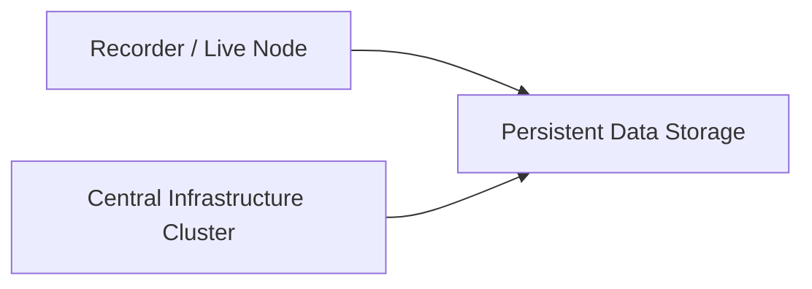
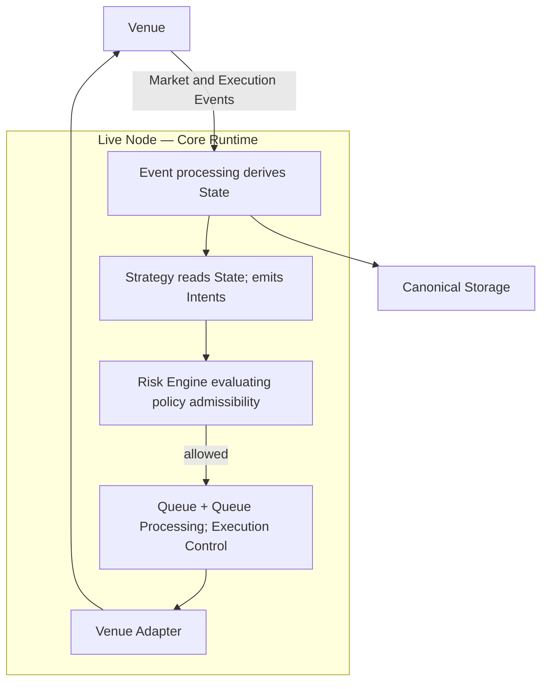
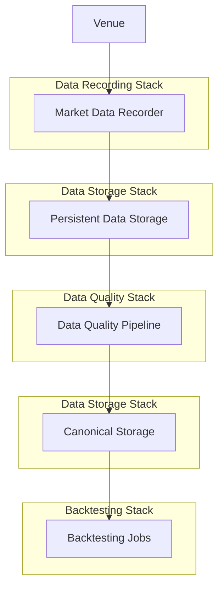
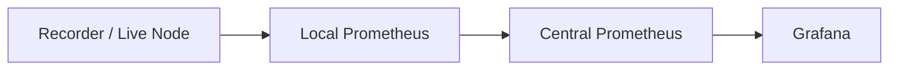

# Physical Architecture

---

## Purpose and scope

The Physical Architecture describes how the Infrastructure's logical components are realized as deployed infrastructure.

While the [Logical Architecture](logical-architecture.md) defines conceptual components and their responsibilities, this document explains:

- the physical deployment environments the Infrastructure operates in
- what runs where, and how physical components interact
- how the Core Runtime's canonical semantics are preserved across deployment boundaries
- how storage, transport, and observability infrastructure relate to the canonical model

This document does **not** redefine the core semantics established in the concept documents. For Event semantics, State derivation, processing chain, and lifecycle definitions, see [Logical Architecture](logical-architecture.md), [Infrastructure Flows](infrastructure-flows.md), and the concept documents listed in [Relationship to Other Documents](#relationship-to-other-documents).

Capitalized terms are used as in [Terminology](../00-guides/terminology.md).

---

## Deployment topology

The Infrastructure is deployed across three classes of physical infrastructure:

- **Recorder / Live Node** — low-latency server co-located near a Venue for market data collection or Live Execution
- **Central Infrastructure Cluster** — general-purpose server infrastructure for Research, Backtesting, and Analysis workloads
- **Persistent Data Storage** — shared storage connecting all Runtimes



Latency-sensitive components run close to Venues. Research and compute-intensive workloads run on scalable cluster infrastructure. Persistent Data Storage connects both.

---

## Core Runtime and deployment semantics

The **Core Runtime** is the deterministic, event-driven processing engine that applies the **Event Stream** under **Configuration** and produces derived **State**, dispatch decisions, and outbound actions.

**Backtesting** and **Live** are two physical deployment configurations of the same Core Runtime. Both realize the same canonical processing chain:

`Event Stream ➝ State derivation ➝ Strategy ➝ Risk ➝ Queue + Queue Processing ➝ Venue Adapter ➝ Venue`

and both obey `State = f(Event Stream, Configuration)`. Physical differences — data source, Venue implementation, compute environment — do not alter this semantics.

| Aspect | Backtesting deployment | Live deployment |
| ------ | ---------------------- | --------------- |
| Core Runtime location | Central Infrastructure Cluster | Recorder / Live Node |
| Event Stream source | Historical datasets from Canonical Storage | Live Venue feeds |
| Venue | Simulated Venue | Real Venue |
| Configuration source | Experiment configuration | Live configuration |
| Output destination | Canonical Storage (experiment artifacts) | Canonical Storage (execution records) |

This equivalence is the physical expression of the architectural principle that Backtesting and Live share the same conceptual runtime semantics.

---

## Recorder / Live Node

The Recorder / Live Node is dedicated, low-latency infrastructure deployed close to Venue endpoints.

It hosts two distinct operating modes depending on configuration:

### Market data recording

In recording mode, the node ingests raw market event data from Venue feeds and writes it to Persistent Data Storage for subsequent validation and canonicalization.

Typical responsibilities:

- Venue API and feed connectivity
- Raw market event capture and persistence
- Local operational monitoring

### Live Execution

In live trading mode, the node runs the **Core Runtime** connected to real Venues.

The Core Runtime on the Live Node implements the full canonical processing chain ([Infrastructure Flows](infrastructure-flows.md)):



**Physical component roles:**

| Component | Physical role |
| --------- | ------------- |
| **Event processing / State derivation** | Applies the Event Stream in Processing Order; derives Market, Execution, and Control State |
| **Strategy** | Reads State projections; emits Intents (ephemeral commands within the processing step) |
| **Risk Engine** | Evaluates each Intent for policy admissibility (allowed / denied) only |
| **Queue + Queue Processing** | Implements Execution Control within the same Event-processing step; schedules dispatch from allowed pending work; no separate runtime tick |
| **Venue Adapter** | Translates outbound dispatch decisions to Venue protocol; surfaces Venue responses as canonical Events |

**Order lifecycle at the Live Node:** An **Order** comes into existence in **Execution State** at submission. The Venue Adapter transmits the outbound request; the Order lifecycle begins from that point. Venue responses (fills, rejections, cancellations) return as **Execution Events**, which advance the already-existing Order through its lifecycle. Orders do not begin at Venue acknowledgment — they begin at submission.

Execution records (Order history, fills, positions) are written to **Canonical Storage** for analysis and audit.

**Typical processes on the Live Node:**

- Market Data Recorders (recording mode) or Live Core Runtime process (live mode)
- Venue Adapter processes
- Local monitoring instance (e.g. [Prometheus](https://prometheus.io/) forwarding operational metrics to the Central Infrastructure Cluster)

---

## Central Infrastructure Cluster

The Central Infrastructure Cluster hosts Research workloads and observability infrastructure. It is not latency-constrained and runs on scalable compute.

The cluster runs the **Core Runtime** in Backtesting configuration: same processing chain as Live, operating on historical Event Streams sourced from Canonical Storage, with a Simulated Venue in place of a real Venue.

Typical responsibilities:

- Large-scale Backtesting execution (Core Runtime against historical datasets)
- Experiment orchestration and parameter sweeps
- Data quality and normalization pipelines
- Analytics and reporting workloads
- Central observability services

Backtesting jobs consume datasets from Canonical Storage and write experiment artifacts (results, metrics, logs) back to Persistent Data Storage.

The cluster is isolated from Live infrastructure. Backtesting workloads cannot interfere with Live Execution.

**Typical workloads:**

- Backtesting jobs (Core Runtime in Backtesting mode)
- Experiment orchestration pipelines
- Analytics notebooks
- Observability services (e.g. [Prometheus](https://prometheus.io/), [Grafana](https://grafana.com/), [MLflow](https://mlflow.org/))

---

## Data Storage

Persistent Data Storage connects all Runtimes holding canonical datasets and arbitrary persisted outputs.

**Canonical Storage is not the runtime Event Stream.** During live execution, the Event Stream is the runtime stream managed by the Core Runtime on the Live Node. Canonical Storage holds promoted, validated datasets — historical market data, experiment results, and execution records — that Research consumes. State reconstruction for Research is defined from those canonical datasets, not from a live storage read.

Typical storage responsibilities:

- Canonical market datasets (validated and promoted from raw recording)
- Backtesting experiment artifacts and results
- Live Execution records (Order history, fills, positions)
- Operational logs and telemetry

A typical storage layout:

```
data/
├─ raw/
├─ normalized/
├─ canonical/
├─ derived/
├─ quarantine/
└─ experiments/
```

The `canonical/` layer holds promoted validated market data used by Backtesting as its Event Stream input for historical Market Events.

---

## Market data pipeline

Market data enters the Infrastructure through Recorder nodes and is promoted to Canonical Storage through a validation pipeline:



1. Market data is collected from Venue feeds by the Recorder.
2. Raw data is written to Persistent Data Storage.
3. The Data Quality Pipeline validates and normalizes the data.
4. Validated datasets are promoted to Canonical Storage.
5. Backtesting jobs consume canonical datasets.

This pipeline ensures that Research Runtimes operate on validated, consistent historical inputs.

---

## Observability infrastructure

Observability infrastructure provides operational visibility into both Live and Backtesting Runtimes.

An example of metrics and telemetry flow from physical nodes to central observability services:



Typical observability components:

- **Prometheus** — metrics collection at node and cluster level
- **Grafana** — visualization and dashboards
- **MLflow** — experiment tracking for Backtesting workloads

Observability infrastructure is read-only with respect to canonical State. Operational metrics do not influence the Event Stream or derived State.

---

## Physical design principles

### Latency isolation

Latency-sensitive components — live market data capture and Live Core Runtime Execution — run on dedicated nodes close to Venue endpoints. Compute-intensive Research workloads run on cluster infrastructure. These environments do not share compute.

### Semantic equivalence across deployments

Backtesting and Live use the same Core Runtime code and canonical processing rules. Physical differences (data source, Venue, environment) do not alter the runtime semantics. A Strategy evaluated in Backtesting is evaluated against the same logical processing model it will encounter in Live.

### Shared storage, separate runtime truth

Persistent Data Storage connects all Runtimes and acts as the integration point for validated datasets and results. The Event Stream during Live Execution is managed by the Core Runtime process on the Live Node — it is not read from storage in real time. Storage holds canonical records; the Core Runtime holds Runtime State.

### Live isolation from Research

Live infrastructure is operationally isolated from Backtesting infrastructure. Experimental workloads in the cluster cannot affect Live Execution. Live Execution records are written to Persistent Data Storage for Research use, but this write path is one-directional and does not feed back into the Live Core Runtime.

---

## Relationship to other documents

| Document | What it adds |
| -------- | ------------ |
| [Logical Architecture](logical-architecture.md) | Component responsibilities and semantic boundaries — the logical model this document physically realizes |
| [Infrastructure Flows](infrastructure-flows.md) | Step-by-step canonical runtime sequencing; the processing chain realized in both Live and Backtesting deployments |
| [Architecture Overview](architecture-overview.md) | Top-level structural layers (Data Platform, Core Runtime, Analysis and Monitoring) |
| [Event Model](../20-concepts/event-model.md) | Formal definition of Events and the Event Stream |
| [State Model](../20-concepts/state-model.md) | `State = f(Event Stream, Configuration)` and State domains |
| [Determinism Model](../20-concepts/determinism-model.md) | What determinism requires; why physical differences between Runtimes do not affect semantic equivalence |
| [Order Lifecycle](../20-concepts/order-lifecycle.md) | Order from submission onward |
