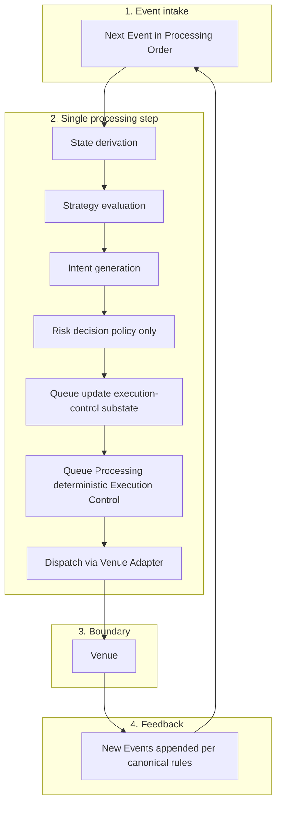

# System Flows

---

## Purpose and scope

This document describes **runtime sequencing**: how work moves from **Event intake** through **State derivation**, **decision-making**, **Execution Control**, **dispatch**, and **feedback** back into the **Event Stream**.

It explains **causal order** and **what runs when** in the canonical model. It does **not**:

- redefine terms ([Terminology](../00-guides/terminology.md));
- restate formal **Event** or **State** rules ([Event Model](../20-concepts/event-model.md), [State Model](../20-concepts/state-model.md));
- restate component boundaries ([Logical Architecture](logical-architecture.md));
- replace **Intent lifecycle** or **Order lifecycle** documents ([Intent Lifecycle](intent-lifecycle.md), [Order Lifecycle](../20-concepts/order-lifecycle.md)).

Canonical vocabulary applies throughout.

---

## Runtime flow overview

The System advances **only** through **deterministic Event processing**: each step applies **Events** from the **Event Stream** in **Processing Order** under **Configuration** and updates **derived State** (see [Time Model](../20-concepts/time-model.md)).

There is **one** unified Runtime sequence for a given applied Event—**no** competing alternative flows. **Queue Processing** is **not** a second **loop**, **tick**, or **scheduler phase**; it is part of **the same** Event-processing step that updates Market, Execution (including **execution-control substate**), and System domains.

The diagram is **logical** sequencing within processing, not a second concurrent pipeline. **Feedback** closes the loop when **Events** re-enter the stream; the next advance is again **Event-driven**.

If a step has nothing to do (e.g. no **Intents**, or no outbound work selected), the **order** of stages is unchanged; those substeps are **vacuous** for that application. Causal order **when** work exists is always as listed.

---

## End-to-end event-driven sequence

The following is the **single canonical order** of stages when an **Event** is applied (names are descriptive; formal semantics remain in foundational docs).

### 1. Event intake

The next **Event** is taken in **Processing Order** (stream position), not by **Event Time** alone.

Sources include, per [Event Model](../20-concepts/event-model.md): **Market**, **Execution**, **Intent-related**, **System**, and **Control** categories—whatever the stream contains at that position.

---

### 2. State derivation

The **Event** is applied. **Derived State** becomes `f(stream_prefix, Configuration)` at the new position.

- **State** includes **Market State**, **Execution State**, and **Control State**.
- **Queue** (execution-control **substate**) is part of **Execution State** derivation, **not** a fourth top-level domain ([State Model](../20-concepts/state-model.md)).

No Component **mutates** truth outside this step.

---

### 3. Strategy evaluation

**Strategy** reads **projections** of **derived State** (Market and Execution views as needed).

**Strategy** does **not** advance Events or alter State directly.

---

### 4. Intent generation

**Strategy** emits zero or more **Intents**—ephemeral **commands** (create, replace, cancel), **not** Events, **not** persistent ([Terminology: Intent](../00-guides/terminology.md#intent)).

---

### 5. Risk decision (policy only)

For each **Intent**, the **Risk Engine** decides **admissibility** only:

- **Allowed** — passes to Execution Control.
- **Denied** — does **not** pass; policy forbids the command.

**Normative exclusions:** Risk **does not** classify Intents as “queued,” “send later,” or “immediate.” It **does not** own **rate-limit pacing**, **inflight** gating, or **transmission ordering**. It **does not** evaluate “execute now vs later”; **delay** belongs to **Queue Processing** ([Logical Architecture: Queue Processing](logical-architecture.md#queue-processing)).

If **canonical history** requires a visible policy outcome, it appears through **Events** per [Terminology: Intent visibility](../00-guides/terminology.md#intent-visibility).

---

### 6. Queue update / execution-control substate update

For **allowed** Intents, the **Queue** (derived **execution-control substate**) is updated: reconciliation (e.g. [Intent Dominance](../20-concepts/intent-dominance.md)), effective pending outbound work, and related bookkeeping as defined under **Configuration**.

The **Queue** is **derived execution-control substate** ([Queue Semantics](../20-concepts/queue-semantics.md)).

---

### 7. Queue Processing (deterministic Execution Control)

Still **within the same Event-processing step**, **Queue Processing** computes **Execution Control** only:

- **eligibility** (e.g. inflight, validity against current Execution projection);
- **ordering** among eligible work;
- **rate-compliant** timing and sequencing using **deterministic** rules tied to **Processing Order** and derived State—not wall-clock timers as authority.

This is **pure derivation** from current State + Configuration unless an outcome **must** be recorded as an **Event** for **canonical history** ([Terminology: Intent visibility](../00-guides/terminology.md#intent-visibility)).

**Dominance**, **eligibility**, and **scheduling** are **not** separate **Event types** **unless** explicitly required for canonical history; they do not need to be modeled as standalone “event kinds” in the flow narrative.

There is **no separate main loop** or **queue-processing phase** after the fact—only this stage inside **Event processing**.

---

### 8. Dispatch

Work selected for send is passed to the **Venue Adapter**: **protocol translation** and **external I/O** only ([Logical Architecture: Venue Adapter](logical-architecture.md#venue-adapter)).

**Dispatch** may occur only after **Execution Control** selects it; **Risk** has already **allowed** the underlying Intent.

---

### 9. Venue feedback

The **Venue** returns execution feedback. The Adapter surfaces this so it can enter the stream as **Execution Events** (and similar), per [Event Model](../20-concepts/event-model.md)—not to be confused with ephemeral **Intents**.

---

### 10. Event re-entry into the Event Stream

Feedback (and any other required records) is appended or merged into the **Event Stream** according to Processing rules so that the next application step sees a **canonical** history.

Until those **Events** are applied, **Execution State** does not reflect new acknowledgements, fills, or rejections—**Orders** and positions evolve **only** through **Events**.

---

## Distinct flows (event vs intent vs order)

Three notions must stay separate:

| Concern | What moves | Persistence |
| -------- | ----------- | ----------- |
| **Event flow** | **Events** in **Processing Order** | Immutable stream records; sole driver of **State transitions** |
| **Intent processing** | Ephemeral **Intents** → **allowed/denied** → **Execution Control** → dispatch | **Intents** are not persistent; visibility via **Events** when required |
| **Order evolution** | **Order** projections in **Execution State** | **Derived** from **Execution** (and where applicable **Intent-related**) **Events**; lifecycle **begins at submission** with state **Submitted** |

**Intent lifecycle** and **Order lifecycle** documentation define stage names; this document only fixes **where** they fit in Runtime sequencing—not a merged lifecycle model.

---

## Execution Control within the flow

**Execution Control** (Queue + Queue Processing) is solely responsible for:

- holding **effective** allowed pending work;
- **when** and **in what order** that work is **dispatched**, subject to inflight and rate rules;
- deterministic reconciliation steps that do not duplicate **Risk** policy.

**Risk** stops at **admissibility**. “Cannot send yet” is an **execution-control** outcome built from derived substate and rules, **not** a third Risk verdict.

---

## Feedback and state re-entry

After **Venue** (or simulator) behavior produces **Execution Events**:

1. Those **Events** enter the **Event Stream**.
2. On a later processing step, they **derive** updated **Execution State** (**Order** lifecycle transitions, fills, etc.).
3. **Strategy** may then emit new **Intents** based on new projections.

There is **no** parallel path where **Venue** updates **State** without **Events**.

---

## Invariants of the flow

1. **Single advancement mechanism:** Processing proceeds by applying the **Event Stream** under **Configuration**; **Queue Processing** is **inside** that mechanism, not beside it.
2. **State derivation:** `State = f(Event Stream, Configuration)`; Components **read** projections, they do **not** own mutable system truth.
3. **Risk vs Execution Control:** **Allowed / denied** only at **Risk**; **timing and ordering** only at **Queue Processing**.
4. **Intent vs Event:** **Intents** are commands during a step; they are **not** Events. Stream updates use **Events** only **when** canonical history requires ([Terminology: Intent visibility](../00-guides/terminology.md#intent-visibility)).
5. **Orders:** **Orders** are **derived** in **Execution State**; they **exist** from **submission** onward in state **Submitted** as projections; Strategy does **not** “send Orders” as primary objects— it sends **Intents**; the System **dispatches** and **Venue** **Execution Events** refine **Order** state.
6. **Determinism:** Same stream + Configuration → same derived State at each position (including execution-control substate).

---

## Relationship to other documents

- [Terminology](../00-guides/terminology.md) — definitions.
- [Logical Architecture](logical-architecture.md) — component boundaries.
- [Event Model](../20-concepts/event-model.md), [State Model](../20-concepts/state-model.md) — formal semantics.
- [Architecture Overview](architecture-overview.md) — Stacks (not the focus here).
