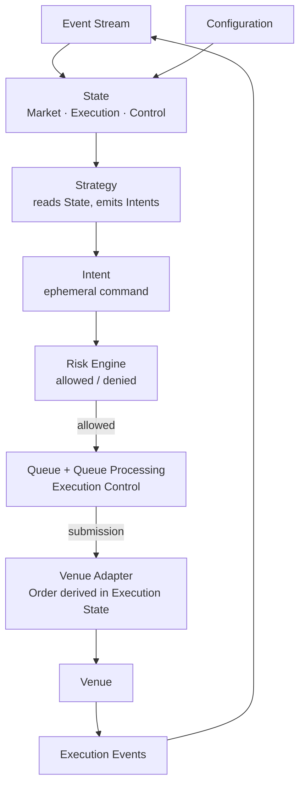

# Concepts Overview

---

## Purpose and scope

This document provides **semantic orientation** for the Infrastructure's core conceptual layer.

Each section below summarizes one core concept, states its role, and explains how it relates to others. Full normative rules, invariants, and lifecycle definitions are in the individual concept documents linked throughout.

Capitalized terms are used as in [Terminology](../00-guides/terminology.md).

This document does **not** restate full lifecycle stages, queue evaluation algorithms, or runtime walkthroughs. Those belong in the concept documents below.

---

## The canonical inputs

The Infrastructure's behavior is fully defined by two inputs. Everything else—all derived **State**, all dispatch decisions, all **Order** projections—is a deterministic function of these two.

### Event

An **Event** is an **immutable record of an occurrence** that the Infrastructure must treat as input to processing. Events are the **only source of State transitions**.

Events are not commands. They record what has observably occurred: market data, execution feedback, control signals, intent-processing outcomes where canonical history requires them.

→ [Event Model](event-model.md)

### Event Stream

The **Event Stream** is the **canonical, totally ordered sequence** of Events the Infrastructure applies. It defines **Processing Order**: the strict internal sequence that determines causality and State derivation.

**Event Time** (the external timestamp inside an Event) is metadata. It does not define Processing Order.

→ [Event Model](event-model.md) · [Time Model](time-model.md)

### Configuration

**Configuration** is the explicit, versioned set of rules, parameters, and ordering assumptions under which the Infrastructure processes the Event Stream and derives State. It is the second canonical input alongside the Event Stream.

Configuration must not change silently during processing. Any Configuration change that affects derived State must be represented as an explicit versioned input consistent with canonical history.

→ [Terminology: Configuration](../00-guides/terminology.md#configuration)

---

## Derived State

### State

**State** is the complete derived condition of the Infrastructure:

`State = f(Event Stream, Configuration)`

State is **not** a mutable store owned by components. It is a **deterministic projection**: recomputable by replaying the Event Stream under the same Configuration. Components read projections of State; they do not own it as independent truth.

→ [State Model](state-model.md)

### State Domains

Derived State is organized into **three** top-level domains:

| Domain | What it covers |
| ------ | -------------- |
| **Market State** | Market conditions derived from market-related Events |
| **Execution State** | Orders, fills, positions, balances, and execution-control substate |
| **Control State** | Runtime control flags, configuration status, and operational signals |

The **Queue** (execution-control substate) is part of **Execution State**. It is **not** a fourth top-level domain.

→ [State Model](state-model.md)

---

## Intent

An **Intent** is a **command** produced by **Strategy**: a desired trading action (`NEW`, `REPLACE`, `CANCEL`) in internal form, generated during Event processing.

Three normative distinctions define what an Intent is not:

- **Not an Event** — Intents do not enter the Event Stream as Intent objects.
- **Not persistent** — An Intent exists only as transient input to the processing step in which it is generated.
- **Not an Order** — Intent lifecycle and Order lifecycle are distinct and must not be collapsed.

Where the Infrastructure must record an Intent-processing outcome for canonical history (e.g. a policy decision, a dispatch), that record appears as an **Intent-related Event**, not as the Intent itself.

→ [Terminology: Intent](../00-guides/terminology.md#intent) · [Intent Lifecycle](../10-architecture/intent-lifecycle.md)

---

## Risk

The **Risk Engine** is the **policy layer only**. It evaluates each Intent and produces one binary decision: **allowed** or **denied**.

Risk does **not** schedule transmission, apply rate limits, manage inflight gating, or decide send timing. Those responsibilities belong exclusively to **Execution Control**.

→ [Logical Architecture: Risk Engine](../10-architecture/logical-architecture.md#risk-engine)

---

## Execution Control

**Execution Control** is the collective responsibility of **Queue** and **Queue Processing**: scheduling and transmitting allowed outbound work, without re-running policy.

### Queue

The **Queue** is **derived execution-control substate** within **Execution State**. It holds allowed pending outbound commands after reconciliation (e.g. dominance).

The Queue is:

- **not** a source of truth — it is fully recomputable from Event Stream + Configuration
- **not** a fourth top-level State domain — it is substate within Execution State
- **not** a buffer of raw Strategy emissions — it holds only effective reconciled pending work

→ [Queue Semantics](queue-semantics.md)

### Queue Processing

**Queue Processing** is a **deterministic computation within Event processing** — not a separate runtime tick, background loop, or independently clocked phase. It runs as part of the same sequential step that updates all derived State.

It decides, for the current processing step, which reconciled allowed Intents may be dispatched and in what order, subject to inflight rules and rate rules from Configuration.

Internal Queue Processing derivations — dominance, eligibility, inflight gating, scheduling — are **not** separate Events unless canonical history explicitly requires them.

→ [Queue Processing](queue-processing.md) · [Intent Dominance](intent-dominance.md)

---

## Order

An **Order** is a **derived entity in Execution State**. It represents the Infrastructure's execution-level tracking of a submitted outbound action.

**The Order lifecycle begins at submission.** `Submitted` is the first Order state. Nothing before dispatch — Intent generation, Risk acceptance, Queue residency — constitutes an Order.

After submission, Order state evolves exclusively through **Execution Events**. Venue acknowledgements, fills, rejections, and cancellations advance an already-existing Order; they do not create it.

→ [Order Lifecycle](order-lifecycle.md)

---

## Determinism

The Infrastructure is **deterministic**: given an identical Event Stream, identical Configuration, and the same Processing Order, it produces identical State at every stream position.

This requires:

- **No hidden state** outside Event Stream + Configuration
- **No out-of-band State mutations** by any component
- **No separate runtime tick** that advances execution-control state independently of Event processing
- **No wall-clock-dependent branching** in canonical logic

Determinism applies equally to **Backtesting** and **Live**. Infrastructure differs; the semantic model does not.

→ [Determinism Model](determinism-model.md) · [Invariants](invariants.md)

---

## Concept relationships

**Key relationships:**

- **Event Stream + Configuration** together fully determine all derived **State**.
- **Strategy** reads State projections and emits **Intents** (commands, not Events, not persistent).
- **Risk** decides admissibility only; **allowed** Intents proceed to **Execution Control**.
- **Queue + Queue Processing** schedule dispatch deterministically as part of Event processing — not a separate loop.
- At **submission**, an **Order** comes into existence in **Execution State**.
- **Venue** responses re-enter the stream as **Execution Events**, advancing the Order through its lifecycle and returning to State derivation.

---

## Reading order

Concept documents are best read in dependency order:

1. [Time Model](time-model.md) — Processing Order and Event Time
2. [Event Model](event-model.md) — Events and the Event Stream
3. [State Model](state-model.md) — `State = f(Event Stream, Configuration)`; State domains
4. [Determinism Model](determinism-model.md) — what determinism requires and what breaks it
5. [Invariants](invariants.md) — non-negotiable infrastructure-wide constraints
6. [Order Lifecycle](order-lifecycle.md) — Order from submission to terminal state
7. [Intent Dominance](intent-dominance.md) — deterministic reconciliation of pending pre-submission work
8. [Queue Semantics](queue-semantics.md) — Queue as derived execution-control substate
9. [Queue Processing](queue-processing.md) — selecting allowed work for dispatch
