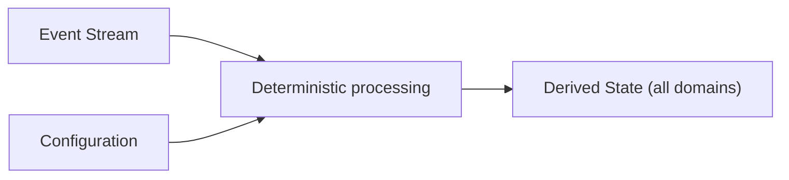

# Determinism Model

---

## Purpose and scope

The **Determinism Model** defines what determinism means in the Infrastructure, what it requires, and what behavior is forbidden because it would break **replayability** or **reproducibility**.

It does **not** restate the architecture in full. For formal definitions of **Events**, **State**, **Processing Order**, and **time**, see [Event Model](event-model.md), [State Model](state-model.md), and [Time Model](time-model.md).

Capitalized terms are used as in [Terminology](../00-guides/terminology.md).

---

## Definition

The Infrastructure is **deterministic** if and only if:

> Given an identical **Event Stream**, identical **Configuration**, and the same **Processing Order**, the Infrastructure produces identical **State** (including all **execution-control substate**) at every stream position.

Formally:

`State = f(Event Stream, Configuration)`

**Normative rules:**

1. **Events are the only source of State transitions.** No component may change derived State by any other means.
2. **Configuration is a stable, explicit input.** It must not change in an untracked way during processing. Any Configuration change that affects derived State must be represented as an **Event** or as an explicit, versioned Configuration update that is part of the canonical input.
3. The formula applies to **all** derived State domains: **Market State**, **Execution State** (including **Orders** and execution-control substate), and **Control State**. No domain is exempt.

---

## Processing Order as the causal axis

**Processing Order** is the strict internal sequence in which Events are applied. It is the **causal axis** of determinism.

Two runs are deterministic relative to each other if and only if they apply the same Events in the same **Processing Order** under the same **Configuration**. **Event Time** (the external timestamp carried inside an Event) is metadata; it does not define Processing Order and does not cause State changes by itself.

See [Time Model](time-model.md) for the full definition of Event Time and Processing Order.

---

## What must be fully derivable

The following must all be **deterministic functions** of **Event Stream + Configuration**. None may introduce hidden state, independent truth, or out-of-band mutations:

| Subject | Determinism requirement |
| ------- | ----------------------- |
| **Derived State** (Market, Execution, Control) | `State = f(Event Stream, Configuration)` |
| **execution-control substate (Queue)** | Fully derivable; not a second source of truth; recomputable by replay |
| **Queue Processing decisions** | Pure functions of current derived State and Configuration; no independent clock or timer authority |
| **Dominance and reconciliation** | Deterministic functions of pending substate and incoming command under Configuration |
| **Eligibility, inflight gating, ordering** | Deterministic derivations from current derived State and Configuration |
| **Rate-limit bookkeeping** | Deterministic functions of prior stream history and Configuration rules |
| **Order existence** | Orders begin at submission; no Order state exists before that point in the lifecycle |

**Normative rule:** None of the items in the table above may depend on wall-clock time, OS scheduler state, thread interleaving, or private mutable stores that are not part of **Event Stream + Configuration**.

---

## What would break determinism

The following behaviors violate determinism and are forbidden:

### Hidden mutable state

Any state that changes outside **Event processing** and influences **State Transitions** or **dispatch decisions** breaks the canonical input contract. All persistent evolution must be derivable from **Event Stream + Configuration**.

### Out-of-band Queue or execution-control state

If the **Queue** (execution-control substate) or any execution-control bookkeeping (inflight status, rate-limit capacity, eligibility) is maintained as a separate primary store that is not recomputable from the **Event Stream**, replay cannot reproduce identical decisions. The **Queue** must be derived, not owned.

### Separate runtime tick or autonomous loop

Any mechanism that advances execution-control state or triggers Queue reevaluation **independently of Event processing**—a background timer, a polling loop, an OS scheduler callback—introduces a source of advancement that is not present in the **Event Stream**. This breaks replay because the additional advancement cannot be reproduced from the stream alone.

### Wall-clock-dependent branching

Any branching in processing logic that depends on what the wall clock reads at runtime (e.g. "if current time > T, do X") is not a function of the **Event Stream**. Time-dependent behavior must instead be expressed through Events or Configuration-level rules applied deterministically (see [Time Model](time-model.md)).

### Thread and scheduler timing

State Transitions must not depend on the order in which threads or tasks are scheduled by the OS. **Processing Order** is defined by the **Event Stream**, not by thread execution order.

### Non-canonical ordering of Events

Applying the same Events in a different order than their canonical **Processing Order** produces different derived State. Any mechanism that allows Events to be applied out of stream order (except under a well-defined override specified in Configuration) breaks determinism.

### Randomness outside the Event Stream

Stochastic behavior that is not seeded deterministically via the **Event Stream** or **Configuration** must not influence State Transitions or dispatch decisions.

---

## Deterministic processing requirements

The following requirements must hold at every processing step:

1. **Event-driven only:** Every State Transition has exactly one causing **Event** in **Processing Order**. No spontaneous, timer-driven, or implicit updates.
2. **No separate tick:** Queue Processing and execution-control reevaluation run **within** Event processing—not as a separate loop. There is no independent runtime tick. ([Queue Processing](queue-processing.md)).
3. **Pure derivations:** Dominance, eligibility, inflight gating, scheduling, and rate-limit evaluation are **pure functions** of current derived State and **Configuration**. They do not maintain independent authoritative state.
4. **No retroactive mutation:** Processing Order defines a total order. State at position `n` may not be retroactively modified by processing Events at position `m > n`.
5. **Configuration stability:** Configuration must not change silently during processing. Any Configuration update that affects derived State must be represented as an explicit input.

---

## Implications

Determinism enables:

| Capability | How determinism enables it |
| ---------- | -------------------------- |
| **Reproducible Backtesting** | Same Event Stream + Configuration ➝ same derived State and decisions |
| **Failure recovery** | State can be reconstructed by replaying the Event Stream from any known position |
| **Debugging and Analysis** | Any historical execution can be reproduced precisely for inspection |
| **Backtesting / Live semantic parity** | Both Runtimes apply the same deterministic processing rules; infrastructure differs but semantics are identical |

---

## Relationship to other documents

- [Terminology](../00-guides/terminology.md) — canonical definitions including **Event Stream**, **Configuration**, **Processing Order**, **State**.
- [Event Model](event-model.md) — how Events enter the Infrastructure; Event Stream as canonical input.
- [State Model](state-model.md) — `State = f(Event Stream, Configuration)`; State domains; no hidden mutation.
- [Time Model](time-model.md) — Processing Order as causal axis; Event Time as metadata; no wall-clock authority.
- [Queue Processing](queue-processing.md) — deterministic execution-control evaluation within Event processing; no separate tick.
- [Intent Dominance](intent-dominance.md) — dominance as deterministic derivation over execution-control substate.
