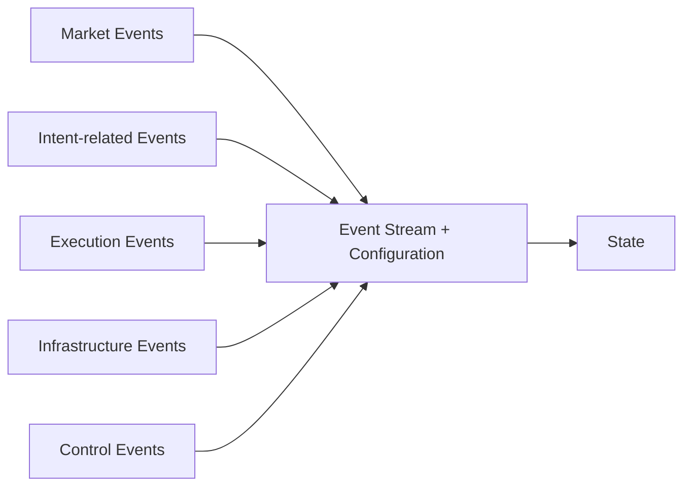

# Event Model

---

## Purpose and scope

The **Event Model** is the formal definition of **Events** in the Infrastructure.

It specifies:

- what qualifies as an Event;
- what properties every Event must satisfy;
- how Events relate to **Processing Order**, the **Event Stream**, and **State derivation**.

Canonical definitions of **Event**, **Event Stream**, **Processing Order**, **Intent**, **State**, and related terms appear in [Terminology](../00-guides/terminology.md). This document elaborates **Events only** and does not redefine component responsibilities beyond what is required for Event semantics.

The Event Model rests on the [Time Model](time-model.md): **Event Time** and **Processing Order** are distinct; internal causality follows **Processing Order**, not Event Time.

---

## What an Event is

An **Event** is an **immutable**, **canonical** record of an occurrence that the Infrastructure treats as input when advancing derived State.

**Normative properties:**

1. **Occurrence, not command.** An Event records that something **has occurred** or **has been decided** for canonical history (e.g. external market update, Venue execution report, recorded policy outcome, control signal). It does not substitute for an **Intent**, which is an ephemeral **command** (see [Terminology: Intent](../00-guides/terminology.md#intent)).
2. **Sole driver of State transitions.** **Events are the only source of State transitions.** No change to derived State occurs except by processing an Event under **Configuration**.
3. **Immutability.** After append (or equivalent canonical creation), an Event must not be modified.
4. **Ordering.** Events are applied strictly in **Processing Order** as realized by their position in the **Event Stream** (see [Event Stream](#event-stream)).

Events **do not** “mutate State” as an extra mechanism: **State Transitions** are the **result** of deterministically applying an Event to the State derived from all prior Events and Configuration.

---

## What Events record

Events exist to capture **observable occurrences**, **externally supplied feedback**, and **decisions or outcomes that must be part of canonical infrastructure history** so that:

- replay reproduces the same derived State; and
- audit and debugging can rely on a single ordered history.

Examples of what may be recorded (non-exhaustive, illustrative):

- a market trade or book update as observed by the Infrastructure;
- a Venue execution report (acknowledgement, fill, rejection, cancel confirmation);
- an outcome of intent processing **where canonical history requires it** (see [Intent-related Events](#intent-related-events) and [Terminology: Intent visibility](../00-guides/terminology.md#intent-visibility));
- a configuration or control signal that must affect derived State.

**Normative rule:** An **Intent** is **not** an Event. Strategy output is an **Intent** (command). The Infrastructure makes intent processing **visible** only through **Events** when required for canonical history—not by treating the command itself as an Event.

---

## Event categories

Events are grouped below by **semantic role**. Categories are **not** a runtime stack and **not** execution-control mechanics; they classify **what** the Event records for derivation of [State](state-model.md).

### Market Events

**Market Events** record changes or observations in a market (e.g. trades, order book updates, snapshots, price ticks) as **inputs** to the Infrastructure from a Venue or from historical datasets aligned with that semantics.

They primarily drive **Market State** (see [State Model](state-model.md)).

### Intent-related Events

**Intent-related Events** record **outcomes** of processing **Intents**—the ephemeral **commands** produced when Strategy runs during Event processing—**only where canonical history requires** (see [Terminology: Intent visibility](../00-guides/terminology.md#intent-visibility)).

They do **not** re-label the Intent itself as an Event. They document, for example, that a risk policy outcome or an outbound dispatch outcome **occurred** and must be replayable.

**Normative distinction:**

| Concept | Role |
| ------- | ---- |
| **Intent** | Ephemeral **command** from Strategy; not persistent; **not** an Event. |
| **Intent-related Event** | Immutable **record** that intent processing produced a given outcome when that outcome must appear in the Event Stream. |

### Execution Events

**Execution Events** record **Venue-side** (or simulated Venue) **responses and reports** concerning requests the Infrastructure has sent: e.g. order accepted, rejected, partially or fully filled, cancel confirmed.

They primarily drive **Execution State**, including the **Order** as a **derived** entity and its lifecycle after **submission** in state **Submitted** (see [Terminology: Order](../00-guides/terminology.md#order)).

**Normative distinction:**

| Concept | Role |
| ------- | ---- |
| **Intent-related Event** | Infrastructure-recorded outcome of **intent / policy / dispatch** pipeline when required for canonical history (origin: Infrastructure recording, not the Venue’s book). |
| **Execution Event** | **External execution feedback** (origin: Venue or execution path) that updates Order and related Execution State. |

### Infrastructure Events

**Infrastructure Events** record internal or operational facts that must affect **Infrastructure State** (e.g. configuration changes, operational signals that are part of canonical history as defined by the Infrastructure).

They are not a catch-all for every internal computation; see [Derivations that are not Events](#derivations-that-are-not-events).

### Control Events

**Control Events** record **control signals** that affect how the Runtime applies the stream or how derived State must interpret it (e.g. session boundaries, replay markers, checkpoints, shutdown triggers), when such signals are modeled as stream inputs.

---

## Event sources

**Normative clarification:** **Strategies do not emit Events.** Strategies produce **Intents** during processing triggered by prior Events. **Intent-related Events** (when used) are **recorded** by the Infrastructure as outcomes of that processing, not “Strategy-originated Event” in the sense of the Intent payload.

**Typical sources of Events** (who or what introduces a new Event into the canonical history):

| Source | Typical categories |
| ------ | ------------------ |
| Venue or historical market feed | Market Events |
| Venue or simulated execution path | Execution Events |
| Runtime / Core when canonical history requires an intent-processing outcome | Intent-related Events |
| Internal subinfrastructures (when modeled as stream inputs) | Infrastructure Events |
| Orchestration or Runtime controllers (when modeled as stream inputs) | Control Events |

Each **logical** source may append Events according to Infrastructure rules; **Processing Order** of the **merged** stream is authoritative for State.

---

## Event Stream

The **Event Stream** is the canonical **totally ordered** sequence of Events the Runtime applies.

**Normative rules:**

1. The Event Stream **materializes Processing Order** (see [Time Model](time-model.md)).
2. **State is fully derived from Event Stream + Configuration.** The stream is the authoritative historical input for derivation; Configuration supplies static or versioned rules and parameters as defined by the Infrastructure.
3. **No State mutation outside Event processing.** No Component may update derived State except by applying the next Event (or equivalently, the formal reduce step defined for that Event) under Configuration.

---

## Event ordering

Events are processed **strictly** in the order they occupy in the Event Stream.

If two Events share the same **Event Time**, **Processing Order** is still defined solely by **stream position**, not by Venue timestamp.

The Event Stream is the **canonical** ordering of Events for causality and replay.

---

## Event processing

During Runtime, Events are applied **one at a time** in stream order. Each applied Event yields **deterministic State Transitions** (possibly zero or more updates within a single formal transition step, as defined by the State Model), consistent with [Terminology: State Transition](../00-guides/terminology.md#state-transition).

Applying an Event may:

- advance Market, Execution (including **execution-control substate** derived as part of Execution State—see [Terminology: Queue](../00-guides/terminology.md#queue)), and Infrastructure domains;
- trigger Strategy evaluation, which produces **Intents** (not Events);
- record **new Events** when canonical history requires (e.g. intent-processing outcomes, appended **before** those outcomes may affect downstream State in replay).

**Normative rule:** **Queue** and **Queue Processing** are **derived Execution Control**, not a separate source of truth and not a separate Event category. They do not appear as “Queue Events” in this model unless the Infrastructure explicitly defines certain records as Events for canonical history; internal reconciliation, eligibility, and scheduling are otherwise **derivations during processing** (see [Terminology: Queue Processing](../00-guides/terminology.md#queue-processing)).

---

## Derivations that are not Events

**Normative rule:** **Internal deterministic derivations**—including dominance reconciliation, eligibility, scheduling order among allowed work, and rate-limit bookkeeping—**do not** generate separate Events **unless** explicit canonical history requires such records.

**Rate limits and wakeups** must **not** multiply Event types unnecessarily; they are expressed through deterministic rules tied to **Processing Order** and **State** derived from Events already in the Stream, as specified in [Terminology: Intent visibility](../00-guides/terminology.md#intent-visibility).

Absence of an Event for an intermediate computation does **not** mean non-determinism: those computations are **functions of** prior Events and Configuration.

---

## Relationship to State and other documents

- **State** is defined in [State Model](state-model.md). **Events do not store State;** they are the inputs from which `State = f(Event Stream, Configuration)` is derived.
- **Logical Architecture** describes components (e.g. Strategy, Risk, Queue). This document does **not** redefine those boundaries; it states only that **all** State change is accounted for through **Event processing**.
- **Terminology** remains the canonical glossary; where wording differs elsewhere in the docs, **Terminology** and this Event Model take precedence for Event semantics.
