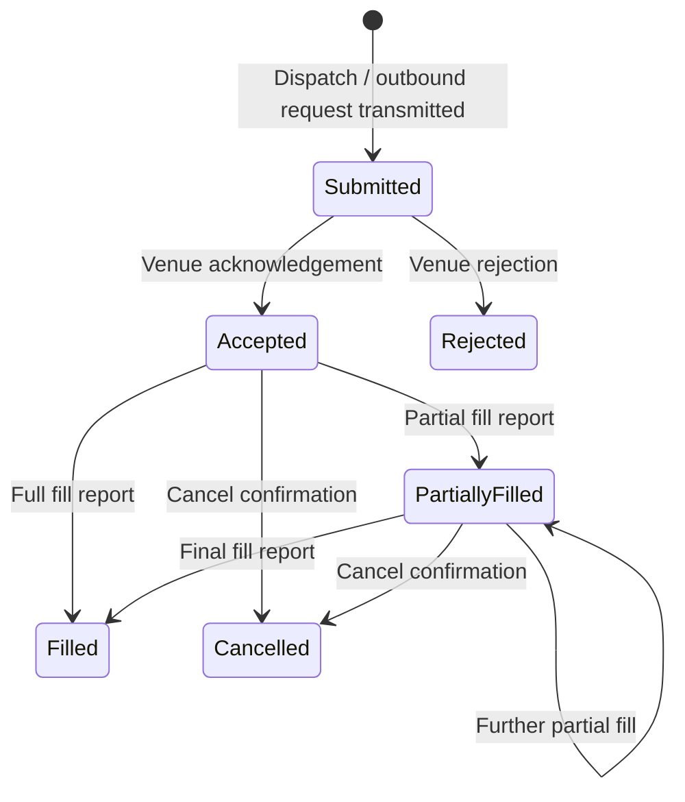

# Order Lifecycle

---

## Purpose and scope

This document defines the **lifecycle of Orders only**: how an **Order** evolves as a **derived entity** in **Execution State** from **submission** (`Submitted`) through **terminal disposition**.

It specifies **lifecycle stages**, **valid transitions**, and **terminal states**. It does **not**:

- define **Intent** lifecycle ([Intent Lifecycle](intent-lifecycle.md));
- restate formal **Event** or **State** semantics ([Event Model](../20-concepts/event-model.md), [State Model](../20-concepts/state-model.md));
- replace the canonical glossary ([Terminology](../00-guides/terminology.md));
- restate full **Runtime** sequencing ([Infrastructure Flows](../10-architecture/infrastructure-flows.md)) or component boundaries ([Logical Architecture](../10-architecture/logical-architecture.md)).

Capitalized terms are used as in [Terminology](../00-guides/terminology.md).

---

## What an Order represents

An **Order** is a **derived entity** in **Execution State**: the infrastructure's execution-level representation of a submitted outbound action, created at **dispatch** and subsequently evolved through **canonical Execution Events**.

**Normative rules:**

1. An **Order** is **not** an **Intent** and **not** a stage in the **Intent lifecycle**. The two lifecycles are **distinct**.
2. An **Order** comes into existence in **Execution State** at **submission**. The dispatch-time Event Stream record makes that entry canonical and replayable; subsequent state is derived from **Execution Events** under **Configuration**.
3. An **Order** is **not** a source of truth; its full history is **reconstructible** from the **Event Stream** and **Configuration** by replay.
4. **Order state** reflects the current derived condition: **Submitted** from dispatch onward; subsequent states reflect observable **Venue** execution reality as reported through **Execution Events**. The word "pending" in prose is descriptive only, not a separate canonical Order state.

---

## Order identity

Each **Order** is identified by a stable **Order ID** assigned by the Core when an outbound action for a new order is first submitted.

- **All** **Execution Events** and outbound commands targeting the same logical order share that **Order ID**.
- The **Venue** may assign an additional **Venue-side identifier** (e.g. exchange order ID), associated with the **Order** after **Venue acknowledgement**.
- **Order ID** is the canonical key for lifecycle tracking within the infrastructure regardless of Venue-assigned identifiers.

---

## Lifecycle entry condition

An **Order** comes into existence in **Execution State** at **submission** in state **Submitted**: the point at which the infrastructure represents an outbound request as **submitted** and is awaiting **Venue** acknowledgement or further **Execution Events**.

**Prior stages**—such as **Intent** command creation, **Risk** policy evaluation, and **Queue Processing** / **Execution Control**—belong to the **Intent lifecycle** ([Intent Lifecycle](intent-lifecycle.md)), **not** to this lifecycle. The **Order** lifecycle **begins** only at **Submission**.

---

## Lifecycle stages

| Stage | Meaning |
| ----- | ------- |
| **Submitted** | The outbound request has been transmitted to the **Venue**; the **Order** is pending **Venue** response. |
| **Accepted** | The **Venue** has acknowledged the **Order** for processing. **Execution** on the order book may occur but is not guaranteed. |
| **Partially Filled** | One or more fill **Execution Events** have been applied; residual open quantity remains. |
| **Filled** | The **Order** has been fully executed. **Terminal.** |
| **Cancelled** | The **Order** has been terminated before full execution. **Terminal.** |
| **Rejected** | The **Venue** did not accept the **Order** after **submission**. **Terminal.** |

---

## Valid transitions

**Entry transition** (`[*] ➝ Submitted`): The **Order** enters **Execution State** at **submission**. `Submitted` is the first **Order** state. The corresponding dispatch-time Event Stream record makes this entry part of canonical history. It is not created by any later **Venue** response.

**Post-submission transitions** (`Submitted` onward): All subsequent state changes are triggered by **Execution Events** (Venue execution reports) processed in **Processing Order**. No post-submission transition occurs outside **Event processing**.

**Normative rules:**

1. **Entry to `Submitted`** is triggered by **dispatch** (the Venue Adapter transmitting the outbound request), recorded in the Event Stream via an appropriate dispatch-time record when canonical history requires it. It is **not** triggered by a Venue execution report.
2. **Post-submission transitions** occur only through **Execution Events** (Venue execution reports) applied in **Processing Order** via the **Event Stream**.
3. Transitions must be **consistent** with the ordering defined by the **Event Stream**: no retroactive or out-of-order mutation.
4. A **Venue**-initiated modification event (e.g. Venue-side cancel or modification) also produces a post-submission state transition via the same **Execution Event** mechanism.

---

## Terminal states

Once an **Order** enters a **terminal** state, no further lifecycle transitions may occur for that **Order**.

| Terminal state | Description |
| -------------- | ----------- |
| **Filled** | Fully executed; no remaining open quantity. |
| **Cancelled** | Terminated before full execution (by infrastructure request or Venue-side action). |
| **Rejected** | Not accepted by the Venue after submission. |

---

## Relationship to Intents and Execution State

- **Intent lifecycle precedes Order lifecycle.** When an **Intent** arc reaches **Dispatched**, the outbound request is transmitted. **At dispatch**, the **Order** enters **Submitted** in **Execution State**. The **Intent** arc then **closes** ([Intent Lifecycle](intent-lifecycle.md)); the **Order** lifecycle continues independently from **Submitted** forward. Subsequent **Venue** responses arrive as **Execution Events** and evolve the already-existing **Order**—they do **not** create the **Order** for the first time.
- **Replace** and **Cancel** Intents may target an **existing** Order: their dispatch and completion do **not** restart the **Order lifecycle** from **Submitted**; they produce **Execution Events** that transition the existing **Order** state (e.g. a modify acknowledgement or a **Cancelled** terminal state).
- **Order** state is part of **Execution State** ([State Model](../20-concepts/state-model.md)), which also includes **fills**, **positions**, and **balances**. **Order** transitions are a specific class of **State Transitions** within that domain.
- **Orders** are **not** owned by **Strategy** as primary control objects. Strategy reads **Execution State** projections (which include current **Order** states) and produces **Intents** ([Logical Architecture](../10-architecture/logical-architecture.md)).

---

## Deterministic reconstruction

Because the **Order**'s entire history—creation at **Submitted** via dispatch and all subsequent transitions driven by **Execution Events**—is derived from the **Event Stream** and **Configuration** in **Processing Order**, the full lifecycle of any **Order** is **reconstructible** by replaying the **Event Stream** under the same **Configuration**:

- transitions occur in the same sequence;
- the resulting **Order** state is identical.

This property holds identically across **Backtesting** and **Live** Runtimes when **Event Streams** are comparable.

---

## Lifecycle invariants

1. **Derived only:** **Order** state is a **projection** of **Execution State** computed from **Event Stream + Configuration**; it is **not** authoritative independent truth.
2. **Entry at submission:** The **Order lifecycle** begins at **Submitted**; pre-submission stages belong to **Intent lifecycle**.
3. **Event-driven lifecycle:** Entry to **Submitted** is triggered by dispatch (recorded via an appropriate dispatch-time Event Stream record when canonical history requires it); all post-submission transitions require a corresponding **Execution Event** in **Processing Order**. No state change occurs outside **Event processing**.
4. **No retroactive mutation:** Venue timestamps do not override **Processing Order**; transitions apply in Event Stream position order.
5. **Terminal is final:** An **Order** in a **terminal** state admits no further transitions.
6. **Intent vs Order are distinct:** An **Intent** is an ephemeral **command** that may cause an **Order** to exist or transition, but **Intent** stages (Generated, Policy decided, Pending dispatch, etc.) are **not** **Order** states.
7. **Backtesting / Live parity:** The lifecycle model and its event-driven derivation apply identically in both Runtimes.

---

## Relationship to other documents

- [Terminology](../00-guides/terminology.md) — canonical terms.
- [Event Model](../20-concepts/event-model.md), [State Model](../20-concepts/state-model.md) — formal **Event** and **State** semantics; **Execution State** definition.
- [Intent Lifecycle](intent-lifecycle.md) — **Intent** command progression (distinct and upstream from this lifecycle).
- [Intent Pipeline](../10-architecture/intent-pipeline.md) — submission boundary and how dispatch triggers **Order** creation.
- [Logical Architecture](../10-architecture/logical-architecture.md), [Infrastructure Flows](../10-architecture/infrastructure-flows.md) — component boundaries and Runtime sequencing.
