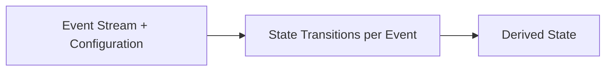

# State Model

---

## Purpose and scope

The **State Model** is the formal definition of **State** in the Infrastructure.

It specifies:

- what **State** is;
- how State is **derived** from the **Event Stream** and **Configuration**;
- which **State domains** exist and how they relate;
- what constraints govern **State evolution** and **determinism**.

Canonical definitions of **State**, **State Transition**, **Processing Order**, **Intent**, **Order**, **Queue**, and related terms appear in [Terminology](../00-guides/terminology.md). **Event** categories and stream semantics appear in [Event Model](event-model.md). **Temporal ordering** is defined in [Time Model](time-model.md).

This document does **not** redefine **Event** semantics or component responsibilities beyond what is required to explain State derivation. It does not specify full Runtime flow.

---

## Definition of State

**State** is the **complete derived condition** of the Infrastructure at a position in **Processing Order**.

**Normative rules:**

1. **State is fully derived only from Event Stream + Configuration:**

   `State = f(Event Stream, Configuration)`

2. State is **not** an independent or mutable “source of truth” held by any Component. It is a **deterministic projection**: at any stream position, State is the result of applying the formal derivation function implied by Configuration to all Events up to that position, in order.

3. The **Event Stream** (with **Configuration**) is **canonical** for history and reconstruction. State is **reconstructible** by replay under the same rules.

4. **Events are the only source of State transitions.** No change to derived State occurs except through processing an Event under Configuration (see [Event Model](event-model.md)).

---

## State is not component-owned

Components such as Strategy, Risk Engine, Queue Processing, or Venue Adapter **do not** own authoritative State.

They may:

- **read** derived State (or a documented **projection** of it) as input to computation;
- **emit** or **cause** new **Events** only through mechanisms defined elsewhere (for example, appending to the Event Stream when canonical history requires it).

They must **not** apply ad hoc mutations to derived State outside the **Event processing** model.

---

## Strategy and State

The **Strategy** **reads** derived State (or an appropriate snapshot / projection) and produces **Intents**—ephemeral **commands**.

**Normative rules:**

1. Strategy **does not** directly mutate derived State.
2. An **Intent** is **not** persistent and **not** an Event; effects on State arise only after further **Events** are processed when canonical history requires them (see [Terminology: Intent](../00-guides/terminology.md#intent)).

---

## State transitions

A **State Transition** is a deterministic change to derived State caused by processing **one** Event.

**Normative rules:**

1. Transitions occur strictly in **Processing Order** (see [Time Model](time-model.md)).
2. **No** State Transition occurs without a corresponding processed Event.
3. There are **no** spontaneous, wall-clock-driven, timer-driven, or out-of-band State changes. **No** hidden background updates.

---

## Determinism

The Infrastructure’s derived State is **deterministic** if and only if: for identical **Event Stream** and identical **Configuration**, State (including all substate described below) is identical at every **Processing Order** position.

Derived State must not depend on wall-clock time, scheduler timing, thread interleaving, or mutable stores outside what is defined by **Event Stream + Configuration** and the derivation rules.

---

## State domains

Derived State is grouped into **exactly three** top-level conceptual domains.

Together they constitute the full System State. **No fourth top-level domain** (such as “Queue state”) exists.

| Domain | Role |
| ------ | ---- |
| **Market State** | Observed market conditions (e.g. order book, trades, derived market indicators) derived from **Market Events** (see [Event Model](event-model.md)). |
| **Execution State** | Trading and execution projection: **Orders**, fills, positions, balances, and related status; includes **execution-control substate** (see below). |
| **Control State** | Runtime configuration, control, and operational flags derived from **System Events** and **Control Events**. |

### Execution State and event kinds

**Execution State** is updated only through processing **Events** whose semantics map into this domain. In line with [Event Model](event-model.md), these include principally:

- **Execution Events** (e.g. Venue execution reports affecting **Orders** and positions);
- **Intent-related Events** when canonical history requires recording outcomes that affect the execution projection (e.g. policy or dispatch outcomes that must be replayable).

The exact mapping from event type to projection is defined by the derivation rules under Configuration; this document only fixes **domain placement** and **non-negotiable constraints**.

---

## execution-control substate (Queue)

The **Queue**—pending **allowed** outbound work after reconciliation, together with data needed for **Execution Control**—is **derived execution-control substate**.

**Normative rules:**

1. The Queue is **not** a **fourth top-level State domain**. It is **part of Execution State** (or equivalently: a well-defined substructure of the single derived State whose top-level domains are Market, Execution, System).

2. The Queue is **not** a second source of truth. It must be **recomputable** from **Event Stream + Configuration** and the deterministic execution-control rules (see [Terminology: Queue](../00-guides/terminology.md#queue)).

3. **Queue Processing** runs **within** deterministic **Event processing**—there is **no separate runtime tick**. Advancing execution-control substate is part of applying Events in **Processing Order** (see [Terminology: Queue Processing](../00-guides/terminology.md#queue-processing)).

---

## Orders

An **Order** is a **derived entity** in **Execution State**.

**Normative rules:**

1. Orders are **not** authoritative objects stored independently of the Event Stream. They exist only as **projections** maintained while applying the derivation function.

2. The **Order lifecycle begins at submission** with state **Submitted**: the stage at which the Infrastructure represents an outbound request as **submitted** and awaiting Venue acknowledgement or further **Execution Events**. Stages before that are **Intent** and execution-control derivation, not a persisted **Order** entity in this sense.

3. Orders evolve **only** through **Events** (e.g. acknowledgements, fills, cancellations, rejections), in **Processing Order**.

---

## Internal derivations vs canonical Events

**Queue Processing**, **dominance** reconciliation, **eligibility**, **inflight** bookkeeping, and **scheduling** among allowed work are **state-dependent deterministic derivations**. They are **not** independent sources of truth; they are **computed** from current derived State and Configuration during Event processing.

**Normative alignment** (see [Terminology: Intent visibility](../00-guides/terminology.md#intent-visibility)):

- These computations are **not** separate **Events** **unless** explicit canonical history requires recording them on the stream.
- **Rate limits** and **wakeups** are modeled **without unnecessary extra event types**, via rules tied to **Processing Order** and State derived from existing Events.

Absence of an Event for an intermediate step does **not** imply non-determinism: the step must be a **pure function** of prior Events and Configuration.

---

## Projections for consumers

Different consumers read the **same** underlying derived State but may use **documented projections** (views) appropriate to their role:

| Consumer | Typical use of State |
| -------- | -------------------- |
| **Strategy** | Market and Execution projections relevant to decisions; emits **Intents** only. |
| **Risk Engine** | Projections needed for **policy** evaluation; does not schedule or reorder outbound execution. |
| **Queue Processing** | execution-control substate and related Execution projections; **Execution Control** only, not policy. |

Projections do not create alternate truths; they are **read patterns** over one deterministic derived State.

---

## State derivation (summary)

State evolves by **sequentially** applying each Event in the **Event Stream**, in **Processing Order**, under **Configuration**.

Each application yields deterministic updates to **Market State**, **Execution State** (including execution-control substate and **Orders**), and **Control State**, as defined by the derivation rules.

---

## State reconstruction and snapshots

Because State is a function of **Event Stream + Configuration**, it can be **reconstructed** by replay from any prefix of the stream using the same rules.

**Snapshots** (if used) are a **pure optimization**: a stored materialization of derived State at a known stream position. **Canonical** history remains the **Event Stream** with **Configuration**; snapshots must not contradict replay.

---

## Relationship to the Event Model

- The [Event Model](event-model.md) defines what **Events** are and how they are ordered.
- This document defines how those Events produce **State**.
- **Events do not “store” State**; they are inputs. **State** is the accumulated **result** of processing them under **Configuration**.
