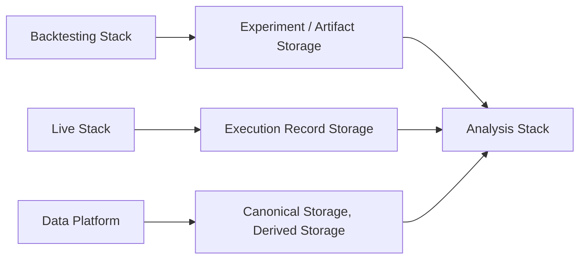

# Analysis Stack

Part of: **Analysis and Monitoring**

The Analysis Stack provides the infrastructure and components required to consume persisted system outputs and artifacts, perform asynchronous and reproducible analysis on them, and produce derived analytical artifacts, comparisons, and evaluation results.

---

## Purpose

The Analysis Stack exists to turn the System's persisted outputs into evaluative knowledge. Backtesting runs produce experiment results. Live execution produces execution records. The Data Platform holds canonical datasets and derived data. The Analysis Stack provides the technical infrastructure to consume these persisted outputs, evaluate them, compare them across experiments and contexts, and produce derived analytical artifacts — all asynchronously and reproducibly.

The Analysis Stack is **retrospective and asynchronous** in character. It operates on data that is already durably stored. It does not participate in ongoing runtime execution and does not observe running systems in real time. Its work begins after other Stacks have produced and persisted their outputs.

---

## Position in the System

The Analysis Stack belongs to the **Analysis and Monitoring** group. It works downstream of persisted outputs and artifacts produced by the Backtesting Stack, the Live Stack, and the Data Platform:

The Analysis Stack reads from the Data Storage Stack's persistent surfaces. It does not interact with the Backtesting Stack or the Live Stack during their execution — it consumes their persisted outputs after the fact.

The Analysis Stack is **not** a runtime-execution Stack. It does not run Strategies, process Events, evaluate Risk, manage Execution Control, or interact with Venues. It analyzes the products of runtime execution, not the execution itself.

---

## Main Responsibilities

The Analysis Stack is responsible for:

- Making persisted outputs and artifacts **analyzable** — providing the infrastructure to load, inspect, query, and evaluate persisted experiment results, execution records, canonical datasets, and derived data.
- Enabling **asynchronous analysis** — analysis runs independently of the Stacks that produced the data, on its own schedule, against durable stored artifacts.
- Supporting **reproducible and versioned analysis** — ensuring that analyses can be re-executed against the same inputs to produce the same results, and that analytical outputs are traceable to their inputs and analysis definitions.
- Enabling **comparison and evaluation** — supporting cross-experiment comparison, parameter-sweep analysis, Strategy ranking, and performance evaluation across runs, time periods, or configurations.
- Enabling **retrospective analysis of persisted Live outputs** — consuming execution records, order history, fill data, and position records for post-hoc evaluation, execution-quality assessment, and performance review.
- Supporting **Research–Live discrepancy analysis** — comparing persisted Backtesting outcomes with persisted Live execution outcomes to identify, measure, and model the gap between Research expectations and production reality.
- Producing **derived analytical artifacts** — comparative evaluations, analysis datasets, reports, and versioned results that become part of the System's persistent record.

---

## Key Boundaries

**Operates on persisted artifacts, not running systems.** The Analysis Stack consumes data that is already durably stored. It does not consume transient runtime state, live event streams, or real-time operational signals.

**Asynchronous and retrospective.** The Analysis Stack operates on its own schedule, independently of the Stacks that produced its inputs. There is no synchronous coupling between the Analysis Stack and the Backtesting or Live Stacks.

**Not operational monitoring.** The Analysis Stack does not track runtime health, emit alerts, or provide real-time operational visibility. Its scope is retrospective analysis of persisted outputs — a fundamentally different concern from ongoing observation of running systems.

**Not runtime execution.** The Analysis Stack does not run Strategies, process Events, or interact with Venues. It operates on the products of runtime execution, not within it.

**Storage surfaces are used, not governed.** The Analysis Stack reads from and writes to the Data Storage Stack's persistent surfaces but does not manage their organization, retention, or access policies.

---

## Relationship to Persisted Outputs and Artifacts

The Analysis Stack's value depends entirely on what other Stacks have persisted:

**Backtesting outputs.** Experiment results, run artifacts, and execution records produced by the Backtesting Stack and stored in Experiment / Artifact Storage and Execution Record Storage. These are the primary inputs for Strategy evaluation, cross-experiment comparison, and parameter-sweep analysis.

**Live execution outputs.** Execution records, order history, fill data, and position records produced by the Live Stack and stored in Execution Record Storage. These are consumed retrospectively — for post-hoc execution-quality review, performance assessment, and Research–Live discrepancy analysis.

**Canonical and derived data.** Canonical datasets from the Data Platform and derived datasets from earlier analytical work. These are consumed where analysis requires access to the underlying market data or to previously produced analytical outputs.

All inputs are consumed from the Data Storage Stack's persistent surfaces. All derived outputs are written back to those surfaces for durable retention.

---

## Why the Stack Matters

The Analysis Stack is where persisted system outputs become actionable knowledge. Experiment results, execution records, and canonical datasets are raw material — they carry information, but they do not by themselves answer questions about Strategy quality, execution effectiveness, or the relationship between Research expectations and Live outcomes.

The Analysis Stack provides the infrastructure to ask and answer those questions: to compare experiments, to evaluate performance, to quantify the gap between Research and Live, and to produce derived artifacts that make the System's behavior measurable and interpretable. Without it, persisted outputs would accumulate without systematic evaluation, and Research conclusions would depend on ad hoc inspection rather than reproducible, versioned analysis.

Detailed treatment of scope and role, interfaces, internal structure, operational behavior, and implementation considerations is provided in the companion documents for this Stack.
