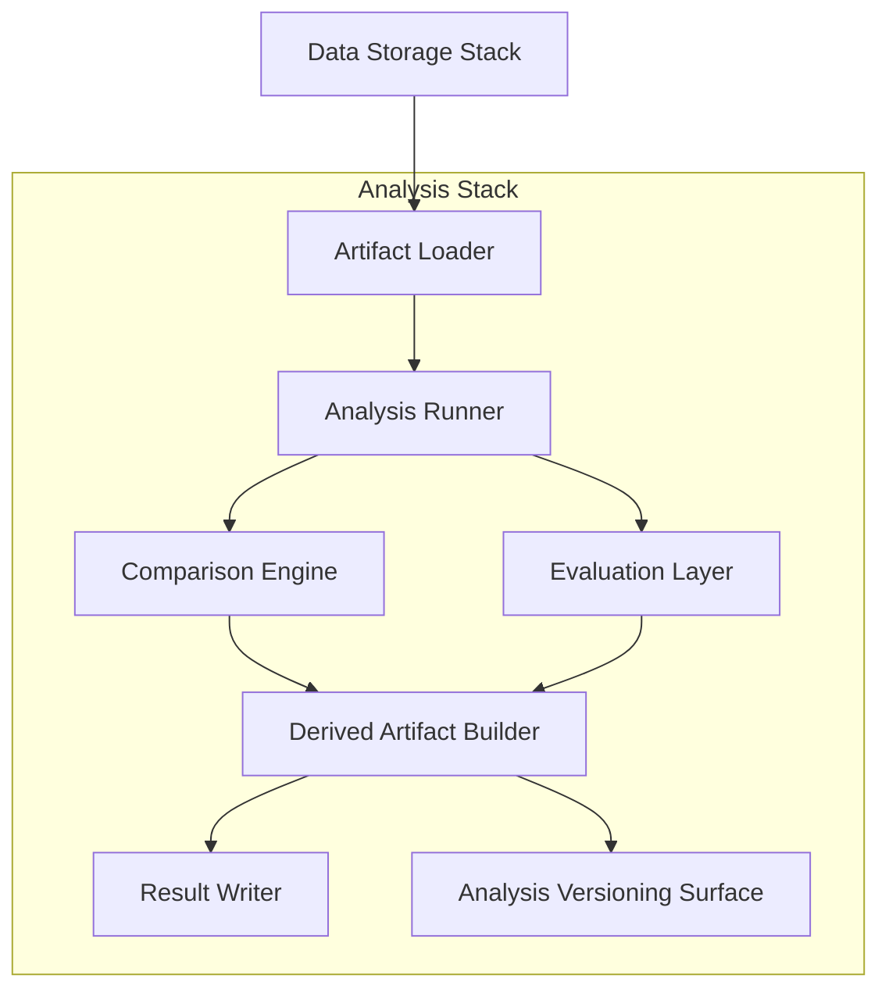

# Internal Structure

This document defines the logical internal structure of the Analysis Stack: its capabilities, their roles, and the internal flow from persisted-artifact loading through analysis execution to versioned result production.

---

## Structural Overview

The Analysis Stack decomposes into a set of logical capabilities that together accomplish one task: consuming persisted infrastructure outputs and artifacts, performing asynchronous and reproducible analysis on them, and producing derived analytical artifacts that are themselves persistable, traceable, and versioned.

The internal flow moves through five stages:

All capabilities operate on persisted data — the Analysis Stack does not interact with running infrastructures or transient runtime state. Its internal structure is oriented around asynchronous, reproducible analytical work on durable artifacts.

---

## Core Internal Capabilities

### Artifact Loader

Reads persisted outputs and artifacts from the Data Storage Stack's persistent surfaces and prepares them for analysis.

Role:

- Load experiment results, run artifacts, and execution records from Experiment / Artifact Storage and Execution Record Storage.
- Load canonical datasets from Canonical Storage where direct analysis of underlying market data is required.
- Load previously produced derived datasets from Derived Storage where analysis builds on earlier analytical work.
- Resolve analysis configurations — dataset selections, comparison parameters, evaluation criteria — and identify the specific persisted artifacts required for the analysis.

The Artifact Loader is the entry point of the stack. It bridges the Data Storage Stack's persistent surfaces and the Analysis Stack's internal processing. No analysis proceeds until the relevant persisted artifacts are loaded and available.

### Analysis Runner

Executes structured analysis logic against loaded artifacts.

Role:

- Apply analysis definitions — evaluation functions, metrics computations, statistical assessments, transformation logic — to the loaded persisted artifacts.
- Execute analysis asynchronously and independently of the Stacks that produced the input artifacts.
- Support parameterized analysis — the same analysis logic applied across different input sets, time periods, or configurations.

The Analysis Runner is the computational core of the stack. It performs the analytical work that transforms persisted inputs into evaluative outputs. It does not interact with running infrastructures — it operates entirely on loaded artifacts.

### Comparison Engine

Compares and relates multiple sets of results, artifacts, or analytical outputs.

Role:

- Cross-experiment comparison — relate results from different Backtesting runs, parameter-sweep variations, or experimental conditions.
- Cross-context comparison — compare persisted Backtesting outcomes with persisted Live execution outcomes for Research–Live discrepancy analysis.
- Ranking and ordering — rank Strategies, configurations, or parameter sets by defined evaluation criteria.

The Comparison Engine operates on the outputs of the Analysis Runner (or directly on loaded artifacts where comparison does not require additional computation). It produces structured comparative outputs that make relationships between results explicit and measurable.

### Evaluation Layer

Applies evaluative criteria and quality assessments to analytical and comparative outputs.

Role:

- Apply performance evaluation criteria — risk-adjusted returns, execution-quality metrics, drawdown assessment, and other evaluative measures.
- Apply threshold-based or criterion-based assessments — flag results that meet or fail defined evaluation standards.
- Produce structured evaluation outputs that characterize the quality or significance of analytical findings.

The Evaluation Layer adds evaluative judgment to raw analytical and comparative outputs. It does not make human decisions — it applies defined criteria and produces structured evaluative artifacts.

### Derived Artifact Builder

Constructs new analytical artifacts from the outputs of the Analysis Runner, Comparison Engine, and Evaluation Layer.

Role:

- Produce derived analytical datasets — aggregations, transformations, or projections that serve as standalone analytical products or as inputs for further analysis.
- Produce reports and summaries — structured outputs that distill analytical findings into communicable form.
- Produce comparison artifacts — structured representations of cross-experiment or cross-context comparisons.

The Derived Artifact Builder packages analytical outputs into durable, reusable artifacts. Its outputs are what the Analysis Stack contributes back to the Infrastructure's persistent record.

### Result Writer

Persists analytical outputs to the Data Storage Stack's persistent surfaces.

Role:

- Write derived analytical artifacts, comparison outputs, evaluation results, and analysis datasets to **Derived Storage** and **Experiment / Artifact Storage**.
- Ensure that analytical outputs are durably stored and available for future reference, further analysis, or downstream consumption.

The Result Writer is the capability through which the Analysis Stack's outputs become part of the Infrastructure's persistent record.

### Analysis Versioning Surface

Maintains the traceability and reproducibility of analysis work.

Role:

- Record the provenance of each analytical output — which persisted inputs were consumed, which analysis definition was applied, which parameters were used.
- Support versioned analysis — the same analysis definition applied to the same inputs must produce the same outputs. Changes to analysis definitions produce new versions, not silent overwrites.
- Enable re-execution — an analysis can be reproduced by retrieving the same inputs and applying the same versioned analysis definition.

The Analysis Versioning Surface is not a separate processing stage — it is a structural concern that spans the analysis pipeline. Every analytical output should be traceable to its inputs and analysis definition through the versioning surface.

---

## Internal Flow

The end-to-end internal flow within the Analysis Stack follows a staged progression:

1. **Artifact loading.** The Artifact Loader reads persisted artifacts from the Data Storage Stack's persistent surfaces and resolves analysis configurations.
2. **Analysis execution.** The Analysis Runner applies analysis logic to loaded artifacts, producing raw analytical outputs.
3. **Comparison and evaluation.** The Comparison Engine relates multiple result sets, and the Evaluation Layer applies evaluative criteria to analytical and comparative outputs.
4. **Derived artifact construction.** The Derived Artifact Builder packages analytical, comparative, and evaluative outputs into structured, reusable artifacts.
5. **Result persistence.** The Result Writer persists derived artifacts to the Data Storage Stack's persistent surfaces.
6. **Versioning and traceability.** The Analysis Versioning Surface records provenance and version information throughout the pipeline, ensuring that outputs are traceable and reproducible.

Not every analysis traverses all stages. A simple inspection may involve only artifact loading and analysis execution. A complex cross-context evaluation may involve all stages, including comparison, evaluation, and derived artifact construction. The stages are composable, not mandatory in sequence.

---

## Structural Boundaries

**No runtime execution.** The Analysis Stack's internal structure operates on persisted artifacts. It does not run Strategies, process Events, evaluate Risk, manage Execution Control, or interact with Venues. It analyzes the products of runtime execution, not the execution itself.

**No operational monitoring.** The internal structure is oriented around asynchronous, retrospective analysis. It does not track runtime health, emit alerts, or provide real-time operational visibility. That is a separate concern.

**No storage governance.** The Artifact Loader reads from and the Result Writer writes to the Data Storage Stack's persistent surfaces, but neither manages those surfaces. Storage organization, retention, and access are Data Storage Stack responsibilities.

**Reproducibility is structural.** The Analysis Versioning Surface is not an optional add-on — it is a structural concern that makes the Analysis Stack's outputs trustworthy. An analytical result that cannot be traced to its inputs or reproduced from its analysis definition has limited value.

**Logical structure, not deployment specification.** The capabilities described here are logical roles. They may be realized as notebook environments, pipeline stages, library functions, or service components. Physical deployment topology is not specified by this document.
