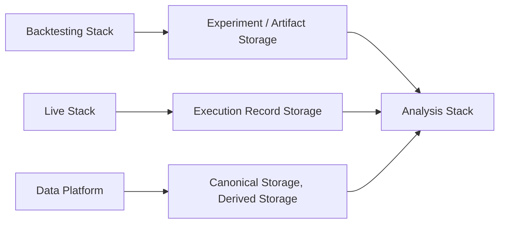

# Scope and Role

The Analysis Stack provides the infrastructure and components required to consume persisted system outputs and artifacts, perform asynchronous and reproducible analysis on them, and produce derived analytical artifacts, comparisons, and evaluation results.

---

## Purpose

The Analysis Stack exists to make the Infrastructure's persisted outputs analyzable. Backtesting runs produce experiment results and artifacts. Live execution produces execution records, order history, and fill data. Canonical datasets hold the validated empirical record. The Analysis Stack provides the technical infrastructure to consume these persisted outputs, evaluate them, compare them, and produce derived analytical artifacts — all asynchronously and reproducibly.

The Analysis Stack is **retrospective and asynchronous** in character. It operates on data that is already durably stored — experiment results, execution records, derived datasets, canonical data where direct analysis requires it. It does not participate in ongoing runtime execution and does not operate on transient runtime state. Its work begins after other Stacks have produced and persisted their outputs.

---

## Position in the Infrastructure

The Analysis Stack belongs to the **Analysis and Monitoring** group. It works downstream of persisted outputs and artifacts produced by the Backtesting Stack, the Live Stack, and the Data Platform:

The Analysis Stack reads from the Data Storage Stack's persistent surfaces. It does not interact with the Backtesting Stack or the Live Stack during their execution — it consumes their persisted outputs after the fact.

The Analysis Stack is **not** a runtime-execution Stack. It does not run Strategies, process Events, evaluate Risk, or manage Execution Control. It is not part of the Core Runtime. It operates on the products of runtime execution, not within runtime execution itself.

### Relationship to Research

The Analysis Stack is strongly Research-adjacent — it is the primary technical infrastructure through which experiment results are evaluated, Strategies are compared, and Research conclusions are drawn. However, it is not identical with Research as a practice. Research encompasses hypothesis formation, Strategy design, experimental methodology, and interpretive judgment — activities that extend beyond what the Analysis Stack provides. The Analysis Stack provides the analytical infrastructure; Research is the broader discipline that uses it.

---

## Core Responsibilities

The Analysis Stack is responsible for:

- Making persisted outputs and artifacts **analyzable** — providing the tools and infrastructure to load, inspect, query, and evaluate persisted experiment results, execution records, canonical datasets, and derived data.
- Enabling **asynchronous analysis** on persisted inputs — analysis runs independently of the Stacks that produced the data, on its own schedule, against durable stored artifacts.
- Supporting **reproducible and versioned analysis** — ensuring that an analysis can be re-executed against the same inputs and produce the same results, and that analytical outputs are traceable to their inputs and analysis definitions.
- Enabling **comparison and evaluation** — supporting cross-experiment comparison, parameter-sweep analysis, Strategy ranking, and performance evaluation across runs, time periods, or configurations.
- Enabling **retrospective analysis of persisted Live outputs** — consuming execution records, order history, fill data, and position records from Live execution for post-hoc evaluation, execution-quality assessment, and performance review.
- Producing **derived analytical artifacts** — comparative evaluations, reports, analysis datasets, summary statistics, and versioned analytical results that become part of the Infrastructure's persisted output.
- Supporting **Research–Live discrepancy analysis** — helping make discrepancies between Research-oriented expectations and persisted Live outcomes understandable, measurable, and modelable. This is retrospective and analytical, based on comparing persisted outputs from both contexts.

---

## Explicit Non-Responsibilities

The Analysis Stack is **not** responsible for:

- **Ongoing operational monitoring, alerting, or runtime health tracking.** Real-time operational visibility, incident-oriented observation, and runtime alerting are operational monitoring concerns, not analytical ones. The Analysis Stack is retrospective and asynchronous; it does not observe running systems in real time.
- **Core Runtime semantic definitions.** The Event model, State model, Determinism model, Intent lifecycle, Order lifecycle, Risk semantics, Queue semantics, and all canonical processing rules are defined in architecture and concept documents. The Analysis Stack does not define or modify them.
- **Backtesting or Live execution.** The Analysis Stack consumes the outputs of these Stacks; it does not execute Strategies, process Events, or interact with Venues.
- **Raw Venue data capture.** Recording raw market data is a Data Recording Stack responsibility.
- **Dataset validation, normalization, or canonical promotion.** These are Data Quality Stack responsibilities.
- **Storage governance.** The Analysis Stack reads from and may write to the Data Storage Stack's persistent surfaces but does not manage those surfaces, their organization, or their retention policies.

---

## Why the Stack Matters

The Analysis Stack is the point at which persisted system outputs become actionable knowledge. Experiment results, execution records, and canonical datasets are raw material — they carry information, but they do not by themselves answer questions about Strategy quality, execution effectiveness, or the relationship between Research expectations and Live outcomes.

The Analysis Stack provides the infrastructure to ask and answer those questions: to compare experiments, to evaluate performance, to identify discrepancies between what Research predicted and what Live execution produced, and to produce derived artifacts that make the Infrastructure's behavior measurable and interpretable.

Without the Analysis Stack, persisted outputs would accumulate without systematic evaluation. Research conclusions would depend on ad hoc inspection rather than reproducible, versioned analysis. The gap between Research expectations and Live outcomes would remain unmeasured and unmodeled.
