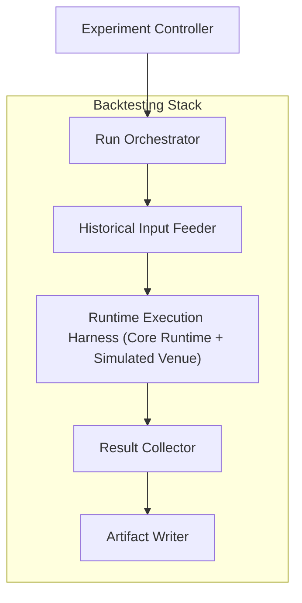

# Internal Structure

This document defines the logical internal structure of the Backtesting Stack: its capabilities, their roles, and the internal flow from experiment configuration through runtime execution to result production.

---

## Structural Overview

The Backtesting Stack decomposes into a set of logical capabilities that together accomplish one task: executing the Core Runtime against historical canonical data in a controlled, reproducible experiment context and capturing the results.

The internal flow moves through five stages:

The Core Runtime is the execution kernel at the center of this structure. The Backtesting Stack's capabilities surround it — feeding it historical inputs, providing a simulated execution environment, controlling run parameters, and capturing outputs. The Backtesting Stack does not define the Core Runtime's processing semantics; it provides the infrastructure that makes the Core Runtime executable for Research.

---

## Core Internal Capabilities

### Experiment Controller

Manages experiment-level concerns: which experiments to execute, which parameter variations to explore, and how individual runs relate to each other within a broader experimental plan.

Role:

- Accept experiment configuration — dataset selection, Strategy definitions, parameter sets, scenario definitions.
- Decompose experiments into individual runs or parameter-sweep variations.
- Pass individual run definitions to the Run Orchestrator for execution.

The Experiment Controller is the entry point for Research intent. It translates an experiment specification into a set of executable run definitions.

### Run Orchestrator

Manages the execution lifecycle of individual Backtesting runs and coordinated groups of runs.

Role:

- Accept individual run definitions from the Experiment Controller.
- Prepare and launch each run — ensuring that the correct canonical dataset, Strategy, Configuration, and parameters are supplied to the Runtime Execution Harness.
- Coordinate batch runs and parameter sweeps — managing concurrency, sequencing, and completion tracking across multiple runs.
- Ensure reproducible run control — the same run definition, executed again, must produce the same execution setup.

The Run Orchestrator is the operational backbone of the stack. It does not execute the Core Runtime directly; it prepares the conditions under which the Runtime Execution Harness does.

### Historical Input Feeder

Loads canonical datasets from Canonical Storage and feeds them to the Runtime Execution Harness as the historical Event input for each run.

Role:

- Read canonical datasets from Canonical Storage for the time period, Venue, and feed specified by the run definition.
- Transform canonical dataset content into the historical Event stream that the Core Runtime processes.
- Deliver Events to the Runtime Execution Harness in the correct Processing Order for deterministic replay.

The Historical Input Feeder is the component that bridges canonical persistent data and the Core Runtime's Event-processing model. It consumes canonical datasets (the Data Platform's output) and produces the historical Event stream (the Core Runtime's input).

### Runtime Execution Harness

Hosts and executes the Core Runtime for a single Backtesting run, including the simulated Venue that completes the processing loop.

Role:

- Instantiate the Core Runtime with the run's Strategy, Configuration, and execution-control rules.
- Feed historical Events from the Historical Input Feeder into the Core Runtime's processing loop.
- Provide the **Simulated Venue** — the simulated execution environment behind the Venue Adapter boundary that generates realistic execution feedback (fills, acknowledgements, rejections) from historical data.
- Execute the complete Core Runtime processing chain: Event intake → State derivation → Strategy evaluation → Risk → Execution Control → Venue Adapter → Simulated Venue → Execution Events back into the stream.
- Ensure that determinism is preserved throughout execution — the same inputs and Configuration produce identical State, dispatch decisions, and Order lifecycle outcomes at every Processing Order position.

The Runtime Execution Harness is where the Core Runtime actually runs. The Simulated Venue is integral to this harness — without it, the processing loop has no execution feedback and cannot produce Order lifecycle outcomes. The harness executes the Core Runtime's semantics faithfully; it does not modify them.

### Result Collector

Captures the outputs of each Backtesting run as structured experiment results and metrics.

Role:

- Collect experiment results from the Runtime Execution Harness — Strategy performance metrics, execution statistics, Order lifecycle summaries.
- Collect run-level metrics and evaluation outputs suitable for cross-run comparison and aggregation.
- Structure results for downstream consumption by the Artifact Writer and ultimately by the Analysis Stack.

The Result Collector transforms raw execution output into structured, analyzable experiment results.

### Artifact Writer

Persists experiment results, run artifacts, execution records, and metrics to the Data Storage Stack's persistent surfaces.

Role:

- Write experiment results and evaluation outputs to **Experiment / Artifact Storage**.
- Write execution records (dispatch histories, Order lifecycle records, detailed execution traces) to **Execution Record Storage**.
- Ensure that all outputs are durably persisted and available for later retrieval by the Analysis Stack and operational tooling.

The Artifact Writer is the final internal capability. Its output is the Backtesting Stack's durable contribution to the System: persisted experiment results and execution records that outlast the run and are available for downstream analysis.

---

## Internal Flow

The end-to-end internal flow within the Backtesting Stack follows a staged progression:

1. **Experiment definition.** The Experiment Controller accepts an experiment specification and decomposes it into individual run definitions (single runs, batch runs, or parameter-sweep variations).
2. **Run preparation.** The Run Orchestrator prepares each run — associating the correct canonical dataset, Strategy, Configuration, and parameters.
3. **Historical input loading.** The Historical Input Feeder reads canonical datasets from Canonical Storage and produces the historical Event stream for the run.
4. **Runtime execution.** The Runtime Execution Harness executes the Core Runtime against the historical Event stream, with the Simulated Venue providing execution feedback to complete the processing loop. The full Core Runtime chain runs deterministically.
5. **Result collection.** The Result Collector captures structured experiment results, metrics, and execution outputs from the completed run.
6. **Artifact persistence.** The Artifact Writer persists results, execution records, and artifacts to the Data Storage Stack's persistent surfaces.

For parameter sweeps and batch runs, steps 2–6 repeat for each variation, coordinated by the Run Orchestrator.

---

## Structural Boundaries

**The Core Runtime is executed, not defined.** The Runtime Execution Harness hosts and runs the Core Runtime, but the Core Runtime's processing semantics — Event model, State derivation, Intent lifecycle, Order lifecycle, Risk, Execution Control, Determinism — are defined in architecture and concept documents. The Backtesting Stack's internal structure provides the execution environment; it does not alter the execution model.

**Canonical datasets are the historical basis.** The Historical Input Feeder reads from Canonical Storage. The internal structure does not include raw data loading, validation, or normalization. Those are Data Platform responsibilities.

**No storage governance.** The Artifact Writer writes to the Data Storage Stack's persistent surfaces but does not manage those surfaces. Storage organization, retention, and access are Data Storage Stack responsibilities.

**No Core Runtime semantic processing.** Internal capabilities such as the Experiment Controller, Run Orchestrator, Result Collector, and Artifact Writer operate around the Core Runtime — configuring it, feeding it, and capturing its outputs. They do not participate in Event processing, State derivation, or execution-control logic. That processing occurs entirely within the Runtime Execution Harness through the Core Runtime itself.

**Logical structure, not deployment specification.** The capabilities described here are logical roles. They may be realized as separate services, stages within a pipeline, or modules within a single application. Physical deployment topology is not specified by this document.
