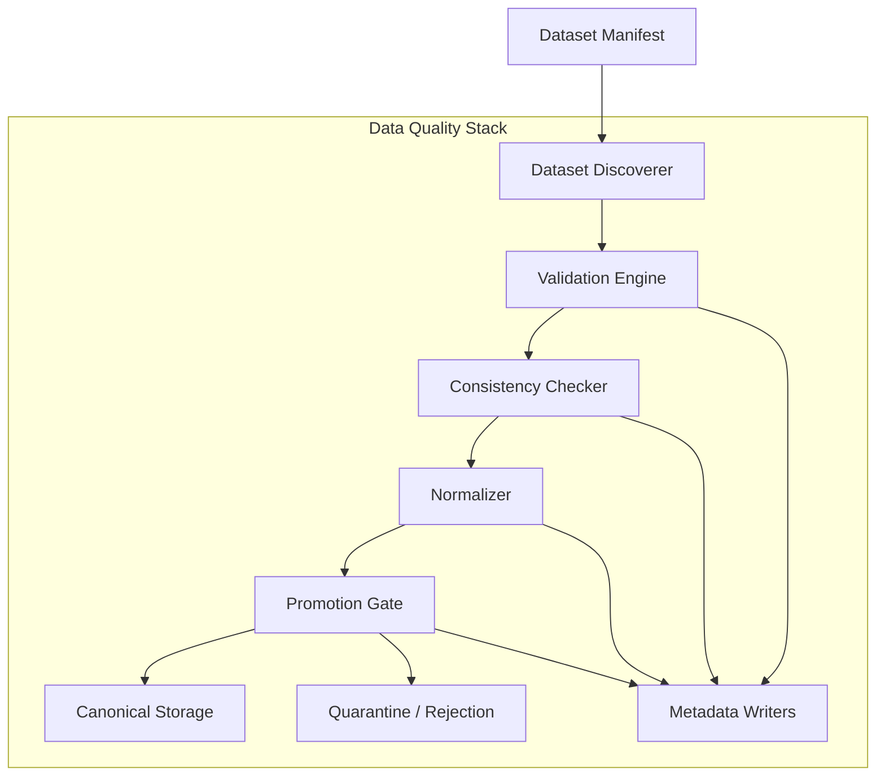

# Internal Structure

This document defines the logical internal structure of the Data Quality Stack: its capabilities, their roles, and the internal flow from dataset discovery through validation, normalization, and promotion or quarantine.

---

## Structural Overview

The Data Quality Stack decomposes into a set of logical capabilities that together perform one task: taking raw recorded datasets and determining whether they are suitable to become canonical datasets — and if so, transforming and promoting them.

The internal flow moves through six stages:

Each capability has a defined role. The progression is not guaranteed to reach promotion: datasets that fail validation or consistency assessment are routed to quarantine or rejection rather than continuing toward canonical promotion.

---

## Core Internal Capabilities

### Dataset Discoverer

Locates new raw recorded datasets by scanning for **Dataset Manifests** published by the Data Recording Stack.

Role:

- Monitor known Dataset Manifest locations for newly available manifests.
- Parse each manifest to identify the corresponding raw recorded dataset in Persistent Raw Storage (Venue, Feed, Time Window, storage location).
- Register the dataset as Discovered within the Data Quality Stack's processing scope.

The Dataset Discoverer is the entry point of the stack. A dataset does not exist from the Data Quality Stack's perspective until a Dataset Manifest is discovered.

### Validation Engine

Assesses raw recorded datasets against structural integrity and completeness constraints.

Role:

- Load the raw recorded dataset from Persistent Raw Storage.
- Verify structural correctness: expected schema, field presence, data types, message ordering.
- Verify completeness: check for expected coverage within the dataset's Time Window, detect gaps or missing segments.
- Produce validation metadata documenting what checks were applied and what the outcomes were.

The Validation Engine determines whether a dataset is structurally sound. It does not assess market-content plausibility — that is the Consistency Checker's responsibility.

### Consistency Checker

Assesses whether the content of a structurally valid dataset is internally coherent and market-plausible.

Role:

- Evaluate cross-field and cross-message consistency within the dataset.
- Assess market-structure plausibility: whether order book data and trade data are mutually consistent, whether observed spreads are plausible, whether recorded trades make sense in the context of the accompanying market structure.
- Produce consistency-assessment metadata documenting the checks applied and their outcomes.

The Consistency Checker operates on datasets that have already passed structural validation. It adds a content-level quality assessment that structural checks alone cannot provide.

### Normalizer

Transforms validated, consistent raw datasets from Venue-specific formats into the canonical form required by Canonical Storage.

Role:

- Apply format normalization: convert Venue-specific schemas, field naming, and data representations into the canonical dataset format.
- Ensure that the normalized output is structurally conformant to the canonical schema.
- Preserve data fidelity: normalization transforms format, not content. The underlying market data must be faithfully represented in the canonical form.

The Normalizer operates only on datasets that have passed both validation and consistency assessment. Datasets that failed earlier stages do not reach normalization.

### Promotion Gate

Determines whether a validated, consistent, normalized dataset is eligible for canonical promotion — and routes it accordingly.

Role:

- Evaluate final promotion eligibility based on the accumulated validation and consistency outcomes.
- For **eligible** datasets: write the normalized canonical dataset to **Canonical Storage**. The dataset becomes canonical at this point.
- For **ineligible** datasets: route to quarantine or rejection. Quarantined datasets are held for review or reprocessing; rejected datasets are definitively excluded from canonical promotion.

The Promotion Gate is the gatekeeper. It is the single point at which the decision to promote or exclude a dataset is made. No dataset enters Canonical Storage without passing through the Promotion Gate.

### Validation Metadata Writer

Records the validation and consistency assessment outcomes for each processed dataset.

Role:

- Write validation metadata: which checks were applied, which passed, which failed, and the resulting quality classification.
- Write consistency-assessment metadata alongside validation metadata.
- Metadata is produced for every processed dataset — promoted, quarantined, and rejected alike.

### Promotion Metadata Writer

Records the promotion outcome for each dataset that reaches the Promotion Gate.

Role:

- For promoted datasets: write promotion metadata documenting when promotion occurred, which canonical location the dataset was written to, and any promotion-specific identifiers.
- For quarantined or rejected datasets: write non-promotion metadata documenting the outcome and the reason.

Promotion metadata and non-promotion metadata are available for downstream diagnostic and operational use.

---

## Internal Flow

The end-to-end internal flow within the Data Quality Stack follows a staged progression:

1. **Discovery.** The Dataset Discoverer locates a new Dataset Manifest and registers the corresponding raw dataset as Discovered.
2. **Structural validation.** The Validation Engine loads the raw dataset from Persistent Raw Storage and assesses structural integrity and completeness.
3. **Consistency assessment.** The Consistency Checker evaluates market-structure plausibility and cross-message coherence on structurally valid datasets.
4. **Normalization.** The Normalizer transforms datasets that pass both validation and consistency assessment into canonical form.
5. **Promotion decision.** The Promotion Gate evaluates final eligibility and either promotes the normalized dataset to Canonical Storage or routes it to quarantine or rejection.
6. **Metadata writing.** The Validation Metadata Writer and Promotion Metadata Writer record the outcomes of each stage.

Not every dataset traverses the full flow. A dataset that fails structural validation does not proceed to consistency assessment or normalization — it is routed toward quarantine or rejection at the point of failure, with appropriate metadata recorded.

The stack tracks dataset progression through states such as Discovered, In Validation, Validated, Normalized, Promotable, Promoted, Quarantined, Rejected, and Incomplete. The detailed state model and transition rules are defined in companion documents.

---

## Structural Boundaries

**No raw data capture.** Internal capabilities consume raw datasets from Persistent Raw Storage. They do not connect to Venue feeds, manage Local Buffers, or perform any recording-side activity. Those are Data Recording Stack responsibilities.

**No Canonical Storage governance.** The Promotion Gate writes promoted datasets to Canonical Storage but does not manage the storage layer itself. Organization, retention, and access management of Canonical Storage are Data Storage Stack responsibilities.

**No Core Runtime semantics.** The internal structure processes raw market datasets. It does not participate in the Core Runtime Event Stream, State derivation, or any execution-path processing. The Data Quality Stack and the Core Runtime are architecturally separate.

**Logical structure, not deployment specification.** The capabilities described here are logical roles. They may be realized as distinct services, stages within a pipeline, or steps within an orchestrated workflow. Physical deployment topology and orchestration tooling are not specified by this document.
