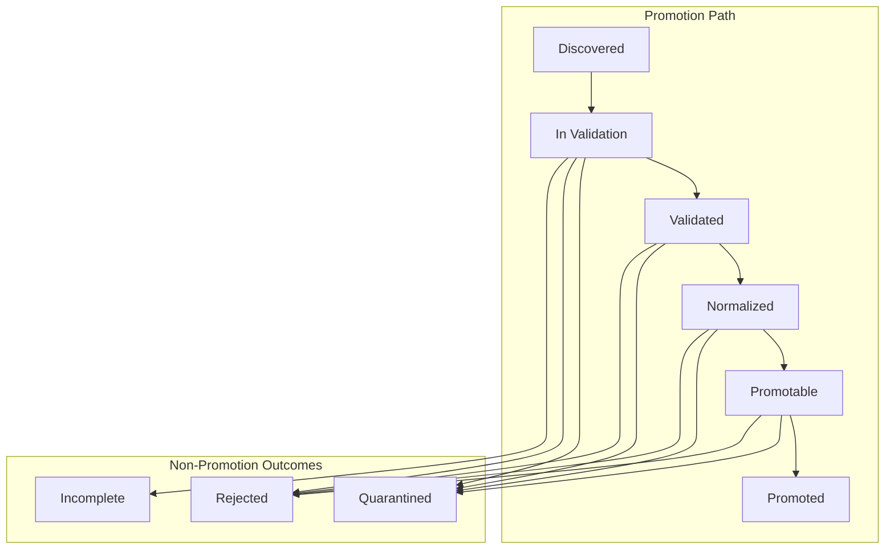

# Operational Behavior

This document describes how the Data Quality Stack behaves during normal operation: how raw recorded datasets are discovered, assessed, transformed, and either promoted to Canonical Storage or excluded from it.

---

## Dataset Discovery and Intake

The Data Quality Stack operates as an **asynchronous consumer** of the Data Recording Stack's outputs. It does not receive active notifications, synchronous handoffs, or push deliveries. Instead, it discovers new work by scanning for **Dataset Manifests** — metadata artifacts published by the Data Recording Stack to known locations.

When a new Dataset Manifest is discovered, the Data Quality Stack registers the corresponding raw recorded dataset as Discovered and loads it from **Persistent Raw Storage** for processing. Before discovery, the dataset is outside the Data Quality Stack's operational scope.

Discovery runs on the Data Quality Stack's own schedule. The cadence at which new manifests are detected and datasets are loaded is determined by the Data Quality Stack's operational configuration, not by the Data Recording Stack's production rate. This decoupling ensures that recording throughput and quality-assessment throughput are independent concerns.

---

## Validation and Quality Assessment

Once a raw dataset is loaded, the Data Quality Stack assesses it against defined quality criteria. Assessment proceeds through two levels:

### Structural validation

The dataset is checked for structural integrity and completeness:

- Schema conformance — expected fields, types, and message structure.
- Coverage — whether the dataset contains data for its declared Time Window without significant gaps or missing segments.
- Ordering — whether messages appear in expected sequence.

A dataset that fails structural validation does not proceed to further assessment. It is routed toward a non-promotion outcome (quarantine or rejection) at the point of failure, with validation metadata recording the reason.

### Consistency and market-plausibility assessment

Structurally valid datasets undergo content-level assessment:

- **Internal consistency** — whether fields within individual messages and across related messages are coherent.
- **Cross-data consistency** — whether order book data and trade data, when both are present, form a mutually consistent recorded market view. For example: whether recorded trades are plausible given the contemporaneous order book state, and whether observed spreads fall within reasonable bounds.
- **Market-structure plausibility** — whether the overall recorded data represents a coherent market snapshot rather than a corrupted or incoherent fragment.

These checks go beyond trivial completeness. They assess whether the recorded data is reliable enough to serve as a canonical Research input — not merely whether it exists in the correct format.

Validation metadata is produced for every assessed dataset, regardless of the outcome. The metadata documents which checks were applied, which passed, and which failed.

---

## Normalization and Promotion

Datasets that pass both structural validation and consistency assessment are eligible for normalization and promotion.

### Normalization

The Data Quality Stack transforms eligible raw datasets from their Venue-specific format into the canonical form required by Canonical Storage. Normalization is a format transformation, not a content modification: the underlying market data must be faithfully represented in the canonical output.

### Promotion

Normalized datasets are evaluated for final promotion eligibility. A dataset that passes all quality criteria and has been successfully normalized is **promoted** — written to **Canonical Storage** as a canonical dataset with accompanying promotion metadata.

Promotion is a **controlled outcome**. It is not an automatic consequence of a dataset's existence or discovery. A dataset becomes canonical only when the Data Quality Stack explicitly writes it to Canonical Storage after successful validation, consistency assessment, and normalization. There is no alternative path into Canonical Storage.

Promotion metadata records when the promotion occurred, the canonical storage location, and any identifiers needed for downstream traceability.

---

## Quarantine and Non-Promotion Outcomes

Not every discovered dataset becomes canonical. Datasets that fail validation, consistency assessment, or normalization are routed to non-promotion outcomes:

- **Quarantine.** The dataset is held for review or potential reprocessing. Quarantine is appropriate when the failure may be transient, when the dataset may be recoverable, or when further investigation is needed before a definitive decision.
- **Rejection.** The dataset is definitively excluded from canonical promotion. Rejection is appropriate when the dataset is unrecoverably defective or fundamentally unsuitable.
- **Incomplete.** The dataset is recognized as not yet processable — for example, because the corresponding raw data in Persistent Raw Storage is not yet fully available. Incomplete datasets may be re-evaluated on a later processing cycle.

Non-promotion outcomes are recorded with validation metadata documenting the reason for exclusion. These outcomes are available for diagnostic and operational purposes but do not enter Canonical Storage.

The progression of a dataset through the Data Quality Stack can be summarized at a high level:

At each stage, a dataset may exit the promotion path if it fails to meet the criteria required to proceed.

---

## Operational Boundaries

**Asynchronous gate, not streaming processor.** The Data Quality Stack operates as a batch-oriented asynchronous gate between raw data and canonical data. It processes datasets as discrete units (partitioned by Venue, Feed, and Time Window), not as a continuous Event Stream of individual messages.

**No raw data capture.** The Data Quality Stack reads from Persistent Raw Storage. It does not connect to Venue feeds, manage recording infrastructure, or produce raw datasets. Those are Data Recording Stack responsibilities.

**No Canonical Storage governance.** The Data Quality Stack writes promoted datasets to Canonical Storage but does not manage the storage layer's organization, retention, or access policies. Those are Data Storage Stack responsibilities.

**No Core Runtime interaction.** The Data Quality Stack's operational cycle — discovery, validation, normalization, promotion — does not intersect with the Core Runtime Event Stream, State derivation, or any execution-path processing.

**Observability.** The operational health of the Data Quality Stack — discovery throughput, validation pass/fail rates, promotion rates, quarantine volumes — should remain observable at a high level. The specifics of monitoring instrumentation and alerting thresholds are defined elsewhere.

---

## Why This Behavior Matters

The Data Quality Stack's operational behavior determines which recorded datasets become canonical Research inputs. Every canonical dataset consumed by Backtesting or Analysis has passed through this Stack's validation, consistency assessment, normalization, and promotion logic.

If the Data Quality Stack is operationally permissive — promoting datasets without rigorous assessment — downstream Research may rely on incomplete, inconsistent, or structurally defective data. If it is operationally opaque — producing insufficient metadata about promotion and non-promotion outcomes — the reasons for dataset inclusion or exclusion become untraceable.

The gatekeeper behavior described here is what gives Canonical Storage its authority as the validated dataset layer. The rigor of this Stack's operational standards propagates directly into the reliability of all downstream Research.
