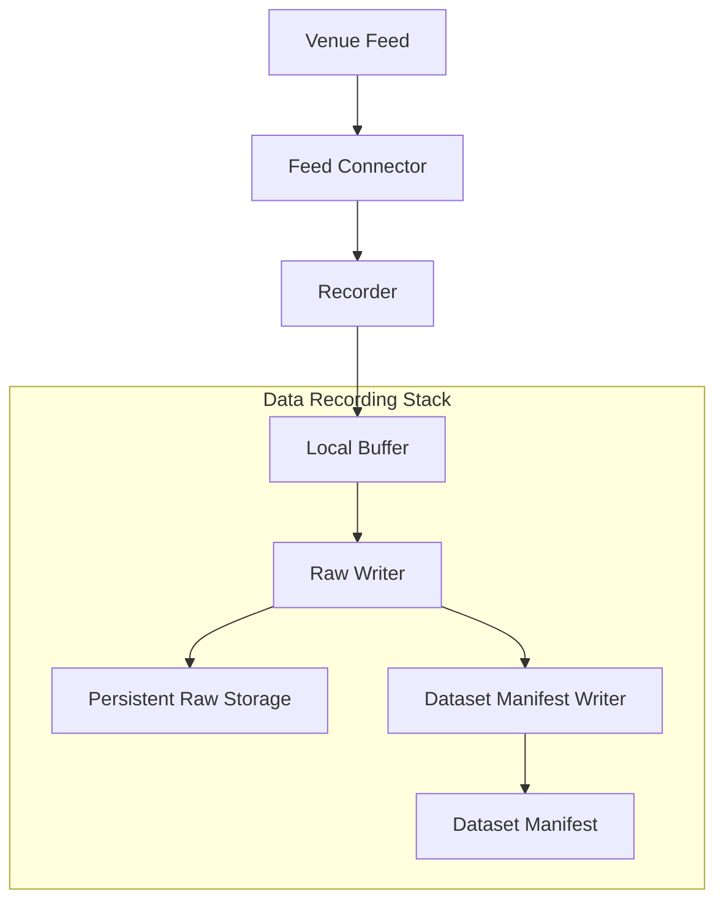

# Internal Structure

This document defines the logical internal structure of the Data Recording Stack: its components, their roles, and the internal flow from raw Venue feed intake to persisted raw datasets and Dataset Manifests.

---

## Structural Overview

The Data Recording Stack decomposes into a small set of logical components that together accomplish one task: receiving raw Venue market-data messages and turning them into durably persisted, discoverable raw recorded datasets.

The internal flow moves through five stages:

Each component has a single defined role. No component performs validation, normalization, or canonical promotion — those responsibilities belong to downstream Stacks.

---

## Core Internal Components

### Feed Connector

Establishes and maintains a connection to a real Venue market-data feed. Each Feed Connector is responsible for a specific Venue and feed combination.

Role:

- Manage the network connection to the external Venue data source.
- Receive raw market-data messages (trades, order book updates) from the feed.
- Deliver raw messages to the Recorder for processing.

The Feed Connector is the Stack's point of contact with external Venue sources. It is not a Venue Adapter in the Core Runtime sense — it performs feed connectivity for data recording, not execution-path protocol translation.

### Recorder

Receives raw messages from one or more Feed Connectors and prepares them for local persistence.

Role:

- Accept raw Venue messages from Feed Connectors.
- Attach **Capture Time** — the local time at which the message was observed or received.
- Attach source metadata: Venue identity, feed identity, and connection provenance.
- Write the annotated raw messages to Local Buffer.

The Recorder does not interpret, transform, or filter the message content. It preserves the raw payload as received and adds the recording metadata that makes the dataset traceable.

### Local Buffer

Temporary local storage on the **Capture Node** — the machine or node performing the recording.

Role:

- Absorb incoming recorded data at capture rate, decoupling feed intake from durable write latency.
- Hold raw recorded data locally until it is flushed to Persistent Raw Storage by the Raw Writer.

Local Buffer is transient. Its contents are not yet durably persisted and are not available to downstream consumers. Durability is achieved only when data reaches Persistent Raw Storage.

### Raw Writer

Reads from Local Buffer and writes completed raw recorded datasets to Persistent Raw Storage.

Role:

- Read buffered raw recorded data from Local Buffer.
- Organize it into raw recorded datasets partitioned by **Venue**, **Feed**, and **Time Window**.
- Write the completed datasets to **Persistent Raw Storage** in their final durable form.

The Raw Writer is the component that transitions data from transient local state to durable raw persistence. It does not write to Canonical Storage. The logical separation between Persistent Raw Storage and Canonical Storage is strict, regardless of whether they share physical infrastructure.

### Dataset Manifest Writer

Creates Dataset Manifests — metadata artifacts that describe completed raw recorded datasets and signal their availability for downstream discovery.

Role:

- After a raw recorded dataset has been durably written to Persistent Raw Storage, create a corresponding **Dataset Manifest**.
- The Dataset Manifest records the dataset's Venue, feed, time window, storage location, and completeness status.
- Publication of the Dataset Manifest is what makes the dataset discoverable to downstream consumers (primarily the Data Quality Stack).

The Dataset Manifest Writer is the final internal component in the recording pipeline. Its output is the downstream discovery boundary: downstream Stacks do not depend on the Data Recording Stack's internal state or runtime, only on the presence of Dataset Manifests and corresponding raw datasets in Persistent Raw Storage.

---

## Internal Flow

The end-to-end internal flow within the Data Recording Stack follows a linear progression:

1. **Feed intake.** A Feed Connector receives raw market-data messages from a Venue feed.
2. **Recording.** The Recorder attaches Capture Time and source metadata to each raw message.
3. **Buffering.** Annotated raw messages are written to Local Buffer on the Capture Node.
4. **Raw persistence.** The Raw Writer reads from Local Buffer, organizes data into raw recorded datasets (partitioned by Venue, Feed, Time Window), and writes them to Persistent Raw Storage.
5. **Manifest publication.** The Dataset Manifest Writer creates a Dataset Manifest for each completed dataset, signaling downstream readiness.

Steps 1–3 operate at capture rate. Steps 4–5 may operate at a different cadence, decoupled from real-time feed pressure by the Local Buffer.

---

## Structural Boundaries

**No validation or normalization.** Internal components record raw data faithfully. They do not detect gaps, validate schemas, normalize formats, or assess quality. Those responsibilities belong to the Data Quality Stack.

**No canonical promotion.** The Raw Writer writes to Persistent Raw Storage only. The path from raw data to Canonical Storage passes through the Data Quality and Data Storage Stacks. No internal component of the Data Recording Stack participates in canonical promotion.

**No Core Runtime semantics.** The internal structure captures raw Venue market data. It does not process the Core Runtime Event Stream, derive State, or interact with Strategy, Risk, Execution Control, or Order lifecycle semantics. The Data Recording Stack and the Core Runtime are architecturally separate.

**Logical structure, not deployment specification.** The components described here are logical roles. A single process may host multiple components (e.g., Recorder and Local Buffer on the same Capture Node), or components may be distributed across nodes. Physical deployment topology is not specified by this document.
