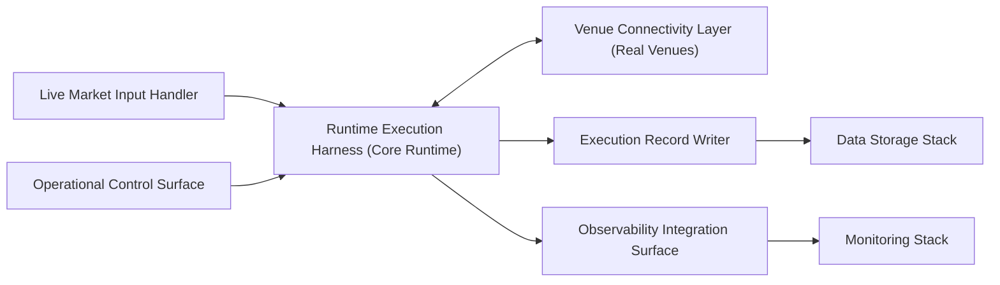

# Internal Structure

This document defines the logical internal structure of the Live Stack: its capabilities, their roles, and the internal flow from real-time market-data intake through live runtime execution to execution-record persistence.

---

## Structural Overview

The Live Stack decomposes into a set of logical capabilities that together accomplish one task: executing the Core Runtime against real-time market data and real Venues in an operationally controlled, observable, and persistent production environment.

The internal flow forms a loop with persistence and observability branches:

The Core Runtime is the execution kernel at the center of this structure. The Live Stack's capabilities surround it — feeding it real-time inputs, connecting it to real Venues, exposing operational controls, persisting execution outcomes, and integrating observability. The Live Stack does not define the Core Runtime's processing semantics; it provides the production infrastructure that makes the Core Runtime operational against real markets.

---

## Core Internal Capabilities

### Live Market Input Handler

Receives real-time market data from live Venue feeds and delivers it to the Runtime Execution Harness as the Event input that drives the Core Runtime's processing loop.

Role:

- Maintain connections to live Venue market-data feeds.
- Receive trade messages, order book updates, and associated data in real time.
- Deliver market-data Events to the Runtime Execution Harness in the form the Core Runtime expects for Event processing.

The Live Market Input Handler is the stack's real-time inbound data surface. It connects the Core Runtime to the live market without the Core Runtime needing to manage feed connectivity directly.

### Runtime Execution Harness

Hosts and executes the Core Runtime for live trading — the same deterministic, event-driven processing model used across all execution contexts.

Role:

- Instantiate the Core Runtime with the session's Strategy, Configuration, and execution-control rules.
- Process incoming Events (market data, Execution Events from Venue feedback) through the full Core Runtime chain: `Event intake → State derivation → Strategy evaluation → Risk → Execution Control → dispatch decisions`.
- Pass outbound work selected for dispatch to the Venue Connectivity Layer for transmission to real Venues.
- Receive Execution Events (Venue feedback) from the Venue Connectivity Layer and feed them back into the processing loop.

The Runtime Execution Harness is where the Core Runtime actually runs in production. It executes the Core Runtime's semantics faithfully; it does not modify them. The harness manages the runtime lifecycle (startup, steady-state execution, shutdown) without altering the processing model within.

### Venue Connectivity Layer

Manages bidirectional communication with real Venues through the Venue Adapter boundary.

Role:

- **Outbound.** Receive dispatch decisions from the Runtime Execution Harness and transmit them to real Venues as Venue-specific API requests (order submissions, modifications, cancellations) through the Venue Adapter.
- **Inbound.** Receive Venue responses (acknowledgements, fills, rejections, cancellations) and surface them as Execution Events for re-entry into the Runtime Execution Harness's processing loop.

The Venue Connectivity Layer operates the Venue Adapter in a live context — managing real network connections, real API sessions, and real protocol translation. It isolates Venue-specific connectivity concerns from the Core Runtime's processing logic.

### Operational Control Surface

Exposes the operational controls through which the live trading environment is managed.

Role:

- Accept operational control inputs — session start and stop, trading enable/disable, kill-switch activation, Configuration updates, and other operational commands.
- Apply control inputs to the Runtime Execution Harness within the bounds of the Core Runtime's processing model.
- Expose session and runtime state for operational visibility.

The Operational Control Surface is how human operators and operational tooling interact with the Live Stack during execution. It does not make trading decisions — those are made by the Strategy within the Core Runtime. It provides the controls that govern when and under what conditions live execution proceeds.

### Execution Record Writer

Persists execution outcomes and related records to the Data Storage Stack's persistent surfaces during and after live execution.

Role:

- Write order history, fill records, position data, dispatch decisions, and execution metadata to **Execution Record Storage**.
- Ensure that execution records are durably persisted so they survive session boundaries and are available for downstream analysis.

The Execution Record Writer is the capability that makes live execution outcomes durable. Without it, the history of what was dispatched, what the Venue reported, and what Order lifecycle outcomes resulted would exist only in transient runtime state.

### Observability Integration Surface

Emits runtime telemetry, execution metrics, and operational signals for consumption by the Monitoring Stack.

Role:

- Emit execution throughput, order status, processing latency, error conditions, and system health indicators during live execution.
- Provide the telemetry surface that the Monitoring Stack consumes for real-time dashboards, alerting, and operational visibility.

The Observability Integration Surface makes live execution observable without the Live Stack owning the monitoring infrastructure. The Monitoring Stack provides the platform; the Live Stack provides the telemetry.

---

## Internal Flow

The internal flow within the Live Stack operates as a continuous real-time loop with persistence and observability outputs:

1. **Market-data intake.** The Live Market Input Handler receives real-time market data from Venue feeds and delivers Events to the Runtime Execution Harness.
2. **Runtime execution.** The Runtime Execution Harness processes Events through the Core Runtime's full processing chain — State derivation, Strategy evaluation, Risk, Execution Control — producing dispatch decisions for outbound work.
3. **Venue interaction.** The Venue Connectivity Layer transmits dispatch decisions to real Venues and receives Execution Events (fills, acknowledgements, rejections) in return. Execution Events re-enter the Runtime Execution Harness for further processing.
4. **Execution-record persistence.** The Execution Record Writer captures execution outcomes — orders, fills, positions, metadata — and writes them to the Data Storage Stack's persistent surfaces.
5. **Observability emission.** The Observability Integration Surface emits runtime telemetry and operational signals to the Monitoring Stack throughout execution.
6. **Operational control.** The Operational Control Surface accepts control inputs from operators and operational tooling, governing session lifecycle and trading state.

Steps 1–3 form the continuous real-time execution loop. Steps 4–5 operate alongside the loop, persisting outcomes and emitting telemetry as execution proceeds. Step 6 operates asynchronously relative to the processing loop, applying control inputs as they arrive.

---

## Structural Boundaries

**The Core Runtime is executed, not defined.** The Runtime Execution Harness hosts and runs the Core Runtime, but the Core Runtime's processing semantics — Event model, State derivation, Intent lifecycle, Order lifecycle, Risk, Execution Control, Determinism — are defined in architecture and concept documents. The Live Stack's internal structure provides the production execution environment; it does not alter the execution model.

**No storage governance.** The Execution Record Writer writes to the Data Storage Stack's persistent surfaces but does not manage those surfaces. Storage organization, retention, and access are Data Storage Stack responsibilities.

**No monitoring ownership.** The Observability Integration Surface emits telemetry. The Monitoring Stack consumes and presents it. The Live Stack does not own dashboards, alerting infrastructure, or monitoring configuration.

**No Core Runtime semantic processing outside the harness.** Capabilities such as the Live Market Input Handler, Venue Connectivity Layer, Operational Control Surface, Execution Record Writer, and Observability Integration Surface operate around the Core Runtime. They do not participate in Event processing, State derivation, or execution-control logic. That processing occurs entirely within the Runtime Execution Harness through the Core Runtime itself.

**Logical structure, not deployment specification.** The capabilities described here are logical roles. They may be realized as separate processes, modules within a single application, or distributed services. Physical deployment topology is not specified by this document.
