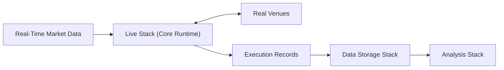

# Live Stack

Part of: **Core Runtime**

The Live Stack provides the runtime environment, real-time connectivity, operational integration, and supporting infrastructure required to execute the Core Runtime in Live mode against real market data and real Venues.

---

## Purpose

The Live Stack exists to make the Core Runtime operational in a production trading context. It connects the Core Runtime to real-time market data, enables bidirectional interaction with real Venues, provides an operationally controllable and observable execution environment, and persists the execution outcomes that result from live trading activity.

The Live Stack **uses** the Core Runtime; it does not **define** it. The Core Runtime's semantic model — Events, State derivation, Intents, Risk, Execution Control, Order lifecycle, Determinism — is established in architecture and concept documents. The Live Stack realizes that model in a real-time, market-connected environment where processing decisions produce real market actions with real financial consequences.

---

## Position in the System

The Live Stack belongs to the **Core Runtime** group. It operates at the boundary between the Core Runtime and the real market and Venue environment:

It depends on:

- **Data Storage Stack** — for persisting execution records, order and fill history, position records, and other live execution outputs.
- **Monitoring Stack** — for operational visibility and observability during live trading.

The Live Stack is **not** part of the Data Platform. It does not capture raw data for recording purposes, validate datasets, normalize formats, or promote canonical data. It is a real-time execution layer that produces execution outcomes, not a data-processing pipeline.

---

## Main Responsibilities

The Live Stack is responsible for:

- Executing the Core Runtime in Live mode — running the full processing chain (Event intake, State derivation, Strategy, Risk, Execution Control, Venue Adapter) against real-time market data.
- Using **real-time market data** from live Venue feeds as the operational input that drives Event processing and State derivation.
- Enabling interaction with **real Venues** — transmitting outbound execution requests and receiving execution feedback through the Venue Adapter boundary.
- Providing an **operationally controllable** live environment — supporting session lifecycle management, trading controls, and safety mechanisms (e.g., kill-switch).
- Supporting **observable execution** — emitting runtime telemetry and operational signals for consumption by the Monitoring Stack.
- Persisting **execution records and related outputs** — writing order history, fill records, position data, and execution metadata to the Data Storage Stack for durable retention and downstream analysis.

---

## Key Boundaries

**Executes the Core Runtime, does not define it.** The Core Runtime's processing semantics apply identically in Live mode. The Live Stack provides the real-time operational context; it does not modify the processing model.

**Real market interaction.** The Live Stack operates against real Venues with real financial consequences. Outbound execution requests are real market actions; inbound execution feedback reflects real Venue outcomes. This is the defining characteristic of the Live Stack.

**Operational control and observability are essential, not optional.** The Live Stack must be controllable by operators and observable through the Monitoring Stack at all times during execution. These are architectural requirements of production trading infrastructure, not secondary features.

**Persistence is a core concern.** Execution records must be durably persisted as they are produced — not deferred to session end. The durable record of live execution is the mechanism by which the System retains knowledge of what it did in production.

**Not the Monitoring Stack.** The Live Stack emits telemetry and supports observable execution. The Monitoring Stack provides the monitoring platform, dashboards, and alerting. The boundary is the telemetry emission surface.

---

## Relationship to Other Stacks

**Data Storage Stack.** Provides the persistent surfaces for the Live Stack's durable outputs. Execution records, order history, fill records, position data, and execution metadata are written to **Execution Record Storage**. The Data Storage Stack provides and governs these surfaces; the Live Stack writes to them.

**Monitoring Stack.** Provides operational visibility into live execution. The Live Stack emits runtime telemetry — execution throughput, order status, connection health, error conditions — that the Monitoring Stack consumes for real-time dashboards and alerting. Monitoring is critically important during live trading but remains a separate Stack.

**Analysis Stack.** Consumes persisted Live outputs for post-hoc analysis — execution-quality review, performance evaluation, and operational assessment. The Analysis Stack reads from Execution Record Storage after live execution has occurred. There is no synchronous interface between the two during live operation.

---

## Why the Stack Matters

The Live Stack is where the System's architecture meets real markets. Everything upstream — the deterministic processing model, the validated canonical datasets, the Research-evaluated Strategies — converges here into real-time execution that produces real financial outcomes.

The Live Stack's reliability, observability, and operational soundness directly determine whether the System's architectural guarantees translate into safe, controlled production behavior. If the Live Stack does not faithfully execute the Core Runtime's processing model, production behavior diverges from what was validated during Research. If execution outcomes are not persistently recorded, the System has no durable history of its actions. If the live environment is not observable and controllable, it cannot be operated safely.

Detailed treatment of scope and role, interfaces, internal structure, operational behavior, and implementation considerations is provided in the companion documents for this Stack.
