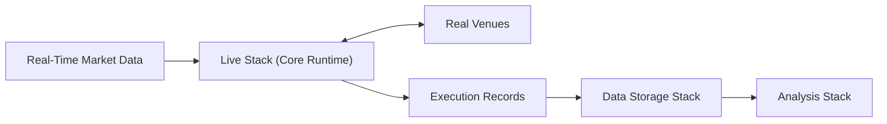

# Scope and Role

The Live Stack provides the runtime environment, real-time connectivity, operational integration, and supporting infrastructure required to execute the Core Runtime in Live mode against real market data and real Venues.

---

## Purpose

The Live Stack exists to make the Core Runtime operational in a production trading context. It connects the Core Runtime to real-time market data, enables interaction with real Venues, provides an operationally controllable execution environment, and persists the execution outcomes that result from live trading activity.

The Live Stack **uses** the Core Runtime; it does not **define** it. The Core Runtime's semantic model — Events, State derivation, Intents, Risk, Execution Control, Order lifecycle, Determinism — is established in architecture and concept documents. The Live Stack realizes that model in a real-time, market-connected environment: it supplies live inputs, connects to real Venues through the Venue Adapter boundary, supports operational control and observability, and persists execution records.

---

## Position in the System

The Live Stack belongs to the **Core Runtime** group. It operates at the boundary between the Core Runtime and the real market and Venue environment:

It depends on:

- **Data Storage Stack** — for persisting execution records, order and fill history, position records, and other live execution outputs.
- **Monitoring Stack** — for observability and operational visibility into live execution.

The Live Stack is **not** part of the Data Platform. It does not capture raw data for recording purposes, validate datasets, normalize formats, or promote canonical data. It is a real-time execution layer, not a data-processing pipeline.

### Relationship to the Core Runtime

The Live Stack executes the same Core Runtime that defines the System's processing semantics — the same Event-driven processing model, the same Strategy → Risk → Execution Control → Venue Adapter chain, the same deterministic State derivation. The Live Stack provides the real-time operational context in which those semantics are applied to live market conditions and real Venue interactions.

### Operational importance

The Live Stack carries the technical burden of production runtime execution. It operates against real markets, transmits real orders to real Venues, and produces real financial outcomes. This makes operational control and observability critically important — the Live Stack must support execution that is observable, controllable, and operationally sound. However, the Monitoring Stack remains a separate Stack; the Live Stack supports observability-ready execution without owning the monitoring infrastructure itself.

---

## Core Responsibilities

The Live Stack is responsible for:

- Making the Core Runtime executable in Live mode — providing the production runtime environment in which the Core processes real-time Events and produces real dispatch decisions.
- Using **real-time market data** as live inputs — connecting to live Venue market-data feeds that drive Event processing and State derivation.
- Enabling interaction with **real Venues** — connecting the Venue Adapter to real Venue APIs for outbound order submission, modification, cancellation, and inbound execution feedback.
- Providing an **operationally controllable** live environment — supporting the operational controls necessary for production trading, including the ability to observe, intervene in, and manage live execution.
- Supporting **observability-ready execution** — emitting runtime telemetry, execution metrics, and operational signals that the Monitoring Stack can consume for real-time visibility into live trading activity.
- Persisting **execution records and related live outputs** — writing order history, fill records, position data, execution metadata, and other live execution outcomes to the Data Storage Stack's persistent surfaces for durable retention and downstream analysis.
- Carrying the technical burden of **production runtime execution** — ensuring that the live environment is reliable, responsive, and operationally sound under real market conditions.

---

## Explicit Non-Responsibilities

The Live Stack is **not** responsible for:

- **Core Runtime semantic definitions.** The Event model, State model, Determinism model, Intent lifecycle, Order lifecycle, Risk semantics, Queue semantics, and all canonical processing rules are defined in architecture and concept documents. The Live Stack realizes these semantics in production execution; it does not define or modify them.
- **Raw Venue data capture for recording purposes.** Connecting to Venue feeds for the purpose of recording raw datasets for the Data Platform is the Data Recording Stack's responsibility. The Live Stack connects to Venue feeds for live execution, not for data recording.
- **Dataset validation, normalization, or canonical promotion.** These are Data Quality Stack responsibilities. The Live Stack does not participate in the Data Platform's dataset processing pipeline.
- **Storage governance.** The Live Stack writes execution records and related outputs to the Data Storage Stack's persistent surfaces but does not manage those surfaces, their organization, or their retention policies.
- **Monitoring infrastructure.** The Monitoring Stack provides the monitoring and observability platform. The Live Stack emits telemetry and supports observable execution; it does not own dashboards, alerting, or monitoring infrastructure.
- **Human operational decision-making.** The Live Stack provides the operational environment and controls. Decisions about when to start, stop, or modify live trading are human operational responsibilities, not Stack responsibilities.

---

## Why the Stack Matters

The Live Stack is where the System's architecture meets real markets. Everything upstream — canonical models, deterministic processing semantics, validated datasets, Research-evaluated Strategies — converges here into real-time execution that produces real financial outcomes.

The Live Stack's reliability and operational soundness directly determine whether the System's architectural guarantees translate into safe, controlled production behavior. A Live Stack that is not observable cannot be operated safely. A Live Stack that does not faithfully execute the Core Runtime's processing model produces behavior that diverges from what was validated during Research. The Live Stack's role is to ensure that the transition from Research to production is architecturally faithful and operationally controlled.
