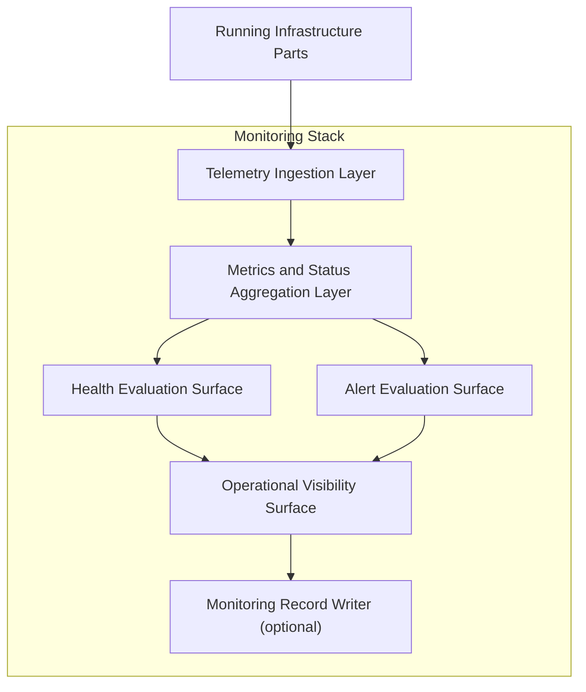

# Internal Structure

This document defines the logical internal structure of the Monitoring Stack: its capabilities, their roles, and the internal flow from observability-signal ingestion through structuring and evaluation to operational visibility exposure.

---

## Structural Overview

The Monitoring Stack decomposes into a set of logical capabilities that together accomplish one task: receiving observability-relevant signals from running infrastructure parts, structuring and evaluating them, and exposing the results as operational visibility, health views, and alert-oriented outputs.

The internal flow moves through four stages:

All capabilities operate on signals from running infrastructures — the Monitoring Stack does not consume persisted analytical outputs or historical experiment datasets. Its internal structure is oriented around ongoing, runtime-concurrent observation of active infrastructure behavior.

---

## Core Internal Capabilities

### Telemetry Ingestion Layer

Receives observability-relevant signals from running infrastructure parts and normalizes them for downstream processing.

Role:

- Receive telemetry, metrics, status signals, health signals, error/failure signals, and other observability-relevant runtime outputs from running Stacks and components.
- Accept signals from multiple sources — primarily the Live Stack and the Backtesting Stack, and from other running infrastructure parts where observability support is needed.
- Normalize heterogeneous signal formats into a consistent internal representation suitable for aggregation, evaluation, and exposure.

The Telemetry Ingestion Layer is the entry point of the stack. It bridges running infrastructure parts and the Monitoring Stack's internal processing. No monitoring capability operates without ingested signals.

### Metrics and Status Aggregation Layer

Structures, aggregates, and organizes ingested signals into queryable representations.

Role:

- Aggregate raw telemetry into time-series metrics, counters, gauges, histograms, and other structured metric representations.
- Maintain current-status representations for monitored components — running, degraded, stopped, errored, or other relevant runtime states.
- Organize ingested signals by source, component, subinfrastructure, or other structuring dimensions so that downstream capabilities can query and evaluate specific slices of operational data.

The Metrics and Status Aggregation Layer transforms raw ingested signals into structured operational data. It provides the organized foundation on which health evaluation, alert evaluation, and operational visibility depend.

### Health Evaluation Surface

Evaluates aggregated signals to produce health assessments for monitored components and subinfrastructures.

Role:

- Evaluate health-check responses, liveness signals, and readiness indicators to determine whether running components are functioning within expected parameters.
- Produce aggregated health views — per-component, per-subinfrastructure, or infrastructure-wide — that represent the operational health posture of running infrastructure parts.
- Detect health degradations, partial failures, and conditions where components are running but outside healthy operating bounds.

The Health Evaluation Surface turns raw health signals into structured health assessments. It does not make operational decisions — it makes health conditions visible and assessable.

### Alert Evaluation Surface

Evaluates aggregated signals and health assessments against monitoring conditions to produce alert-oriented outputs.

Role:

- Evaluate metrics, status, and health data against defined alert conditions — thresholds, anomaly patterns, error-rate limits, and other monitoring criteria.
- Produce alert events when noteworthy conditions are detected — degradations, failures, threshold breaches, or operational anomalies.
- Route alert-oriented outputs toward operators, external notification infrastructures, or alert-handling infrastructure.

The Alert Evaluation Surface is the capability through which the Monitoring Stack surfaces conditions that require operational attention. The specific alert rules and thresholds are operational configuration; the Alert Evaluation Surface provides the structural capability to evaluate and emit alerts.

### Operational Visibility Surface

Exposes the Monitoring Stack's collected, structured, and evaluated data as accessible operational views.

Role:

- Provide queryable and visual access to telemetry, metrics, status, and health information for operators and operational tooling.
- Expose real-time and near-real-time views of running infrastructure behavior — metric time series, status summaries, health dashboards, and incident-relevant diagnostic views.
- Make the operational state of running infrastructure parts inspectable without requiring direct access to those infrastructures.

The Operational Visibility Surface is the primary consumption point of the Monitoring Stack. It is where operational visibility becomes accessible — where telemetry, health, status, and alert information are presented in a form that supports runtime awareness and operational reasoning.

### Monitoring Record Writer

Persists monitoring-related records and artifacts where durable retention is needed.

Role:

- Write metric histories, alert records, status-change logs, and other monitoring artifacts to available storage surfaces.
- Support post-incident reference and operational continuity by ensuring that monitoring data survives beyond the immediate runtime observation window.

The Monitoring Record Writer is not always active — not all monitoring data requires persistence. Where it operates, it produces monitoring artifacts, not analytical datasets. Monitoring records serve operational continuity and incident review, not retrospective analytical evaluation.

---

## Internal Flow

The end-to-end internal flow within the Monitoring Stack follows a staged progression:

1. **Signal ingestion.** The Telemetry Ingestion Layer receives observability-relevant signals from running infrastructure parts and normalizes them for internal processing.
2. **Aggregation and structuring.** The Metrics and Status Aggregation Layer organizes ingested signals into structured metrics, status representations, and queryable operational data.
3. **Health and alert evaluation.** The Health Evaluation Surface assesses component and subinfrastructure health. The Alert Evaluation Surface evaluates aggregated data against monitoring conditions and produces alert-oriented outputs where noteworthy conditions are detected.
4. **Operational visibility exposure.** The Operational Visibility Surface makes telemetry, metrics, status, health, and alert information accessible to operators and operational tooling.
5. **Record persistence (where applicable).** The Monitoring Record Writer persists monitoring artifacts to storage surfaces where durable retention is needed.

Health evaluation and alert evaluation operate in parallel — both consume the Metrics and Status Aggregation Layer's structured outputs, and both feed into the Operational Visibility Surface. They are complementary capabilities, not sequential stages.

Not every signal traverses all stages. A simple metric may flow from ingestion through aggregation to visibility without triggering health or alert evaluation. A critical failure signal may engage all stages, including alert evaluation and record persistence. The stages are composable based on the nature of the signal and the monitoring configuration in effect.

---

## Structural Boundaries

**No runtime execution.** The Monitoring Stack's internal structure observes running infrastructure behavior. It does not run Strategies, process Events, evaluate Risk, manage Execution Control, or interact with Venues. It makes execution visible — it does not perform it.

**No retrospective analysis.** The internal structure is oriented around ongoing runtime observation. It does not evaluate persisted experiment results, compare Strategy performance across runs, or produce derived analytical artifacts. Those are Analysis Stack responsibilities.

**No storage governance.** Where the Monitoring Record Writer persists monitoring artifacts, it writes to available storage surfaces but does not manage their organization, retention policies, or access governance.

**Tool overlap does not change the structure.** When a single product or platform combines monitoring, orchestration, and execution-status concerns, the Monitoring Stack's internal capabilities remain scoped to observability and operational visibility. The logical decomposition described here is defined by architectural role, not by product packaging.

**Logical structure, not deployment specification.** The capabilities described here are logical roles. They may be realized as dedicated services, library components, platform features, or integrated tooling surfaces. Physical deployment topology is not specified by this document.
