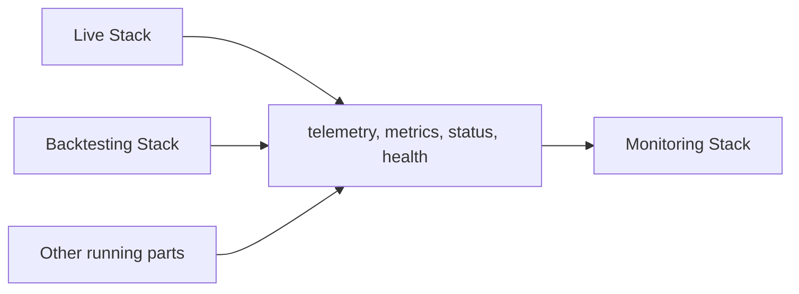

# Monitoring Stack

Part of: **Analysis and Monitoring**

The Monitoring Stack provides the infrastructure, components, and integration surfaces required to observe running system behavior, expose operational visibility, collect telemetry and status signals, and support health- and alert-oriented monitoring for relevant runtime Stacks.

---

## Purpose

The Monitoring Stack exists to make running system behavior visible while it is happening. Runtime Stacks produce telemetry, metrics, status indicators, health signals, and error events as they execute. The Monitoring Stack provides the technical infrastructure to collect these signals, structure them, evaluate them for health and alert conditions, and expose them as operational visibility surfaces.

The Monitoring Stack is **runtime-concurrent** in character. It works alongside running system parts while they are active. Its concern is what is happening now — the operational state of running processes, the health of executing components, and the detection of conditions that require attention. Its value lies in ongoing observation, not in after-the-fact interpretation of stored results.

---

## Position in the Infrastructure

The Monitoring Stack belongs to the **Analysis and Monitoring** group. It works alongside running system parts rather than defining their execution semantics:

The Monitoring Stack has its strongest practical relevance for **Live operation** and **Backtesting execution**, where runtime observability is most operationally critical. It may also support observability of other relevant running system parts where needed.

The Monitoring Stack does **not** define execution logic. It observes execution — it does not participate in it. Runtime Stacks retain full ownership of their execution semantics; the Monitoring Stack provides a parallel observability layer over their running behavior.

---

## Main Responsibilities

The Monitoring Stack is responsible for:

- **Making running system behavior observable** — providing the infrastructure to observe, inspect, and track the runtime state of executing system parts.
- **Collecting and integrating telemetry and status signals** — receiving metrics, health signals, error and failure signals, status indicators, and other observability-relevant runtime outputs from running Stacks.
- **Exposing operational visibility** — making runtime behavior, execution progress, component health, and operational conditions accessible through monitoring surfaces.
- **Supporting health- and alert-oriented monitoring** — enabling detection of runtime issues, degradations, failures, and noteworthy operational conditions, and supporting alert-oriented workflows that surface these conditions.
- **Providing monitoring integration surfaces** — offering the integration points through which running Stacks expose their telemetry and status signals to the monitoring infrastructure.
- **Making runtime issues diagnosable** — ensuring that when something goes wrong in a running system, the Monitoring Stack provides the observability needed to identify, locate, and characterize the issue.

---

## Key Boundaries

**Observes running systems, not persisted results.** The Monitoring Stack consumes signals from running system parts — telemetry, metrics, status, health, and error indicators produced during active execution. It does not consume persisted analytical outputs or historical experiment datasets.

**Runtime-concurrent, not retrospective.** The Monitoring Stack operates while the Infrastructure is running. It does not evaluate persisted experiment results, compare Strategy performance across historical runs, or produce derived analytical artifacts. Retrospective evaluation of stored outputs is a separate concern.

**Observability, not execution.** The Monitoring Stack does not run Strategies, process Events, evaluate Risk, manage Execution Control, or interact with Venues. It observes execution — it does not perform it.

**Detection, not response.** The Monitoring Stack detects conditions and makes them visible. Operational judgment and response decisions remain human responsibilities.

**Tool overlap does not change the boundary.** When a single product or platform combines monitoring, orchestration, and execution-status concerns, the Monitoring Stack's responsibilities remain scoped to observability and operational visibility. The boundary is defined by architectural role, not by product packaging.

---

## Relationship to Running System Behavior

The Monitoring Stack's value depends entirely on what running system parts emit during execution:

**Live operation.** The Live Stack produces continuous telemetry, execution-engine metrics, order-processing status, venue-interaction indicators, and health signals during active trading. The Monitoring Stack provides the integration surfaces and visibility infrastructure through which Live operation is made observable in real time.

**Backtesting execution.** The Backtesting Stack produces run-progress metrics, resource-utilization signals, execution-engine telemetry, and status indicators during backtesting runs. The Monitoring Stack provides runtime observability for backtesting execution where operational visibility is needed — particularly for long-running or resource-intensive runs.

**Other running system parts.** Where additional components — infrastructure services, data-pipeline processes, or other system parts — produce observability-relevant signals, the Monitoring Stack may provide monitoring support for them as well.

In all cases, the relationship is unidirectional at the signal level: running parts emit; the Monitoring Stack receives, structures, evaluates, and exposes. The Monitoring Stack does not influence the runtime behavior of the systems it observes.

---

## Why the Stack Matters

The Monitoring Stack is the layer that makes running system behavior visible, diagnosable, and operationally trackable. Without it, runtime Stacks may still execute, but they do so without structured operational visibility — health conditions go undetected, degradations proceed without awareness, and runtime issues become discoverable only through their downstream consequences rather than through timely observation.

The Monitoring Stack ensures that while the Infrastructure is running, its operational state is accessible, its health is assessable, and conditions that require attention are surfaced through appropriate monitoring and alerting surfaces.

Detailed treatment of scope and role, interfaces, internal structure, operational behavior, and implementation considerations is provided in the companion documents for this Stack.
