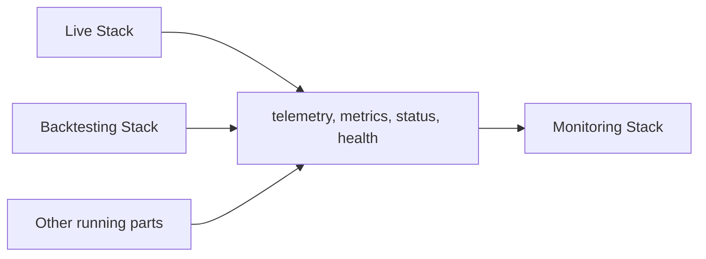

# Scope and Role

The Monitoring Stack provides the infrastructure, components, and integration surfaces required to observe running system behavior, expose operational visibility, collect telemetry and status signals, and support health- and alert-oriented monitoring for relevant runtime Stacks.

---

## Purpose

The Monitoring Stack exists to make running system behavior visible. Runtime Stacks — most prominently the Live Stack and the Backtesting Stack — produce telemetry, metrics, status signals, and health indicators as they execute. The Monitoring Stack provides the technical infrastructure to collect these signals, expose them as operational visibility surfaces, and support health- and alert-oriented monitoring that keeps running system parts diagnosable and operationally trackable.

The Monitoring Stack is **runtime-concurrent** in character. It works alongside running system parts while they are active. Its concern is what is happening now — the operational state of running processes, the health of executing components, the status of active workflows, and the detection of runtime conditions that require attention. Its value is in ongoing observation, not in after-the-fact interpretation.

---

## Position in the Infrastructure

The Monitoring Stack belongs to the **Analysis and Monitoring** group. It works alongside running system parts rather than defining their execution semantics:

The Monitoring Stack has its strongest practical relevance for **Live operation** and **Backtesting execution**, where runtime observability is most critical. It may also support observability of other relevant running system parts where needed.

The Monitoring Stack does **not** define execution logic. It observes execution — it does not participate in it. Runtime Stacks retain full ownership of their execution semantics; the Monitoring Stack provides a parallel observability layer over their running behavior.

### Relationship to Retrospective Analysis

The Monitoring Stack and the Analysis Stack share a group but serve fundamentally different concerns. The Monitoring Stack observes what is happening in running systems. The Analysis Stack evaluates what has already happened by consuming persisted outputs. The boundary is temporal and functional: Monitoring is concurrent and operational; analysis is retrospective and evaluative. This distinction holds even when the same underlying data might eventually serve both purposes.

### Tool-Overlap Principle

Real products and platforms may combine orchestration, execution status, dashboards, and monitoring-like visibility in a single tool. This practical convergence must not blur the architectural boundary. Even when a single tool supports multiple concerns, Monitoring remains a distinct architectural responsibility focused on runtime observability and operational visibility. The conceptual scope of this Stack is defined by its role, not by the tools that happen to implement it.

---

## Core Responsibilities

The Monitoring Stack is responsible for:

- **Making running system behavior observable** — providing the infrastructure to observe, inspect, and track the runtime state of executing system parts.
- **Collecting and integrating telemetry and status signals** — receiving metrics, health signals, error and failure signals, status indicators, and other observability-relevant runtime outputs from running Stacks.
- **Exposing operational visibility** — making runtime behavior, execution progress, component health, and operational conditions accessible through monitoring surfaces.
- **Supporting health- and alert-oriented monitoring** — enabling detection of runtime issues, degradations, failures, and noteworthy operational conditions, and supporting alert-oriented workflows that surface these conditions.
- **Providing monitoring integration surfaces** — offering the integration points through which running Stacks expose their telemetry and status signals to the monitoring infrastructure.
- **Making runtime issues diagnosable** — ensuring that when something goes wrong in a running system, the Monitoring Stack provides the observability needed to identify, locate, and characterize the issue.

---

## Explicit Non-Responsibilities

The Monitoring Stack is **not** responsible for:

- **Executing runtime business logic.** The Monitoring Stack does not run Strategies, process Events, evaluate Risk, manage Execution Control, or interact with Venues. It observes execution; it does not perform it.
- **Retrospective analysis of persisted results.** Evaluating experiment outcomes, comparing Strategy performance across runs, modeling Research–Live discrepancies, and producing derived analytical artifacts are Analysis Stack responsibilities. The Monitoring Stack is concerned with running behavior, not with after-the-fact evaluation of stored outputs.
- **Core Runtime semantic definitions.** The Event model, State model, Determinism model, Intent lifecycle, Order lifecycle, Risk semantics, Queue semantics, and all canonical processing rules are defined in architecture and concept documents. The Monitoring Stack does not define or modify them.
- **Storage governance.** The Monitoring Stack may write monitoring-related records or artifacts to persistent surfaces but does not manage storage organization, retention policies, or access governance.
- **Raw Venue data capture.** Recording raw market data is a Data Recording Stack responsibility.
- **Dataset validation or canonical promotion.** These are Data Quality Stack responsibilities.
- **Human operational decision-making.** The Monitoring Stack makes conditions visible and supports alerting, but operational judgment and response decisions remain human responsibilities.

---

## Why the Stack Matters

The Monitoring Stack is the layer that makes running system behavior visible, diagnosable, and operationally trackable. Without it, runtime Stacks may still execute, but they do so without structured operational visibility — health conditions go undetected, degradations proceed without awareness, and runtime issues become discoverable only through their downstream consequences rather than through timely observation.

The Monitoring Stack ensures that while the Infrastructure is running, its operational state is accessible, its health is assessable, and conditions that require attention are surfaced through appropriate monitoring and alerting surfaces.
