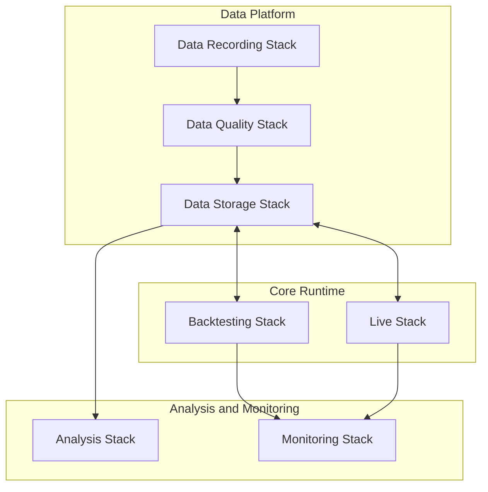

# Stacks Overview

This section describes the Stacks that realize the Infrastructure's architecture as concrete, implementation-facing subsystems. Each Stack is a functional domain with defined responsibilities, interfaces, and boundaries.

---

## Purpose of the Stacks Section

The Stacks section explains how the Infrastructure is implemented. While the Concepts section defines the canonical models and invariants — the Event model, the State model, the Determinism model, the Order lifecycle, Queue semantics — the Stacks section describes the operational domains where those models are applied.

Stack documents are **implementation-facing**. They describe what each subsystem does, what it consumes and produces, how it is structured internally, and how it behaves during operation. They are not canonical semantics documents — they do not define or redefine the core architecture model. They realize it.

---

## Stack Groups

The seven Stacks are organized into three groups that reflect the Infrastructure's major operational domains.

### Data Platform

Stacks responsible for raw data acquisition, validation, normalization, and persistent storage. Together they form the pipeline that produces reliable, canonical datasets and provides the durable storage surfaces used by the rest of the Infrastructure.

- [Data Recording Stack](data-recording/data-recording-overview.md)
- [Data Quality Stack](data-quality/data-quality-overview.md)
- [Data Storage Stack](data-storage/data-storage-overview.md)

### Core Runtime

Stacks responsible for executing the Core Runtime — running Strategies against data, processing Events, managing Orders, and producing execution outputs. One Stack operates on historical data with a simulated Venue; the other operates on live market data with real Venues.

- [Backtesting Stack](backtesting/backtesting-overview.md)
- [Live Stack](live/live-overview.md)

### Analysis and Monitoring

Stacks responsible for making the Infrastructure's outputs interpretable and its runtime behavior visible. One Stack performs retrospective analysis on persisted outputs; the other provides runtime observability for running system parts.

- [Analysis Stack](analysis/analysis-overview.md)
- [Monitoring Stack](monitoring/monitoring-overview.md)

---

## The Stacks at a Glance

### Data Recording Stack

Captures raw market data from real Venues and records it with full provenance — including Capture Time, source identity, and session metadata. The Data Recording Stack writes to raw storage surfaces and publishes Dataset Manifests that make recorded data discoverable by downstream Stacks. It does not validate, normalize, or promote data — it captures the raw empirical record.

### Data Quality Stack

Discovers raw datasets via Dataset Manifests, validates and normalizes them against defined quality criteria, and promotes eligible datasets into Canonical Storage. The Data Quality Stack is the gatekeeper between raw recorded data and canonical datasets — data enters Canonical Storage only through this Stack's promotion path. It does not capture raw data and does not manage storage infrastructure.

### Data Storage Stack

Provides the persistent, logically organized storage substrate used by multiple Stacks — raw storage, Canonical Storage, Derived Storage, Experiment / Artifact Storage, Execution Record Storage, and Quarantine Storage. The Data Storage Stack is a platform layer, not a pipeline stage. It stores the outcomes of other Stacks' decisions but does not validate, promote, or semantically process the data it holds.

### Backtesting Stack

Provides the environment and orchestration to run the Core Runtime in Backtesting mode — executing Strategies against historical canonical datasets with a simulated Venue and producing reproducible experiment results and run artifacts. The Backtesting Stack consumes canonical data from the Data Storage Stack and persists its outputs for downstream analysis. It applies the Core Runtime's processing semantics but does not define them.

### Live Stack

Runs the Core Runtime in production — processing real-time market data, interacting with real Venues, managing live Orders and Positions, and persisting execution records and related outputs. The Live Stack applies the same Core Runtime semantics as the Backtesting Stack but operates against live market conditions with real execution consequences. Market data consumed here serves live execution, not the Data Recording Stack's archival role.

### Analysis Stack

Consumes persisted system outputs — experiment results, execution records, canonical datasets, derived data — and performs asynchronous, reproducible analysis on them to produce derived analytical artifacts, comparisons, and evaluation results. The Analysis Stack is retrospective: it operates on data that is already durably stored, on its own schedule, independently of the Stacks that produced its inputs. It does not observe running systems or provide operational monitoring.

### Monitoring Stack

Provides runtime observability for running system parts — collecting telemetry, metrics, status signals, and health indicators from active Stacks, and exposing them as operational visibility surfaces, health views, and alert-oriented outputs. The Monitoring Stack is runtime-concurrent: it works alongside running systems while they are active, with strongest practical relevance for Live operation and Backtesting execution. It observes execution but does not participate in it and does not perform retrospective analysis of persisted results.

---

## Cross-Stack Relationships

The Stacks cooperate through defined data flows and integration surfaces. At overview level, the key relationships are:

**Raw data capture → validation → canonical storage.** The Data Recording Stack captures raw market data. The Data Quality Stack validates and promotes it. The Data Storage Stack holds the resulting canonical datasets and all other persistent artifacts. This pipeline produces the reliable data foundation that the rest of the Infrastructure depends on.

**Canonical data → runtime execution.** The Backtesting Stack and the Live Stack consume canonical datasets from the Data Storage Stack as inputs to Core Runtime execution. Both produce execution outputs — experiment results, run artifacts, execution records — that are persisted back to the Data Storage Stack's persistent surfaces.

**Persisted outputs → retrospective analysis.** The Analysis Stack consumes persisted outputs from the Data Storage Stack — experiment results from Backtesting, execution records from Live, canonical and derived datasets — and produces derived analytical artifacts. The Analysis Stack operates downstream of execution, not alongside it.

**Running systems → runtime observability.** The Monitoring Stack receives telemetry and status signals from the Live Stack, the Backtesting Stack, and other running system parts during active execution. It provides operational visibility into what is happening while the Infrastructure is running.

**The Data Storage Stack as shared substrate.** The Data Storage Stack is not a sequential pipeline stage — it is a platform layer used by most other Stacks. Recording writes raw data to it. Quality promotes canonical data into it. Backtesting and Live read from it and write execution outputs to it. Analysis reads persisted outputs from it and writes derived artifacts back. The Data Storage Stack provides the persistent surfaces; it does not govern the semantic decisions of the Stacks that use it.

---

## How to Read This Section

Each Stack is documented in its own subsection with a standard internal structure:

| Document | Purpose |
| --- | --- |
| **Overview** | Concise orientation — what the Stack is, why it exists, main responsibilities, key boundaries. |
| **Scope and Role** | What the Stack is responsible for and what it is explicitly not responsible for. |
| **Interfaces** | What enters the Stack, what it produces, and where its interface boundaries lie. |
| **Internal Structure** | Logical decomposition into internal capabilities and their roles. |
| **Operational Behavior** | How the Stack behaves during normal operation. |
| **Implementation Notes** | Implementation-facing rationale, design considerations, and realization patterns. |

Not every Stack document set is identical in structure, but this pattern is the standard. The overview orients; the companion documents provide depth. Reading the overview first is sufficient for a cross-stack understanding; the deeper documents are for readers who need to understand a specific Stack's internals.

---

## Boundary Notes

The following boundaries are architecturally significant and must remain explicit:

- **Stack documents are not canonical semantics documents.** They describe implementation-facing realizations. The canonical Event, State, Determinism, Order lifecycle, and Queue models are defined in the Concepts section. Stacks apply these models — they do not redefine them.
- **Recording is not Quality.** The Data Recording Stack captures raw data. The Data Quality Stack validates and promotes it. These are separate responsibilities with a defined handoff (Dataset Manifests).
- **Quality is not Storage.** The Data Quality Stack makes promotion decisions. The Data Storage Stack provides the persistent substrate. Quality governs what enters Canonical Storage; Storage holds what Quality has promoted.
- **Backtesting is not Live.** Both run the Core Runtime, but against different data sources, with different Venue interactions, and with different operational consequences. They share processing semantics but are distinct operational domains.
- **Analysis is not Monitoring.** The Analysis Stack performs retrospective, asynchronous evaluation of persisted outputs. The Monitoring Stack provides runtime-concurrent observability of running systems. These are fundamentally different concerns — one looks back at what was stored; the other observes what is happening now.
- **Execution Stacks are not the Monitoring Stack.** The Backtesting and Live Stacks emit observability signals, but the monitoring infrastructure itself — collection, aggregation, health evaluation, alerting, visibility — belongs to the Monitoring Stack. Even when a single tool combines execution and monitoring views, the architectural responsibilities remain distinct.
